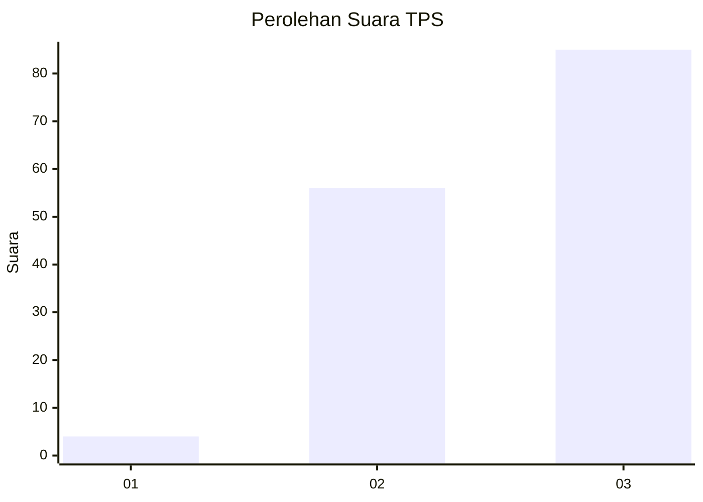
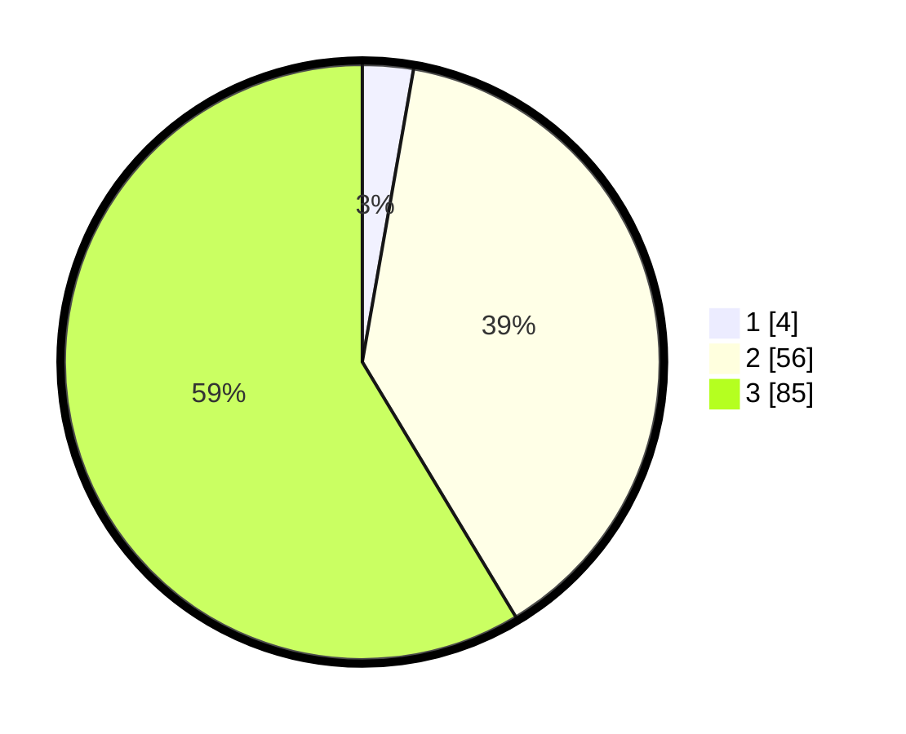

# Hasil

## Grafik

## Tabel

| No. | Nama Paslon    | Suara | Suara (raw) | Persentase |
|:--- |:-------------- | -----:| -----------:| ----------:|
| 1   | ANIES MUHAIMIN | 4     | [4][p-1]    | 2,76       |
| 2   | PRABOWO GIBRAN | 56    | [56][p-2]   | 38,62      |
| 3   | GANJAR MAHFUD  | 85    | [85][p-3]   | 58,62      |

[p-1]: https://github.com/gigit-pemilu/pemilu-2024/blob/main/pilpres/hitung-suara/sub/33-jawa-tengah/sub/12-wonogiri/sub/17-purwantoro/sub/2006-miricinde/sub/004-tps/sub/paslon-1.txt
[p-2]: https://github.com/gigit-pemilu/pemilu-2024/blob/main/pilpres/hitung-suara/sub/33-jawa-tengah/sub/12-wonogiri/sub/17-purwantoro/sub/2006-miricinde/sub/004-tps/sub/paslon-2.txt
[p-3]: https://github.com/gigit-pemilu/pemilu-2024/blob/main/pilpres/hitung-suara/sub/33-jawa-tengah/sub/12-wonogiri/sub/17-purwantoro/sub/2006-miricinde/sub/004-tps/sub/paslon-3.txt

## Foto C Plano

https://sirekap-obj-formc.kpu.go.id/48aa/pemilu/ppwp/33/12/17/20/06/3312172006004-20240216-074647--23c8f445-e43c-4dc8-8613-77589d4ecdf3.jpg

https://sirekap-obj-formc.kpu.go.id/48aa/pemilu/ppwp/33/12/17/20/06/3312172006004-20240214-185835--e86c8747-c3c7-4587-b26d-dc62f50e7b54.jpg

https://sirekap-obj-formc.kpu.go.id/48aa/pemilu/ppwp/33/12/17/20/06/3312172006004-20240215-212059--4e51ec5e-fcb3-4d24-ad35-e532a67992c4.jpg

## Metadata

| Key        | Value               |
| ---------- | ------------------- |
| Time Stamp | 2024-02-16 08:00:28 |

