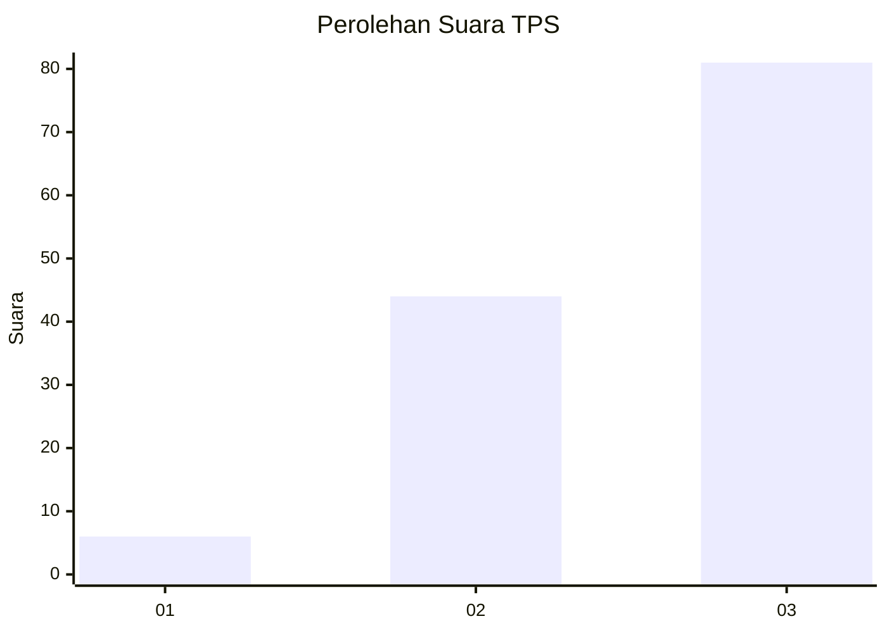
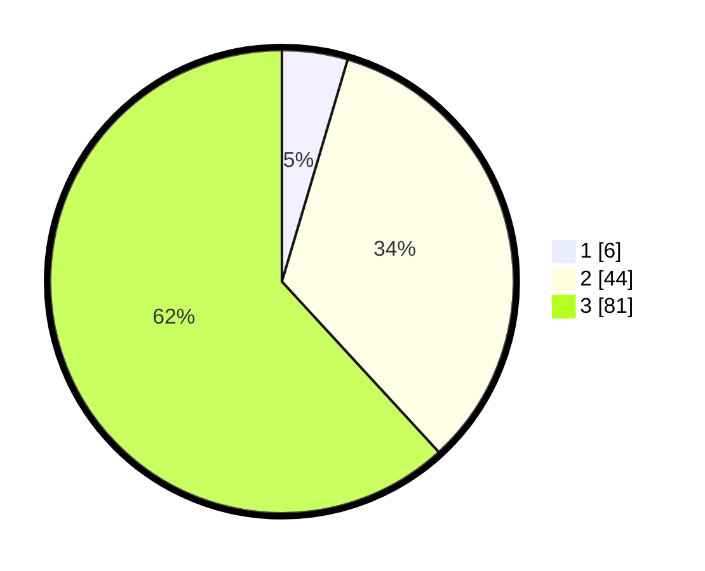

# Hasil

## Grafik

## Tabel

| No. | Nama Paslon    | Suara | Suara (raw) | Persentase |
|:--- |:-------------- | -----:| -----------:| ----------:|
| 1   | ANIES MUHAIMIN | 6     | [6][p-1]    | 4,58       |
| 2   | PRABOWO GIBRAN | 44    | [44][p-2]   | 33,59      |
| 3   | GANJAR MAHFUD  | 81    | [81][p-3]   | 61,83      |

[p-1]: https://github.com/gigit-pemilu/pemilu-2024/blob/main/pilpres/hitung-suara/sub/33-jawa-tengah/sub/12-wonogiri/sub/17-purwantoro/sub/2008-gondang/sub/010-tps/sub/paslon-1.txt
[p-2]: https://github.com/gigit-pemilu/pemilu-2024/blob/main/pilpres/hitung-suara/sub/33-jawa-tengah/sub/12-wonogiri/sub/17-purwantoro/sub/2008-gondang/sub/010-tps/sub/paslon-2.txt
[p-3]: https://github.com/gigit-pemilu/pemilu-2024/blob/main/pilpres/hitung-suara/sub/33-jawa-tengah/sub/12-wonogiri/sub/17-purwantoro/sub/2008-gondang/sub/010-tps/sub/paslon-3.txt

## Foto C Plano

https://sirekap-obj-formc.kpu.go.id/538b/pemilu/ppwp/33/12/17/20/08/3312172008010-20240215-014157--9db3e8bf-3298-4f66-b790-c7dcd3dde1cb.jpg

https://sirekap-obj-formc.kpu.go.id/538b/pemilu/ppwp/33/12/17/20/08/3312172008010-20240215-014315--1ee35866-fb8c-43c3-a0bd-6230a73eb99d.jpg

https://sirekap-obj-formc.kpu.go.id/538b/pemilu/ppwp/33/12/17/20/08/3312172008010-20240215-014337--8725739e-7084-4207-8a34-396abf040340.jpg

## Metadata

| Key        | Value               |
| ---------- | ------------------- |
| Time Stamp | 2024-02-19 06:16:00 |

