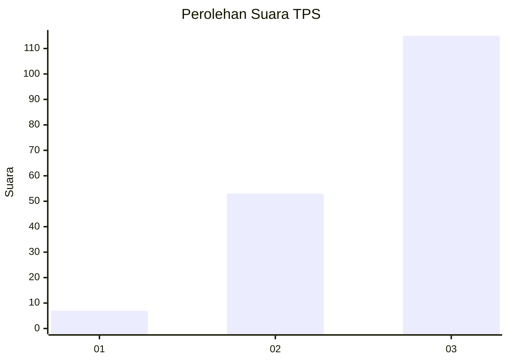
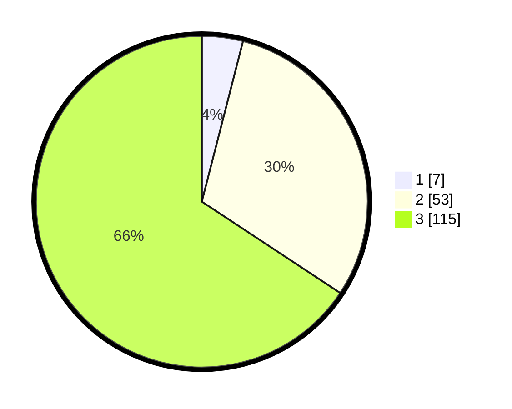

# Hasil

## Grafik

## Tabel

| No. | Nama Paslon    | Suara | Suara (raw) | Persentase |
|:--- |:-------------- | -----:| -----------:| ----------:|
| 1   | ANIES MUHAIMIN | 7     | [7][p-1]    | 4,00       |
| 2   | PRABOWO GIBRAN | 53    | [53][p-2]   | 30,29      |
| 3   | GANJAR MAHFUD  | 115   | [115][p-3]  | 65,71      |

[p-1]: https://github.com/gigit-pemilu/pemilu-2024/blob/main/pilpres/hitung-suara/sub/33-jawa-tengah/sub/12-wonogiri/sub/17-purwantoro/sub/2008-gondang/sub/012-tps/sub/paslon-1.txt
[p-2]: https://github.com/gigit-pemilu/pemilu-2024/blob/main/pilpres/hitung-suara/sub/33-jawa-tengah/sub/12-wonogiri/sub/17-purwantoro/sub/2008-gondang/sub/012-tps/sub/paslon-2.txt
[p-3]: https://github.com/gigit-pemilu/pemilu-2024/blob/main/pilpres/hitung-suara/sub/33-jawa-tengah/sub/12-wonogiri/sub/17-purwantoro/sub/2008-gondang/sub/012-tps/sub/paslon-3.txt

## Foto C Plano

https://sirekap-obj-formc.kpu.go.id/4252/pemilu/ppwp/33/12/17/20/08/3312172008012-20240215-053333--881bbc10-f613-41f6-8dca-e698540dcc4b.jpg

https://sirekap-obj-formc.kpu.go.id/4252/pemilu/ppwp/33/12/17/20/08/3312172008012-20240215-053343--ba9f733f-54ed-4c47-bbde-10e46dfc73fe.jpg

https://sirekap-obj-formc.kpu.go.id/4252/pemilu/ppwp/33/12/17/20/08/3312172008012-20240214-141236--2cf7380c-d332-4b7e-8f76-779c3414ccd2.jpg

## Metadata

| Key        | Value               |
| ---------- | ------------------- |
| Time Stamp | 2024-02-19 06:16:00 |

