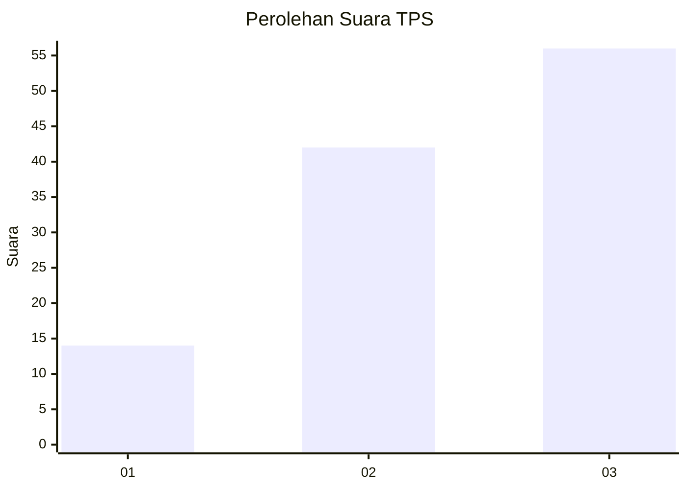
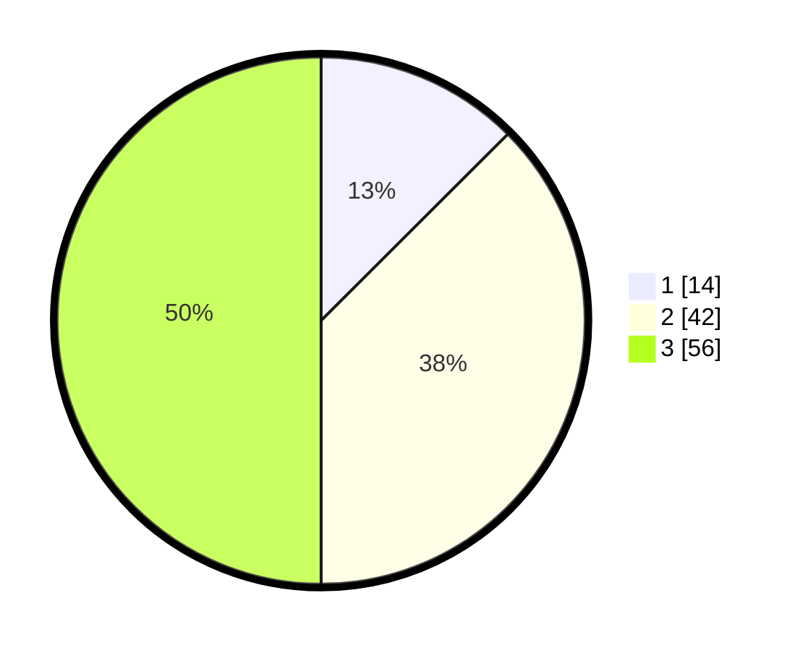

# Hasil

## Grafik

## Tabel

| No. | Nama Paslon    | Suara | Suara (raw) | Persentase |
|:--- |:-------------- | -----:| -----------:| ----------:|
| 1   | ANIES MUHAIMIN | 14    | [14][p-1]   | 12,50      |
| 2   | PRABOWO GIBRAN | 42    | [42][p-2]   | 37,50      |
| 3   | GANJAR MAHFUD  | 56    | [56][p-3]   | 50,00      |

[p-1]: https://github.com/gigit-pemilu/pemilu-2024-33-jawa-tengah/blob/main/pilpres/hitung-suara/sub/33-jawa-tengah/sub/12-wonogiri/sub/17-purwantoro/sub/2009-kepyar/sub/003-tps/sub/paslon-1.txt
[p-2]: https://github.com/gigit-pemilu/pemilu-2024-33-jawa-tengah/blob/main/pilpres/hitung-suara/sub/33-jawa-tengah/sub/12-wonogiri/sub/17-purwantoro/sub/2009-kepyar/sub/003-tps/sub/paslon-2.txt
[p-3]: https://github.com/gigit-pemilu/pemilu-2024-33-jawa-tengah/blob/main/pilpres/hitung-suara/sub/33-jawa-tengah/sub/12-wonogiri/sub/17-purwantoro/sub/2009-kepyar/sub/003-tps/sub/paslon-3.txt

## Foto C Plano

https://sirekap-obj-formc.kpu.go.id/2fdd/pemilu/ppwp/33/12/17/20/09/3312172009003-20240214-141358--51d3cf8a-fdd9-4dd3-b7b1-6bfdcf47436c.jpg

https://sirekap-obj-formc.kpu.go.id/2fdd/pemilu/ppwp/33/12/17/20/09/3312172009003-20240215-150040--9f6d2cb7-9fa3-407f-9f5d-923e8c5a80e1.jpg

https://sirekap-obj-formc.kpu.go.id/2fdd/pemilu/ppwp/33/12/17/20/09/3312172009003-20240214-141337--a563e7ef-bd6a-48b9-a4e3-bd96f6e01a48.jpg

## Metadata

| Key        | Value               |
| ---------- | ------------------- |
| Time Stamp | 2024-02-19 06:16:00 |

