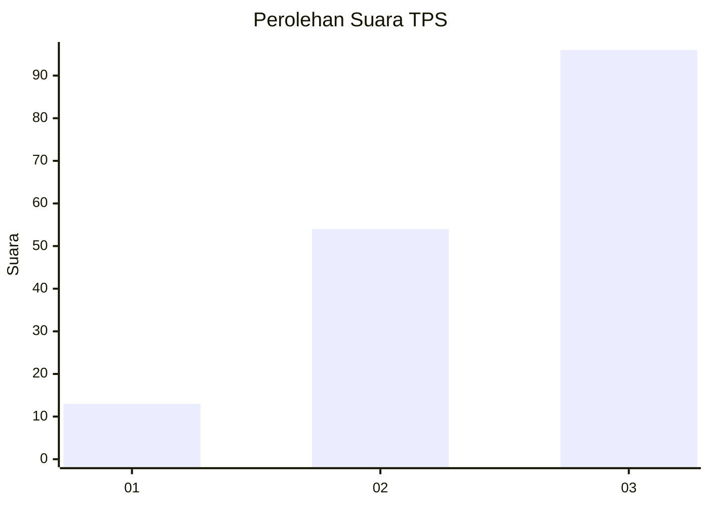
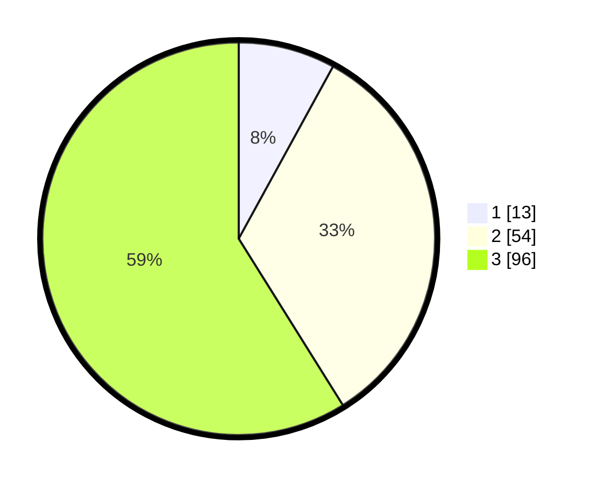

# Hasil

## Grafik

## Tabel

| No. | Nama Paslon    | Suara | Suara (raw) | Persentase |
|:--- |:-------------- | -----:| -----------:| ----------:|
| 1   | ANIES MUHAIMIN | 13    | [13][p-1]   | 7,98       |
| 2   | PRABOWO GIBRAN | 54    | [54][p-2]   | 33,13      |
| 3   | GANJAR MAHFUD  | 96    | [96][p-3]   | 58,90      |

[p-1]: https://github.com/gigit-pemilu/pemilu-2024-33-jawa-tengah/blob/main/pilpres/hitung-suara/sub/33-jawa-tengah/sub/12-wonogiri/sub/17-purwantoro/sub/2009-kepyar/sub/004-tps/sub/paslon-1.txt
[p-2]: https://github.com/gigit-pemilu/pemilu-2024-33-jawa-tengah/blob/main/pilpres/hitung-suara/sub/33-jawa-tengah/sub/12-wonogiri/sub/17-purwantoro/sub/2009-kepyar/sub/004-tps/sub/paslon-2.txt
[p-3]: https://github.com/gigit-pemilu/pemilu-2024-33-jawa-tengah/blob/main/pilpres/hitung-suara/sub/33-jawa-tengah/sub/12-wonogiri/sub/17-purwantoro/sub/2009-kepyar/sub/004-tps/sub/paslon-3.txt

## Foto C Plano

https://sirekap-obj-formc.kpu.go.id/0f43/pemilu/ppwp/33/12/17/20/09/3312172009004-20240214-212922--e5989770-109c-481f-85be-ad94a5b21d7b.jpg

https://sirekap-obj-formc.kpu.go.id/0f43/pemilu/ppwp/33/12/17/20/09/3312172009004-20240217-201340--a07d3f1c-87b4-4ce7-a45e-1dfc3e6489e2.jpg

https://sirekap-obj-formc.kpu.go.id/0f43/pemilu/ppwp/33/12/17/20/09/3312172009004-20240217-201520--254ddd78-cfbe-4e2d-b2c3-f65d9b21bb54.jpg

## Metadata

| Key        | Value               |
| ---------- | ------------------- |
| Time Stamp | 2024-02-19 06:16:00 |

