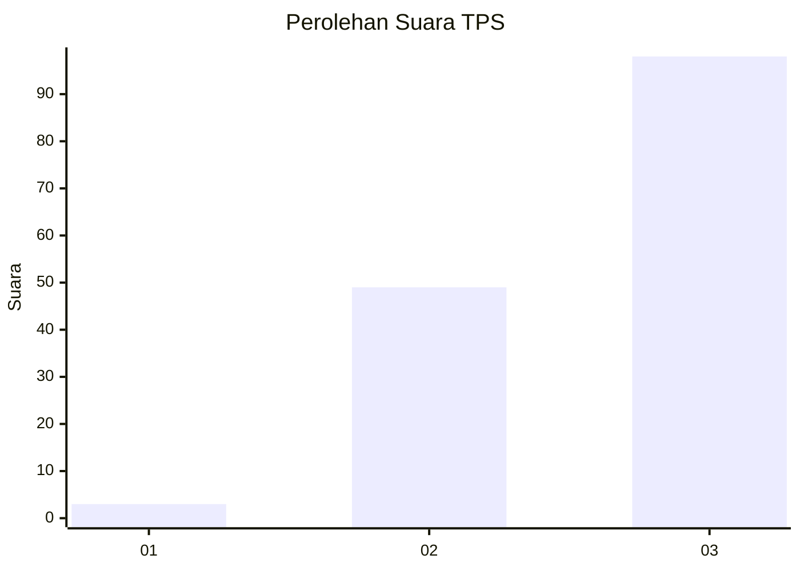
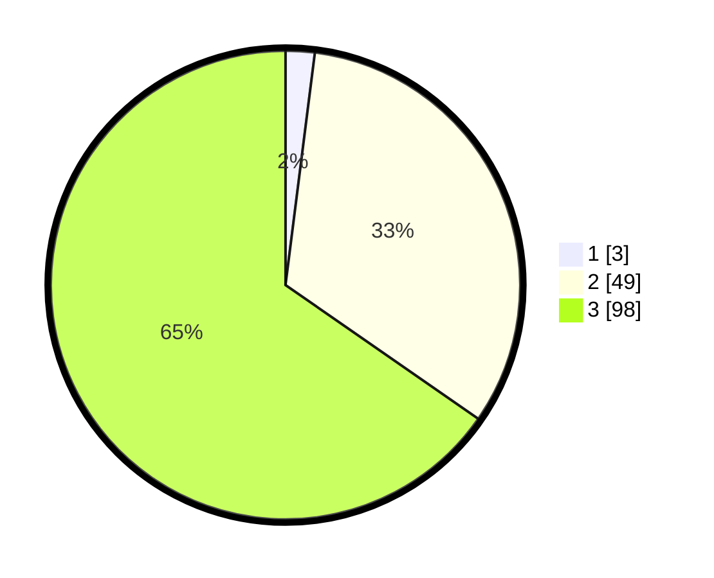

# Hasil

## Grafik

## Tabel

| No. | Nama Paslon    | Suara | Suara (raw) | Persentase |
|:--- |:-------------- | -----:| -----------:| ----------:|
| 1   | ANIES MUHAIMIN | 3     | [3][p-1]    | 2,00       |
| 2   | PRABOWO GIBRAN | 49    | [49][p-2]   | 32,67      |
| 3   | GANJAR MAHFUD  | 98    | [98][p-3]   | 65,33      |

[p-1]: https://github.com/gigit-pemilu/pemilu-2024/blob/main/pilpres/hitung-suara/sub/33-jawa-tengah/sub/12-wonogiri/sub/17-purwantoro/sub/2011-ploso/sub/010-tps/sub/paslon-1.txt
[p-2]: https://github.com/gigit-pemilu/pemilu-2024/blob/main/pilpres/hitung-suara/sub/33-jawa-tengah/sub/12-wonogiri/sub/17-purwantoro/sub/2011-ploso/sub/010-tps/sub/paslon-2.txt
[p-3]: https://github.com/gigit-pemilu/pemilu-2024/blob/main/pilpres/hitung-suara/sub/33-jawa-tengah/sub/12-wonogiri/sub/17-purwantoro/sub/2011-ploso/sub/010-tps/sub/paslon-3.txt

## Foto C Plano

https://sirekap-obj-formc.kpu.go.id/ba41/pemilu/ppwp/33/12/17/20/11/3312172011010-20240217-183929--a59bf424-4a01-4b8c-8eea-c32a636fa96b.jpg

https://sirekap-obj-formc.kpu.go.id/ba41/pemilu/ppwp/33/12/17/20/11/3312172011010-20240218-170923--beab2f04-9efb-45a5-ad75-e501245c2852.jpg

https://sirekap-obj-formc.kpu.go.id/ba41/pemilu/ppwp/33/12/17/20/11/3312172011010-20240217-062310--b068945c-4f79-41bb-99d5-800ddab532b8.jpg

## Metadata

| Key        | Value               |
| ---------- | ------------------- |
| Time Stamp | 2024-02-25 11:00:00 |

