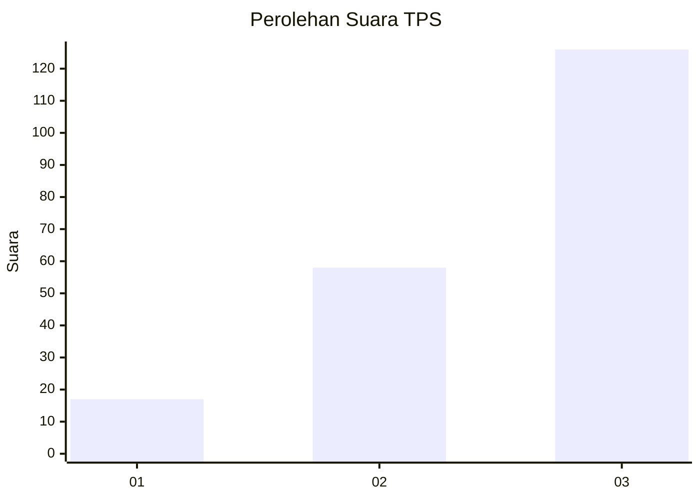
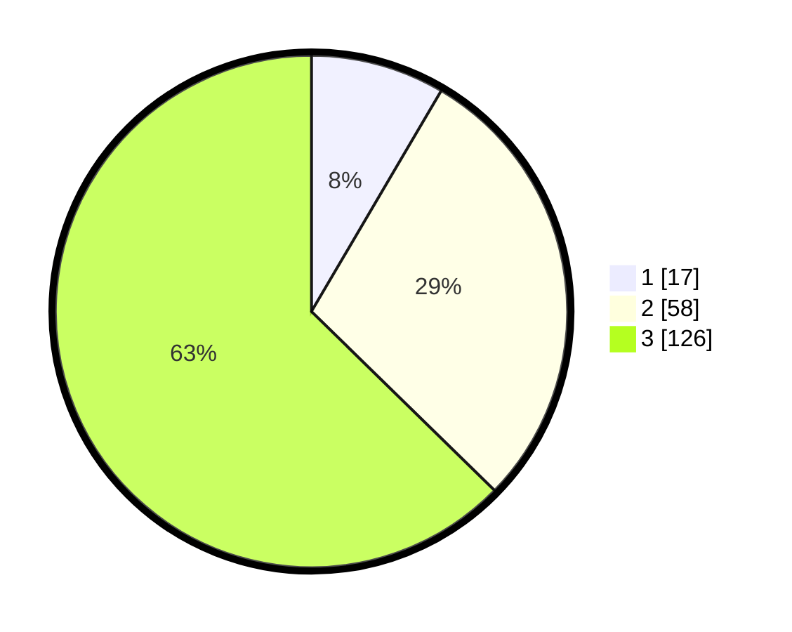

# Hasil

## Grafik

## Tabel

| No. | Nama Paslon    | Suara | Suara (raw) | Persentase |
|:--- |:-------------- | -----:| -----------:| ----------:|
| 1   | ANIES MUHAIMIN | 17    | [17][p-1]   | 8,46       |
| 2   | PRABOWO GIBRAN | 58    | [58][p-2]   | 28,86      |
| 3   | GANJAR MAHFUD  | 126   | [126][p-3]  | 62,69      |

[p-1]: https://github.com/gigit-pemilu/pemilu-2024-33-jawa-tengah/blob/main/pilpres/hitung-suara/sub/33-jawa-tengah/sub/12-wonogiri/sub/17-purwantoro/sub/2015-sukomangu/sub/003-tps/sub/paslon-1.txt
[p-2]: https://github.com/gigit-pemilu/pemilu-2024-33-jawa-tengah/blob/main/pilpres/hitung-suara/sub/33-jawa-tengah/sub/12-wonogiri/sub/17-purwantoro/sub/2015-sukomangu/sub/003-tps/sub/paslon-2.txt
[p-3]: https://github.com/gigit-pemilu/pemilu-2024-33-jawa-tengah/blob/main/pilpres/hitung-suara/sub/33-jawa-tengah/sub/12-wonogiri/sub/17-purwantoro/sub/2015-sukomangu/sub/003-tps/sub/paslon-3.txt

## Foto C Plano

https://sirekap-obj-formc.kpu.go.id/9327/pemilu/ppwp/33/12/17/20/15/3312172015003-20240214-160146--ece4b0f1-969a-46d0-bc1d-e825216f5f3d.jpg

https://sirekap-obj-formc.kpu.go.id/9327/pemilu/ppwp/33/12/17/20/15/3312172015003-20240219-161818--8c2e97f8-fa75-45f9-a5ea-f04466503cb1.jpg

https://sirekap-obj-formc.kpu.go.id/9327/pemilu/ppwp/33/12/17/20/15/3312172015003-20240219-161236--93734e80-118e-479d-971a-b6c5401be64a.jpg

## Metadata

| Key        | Value               |
| ---------- | ------------------- |
| Time Stamp | 2024-02-19 19:00:00 |

