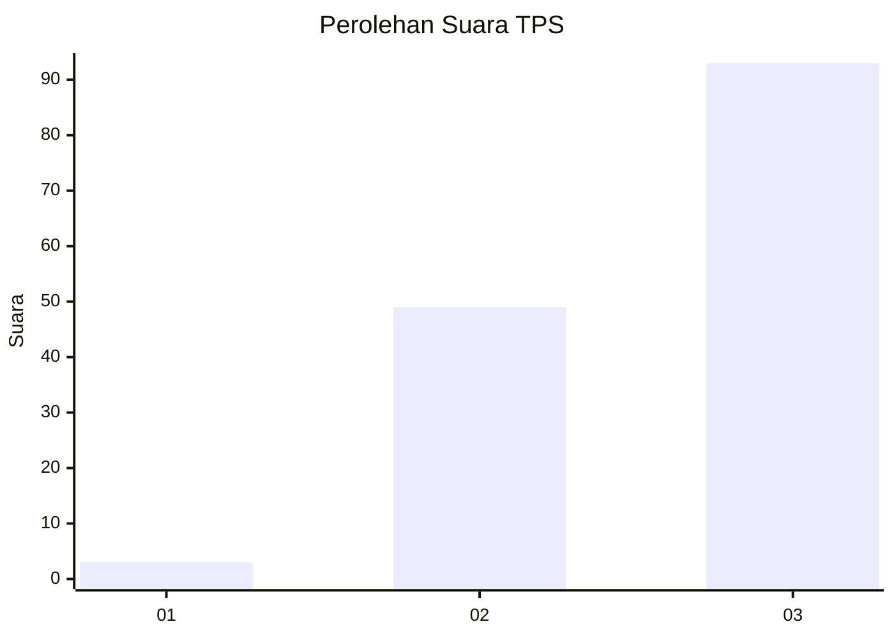
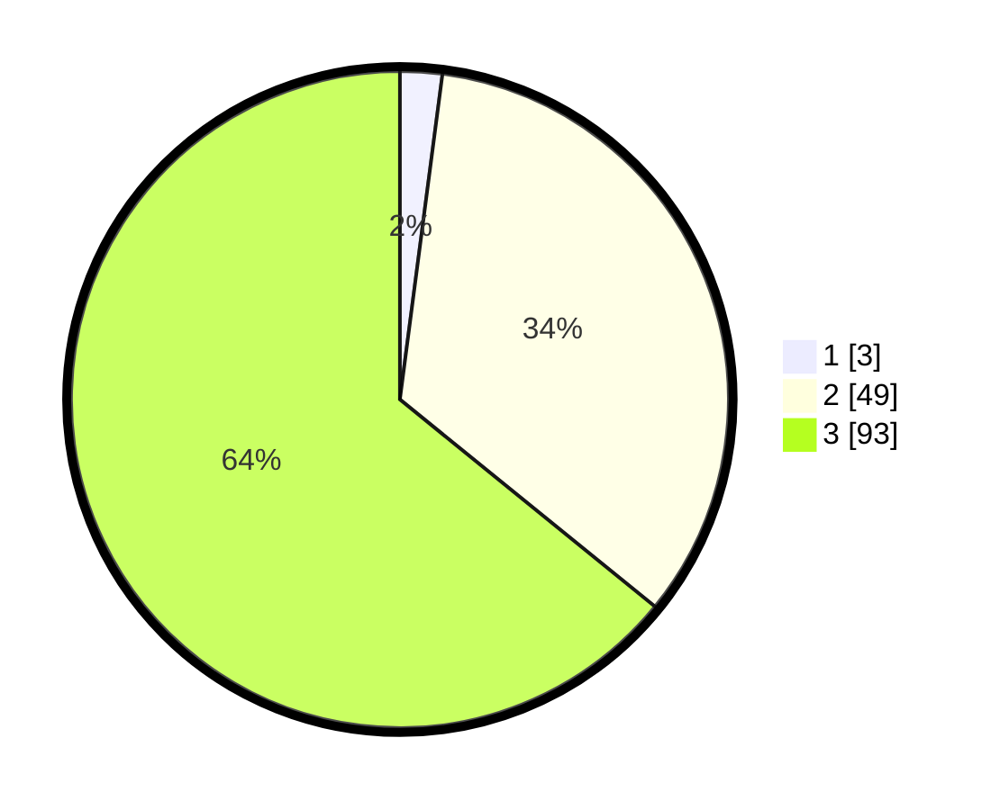

# Hasil

## Grafik

## Tabel

| No. | Nama Paslon    | Suara | Suara (raw) | Persentase |
|:--- |:-------------- | -----:| -----------:| ----------:|
| 1   | ANIES MUHAIMIN | 3     | [3][p-1]    | 2,07       |
| 2   | PRABOWO GIBRAN | 49    | [49][p-2]   | 33,79      |
| 3   | GANJAR MAHFUD  | 93    | [93][p-3]   | 64,14      |

[p-1]: https://github.com/gigit-pemilu/pemilu-2024/blob/main/pilpres/hitung-suara/sub/33-jawa-tengah/sub/12-wonogiri/sub/17-purwantoro/sub/2015-sukomangu/sub/009-tps/sub/paslon-1.txt
[p-2]: https://github.com/gigit-pemilu/pemilu-2024/blob/main/pilpres/hitung-suara/sub/33-jawa-tengah/sub/12-wonogiri/sub/17-purwantoro/sub/2015-sukomangu/sub/009-tps/sub/paslon-2.txt
[p-3]: https://github.com/gigit-pemilu/pemilu-2024/blob/main/pilpres/hitung-suara/sub/33-jawa-tengah/sub/12-wonogiri/sub/17-purwantoro/sub/2015-sukomangu/sub/009-tps/sub/paslon-3.txt

## Foto C Plano

https://sirekap-obj-formc.kpu.go.id/8151/pemilu/ppwp/33/12/17/20/15/3312172015009-20240217-193535--ee37c328-3a33-4acf-9bd3-39b2816a512f.jpg

https://sirekap-obj-formc.kpu.go.id/8151/pemilu/ppwp/33/12/17/20/15/3312172015009-20240217-194735--9e7ad76f-9625-42f4-ab7d-f387d94d878e.jpg

https://sirekap-obj-formc.kpu.go.id/8151/pemilu/ppwp/33/12/17/20/15/3312172015009-20240217-155257--815c9fd5-5ee5-4ac2-9074-dd5d7522837f.jpg

## Metadata

| Key        | Value               |
| ---------- | ------------------- |
| Time Stamp | 2024-02-19 06:16:00 |

