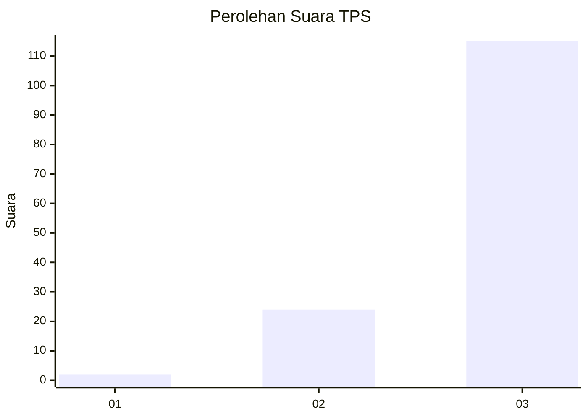
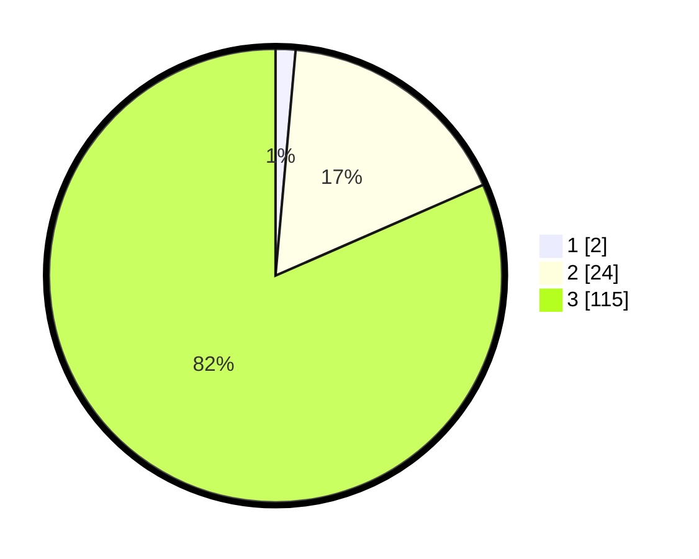

# Hasil

## Grafik

## Tabel

| No. | Nama Paslon    | Suara | Suara (raw) | Persentase |
|:--- |:-------------- | -----:| -----------:| ----------:|
| 1   | ANIES MUHAIMIN | 2     | [2][p-1]    | 1,42       |
| 2   | PRABOWO GIBRAN | 24    | [24][p-2]   | 17,02      |
| 3   | GANJAR MAHFUD  | 115   | [115][p-3]  | 81,56      |

[p-1]: https://github.com/gigit-pemilu/pemilu-2024/blob/main/pilpres/hitung-suara/sub/33-jawa-tengah/sub/12-wonogiri/sub/18-bulukerto/sub/1005-bulukerto/sub/014-tps/sub/paslon-1.txt
[p-2]: https://github.com/gigit-pemilu/pemilu-2024/blob/main/pilpres/hitung-suara/sub/33-jawa-tengah/sub/12-wonogiri/sub/18-bulukerto/sub/1005-bulukerto/sub/014-tps/sub/paslon-2.txt
[p-3]: https://github.com/gigit-pemilu/pemilu-2024/blob/main/pilpres/hitung-suara/sub/33-jawa-tengah/sub/12-wonogiri/sub/18-bulukerto/sub/1005-bulukerto/sub/014-tps/sub/paslon-3.txt

## Foto C Plano

https://sirekap-obj-formc.kpu.go.id/b339/pemilu/ppwp/33/12/18/10/05/3312181005014-20240216-135156--a239a56a-ec82-42e6-985f-4a0e027e6ca0.jpg

https://sirekap-obj-formc.kpu.go.id/b339/pemilu/ppwp/33/12/18/10/05/3312181005014-20240216-125412--886ee2bf-1fa8-4049-a93f-329934802b9a.jpg

https://sirekap-obj-formc.kpu.go.id/b339/pemilu/ppwp/33/12/18/10/05/3312181005014-20240216-072031--41c7b5e6-1f53-42c2-8aaf-5f34ec2a0443.jpg

## Metadata

| Key        | Value               |
| ---------- | ------------------- |
| Time Stamp | 2024-02-24 22:31:28 |

