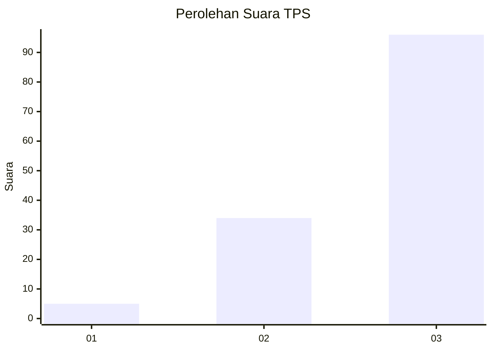
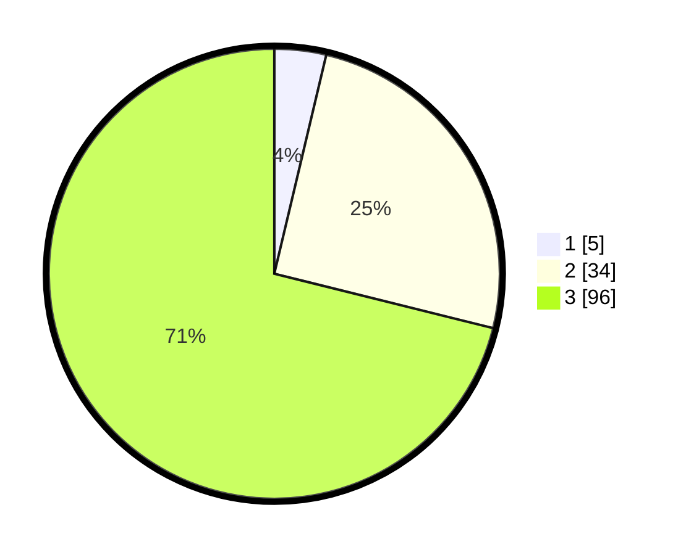

# Hasil

## Grafik

## Tabel

| No. | Nama Paslon    | Suara | Suara (raw) | Persentase |
|:--- |:-------------- | -----:| -----------:| ----------:|
| 1   | ANIES MUHAIMIN | 5     | [5][p-1]    | 3,70       |
| 2   | PRABOWO GIBRAN | 34    | [34][p-2]   | 25,19      |
| 3   | GANJAR MAHFUD  | 96    | [96][p-3]   | 71,11      |

[p-1]: https://github.com/gigit-pemilu/pemilu-2024/blob/main/pilpres/hitung-suara/sub/33-jawa-tengah/sub/12-wonogiri/sub/18-bulukerto/sub/1005-bulukerto/sub/016-tps/sub/paslon-1.txt
[p-2]: https://github.com/gigit-pemilu/pemilu-2024/blob/main/pilpres/hitung-suara/sub/33-jawa-tengah/sub/12-wonogiri/sub/18-bulukerto/sub/1005-bulukerto/sub/016-tps/sub/paslon-2.txt
[p-3]: https://github.com/gigit-pemilu/pemilu-2024/blob/main/pilpres/hitung-suara/sub/33-jawa-tengah/sub/12-wonogiri/sub/18-bulukerto/sub/1005-bulukerto/sub/016-tps/sub/paslon-3.txt

## Foto C Plano

https://sirekap-obj-formc.kpu.go.id/293a/pemilu/ppwp/33/12/18/10/05/3312181005016-20240217-104219--98b0b354-09a4-4582-b374-712c943ba28a.jpg

https://sirekap-obj-formc.kpu.go.id/293a/pemilu/ppwp/33/12/18/10/05/3312181005016-20240217-105328--c8f85b42-12e8-47ae-86bb-122481cd0e1f.jpg

https://sirekap-obj-formc.kpu.go.id/293a/pemilu/ppwp/33/12/18/10/05/3312181005016-20240217-105003--77071492-f08e-4262-b65b-f283a379df25.jpg

## Metadata

| Key        | Value               |
| ---------- | ------------------- |
| Time Stamp | 2024-02-24 22:31:28 |

