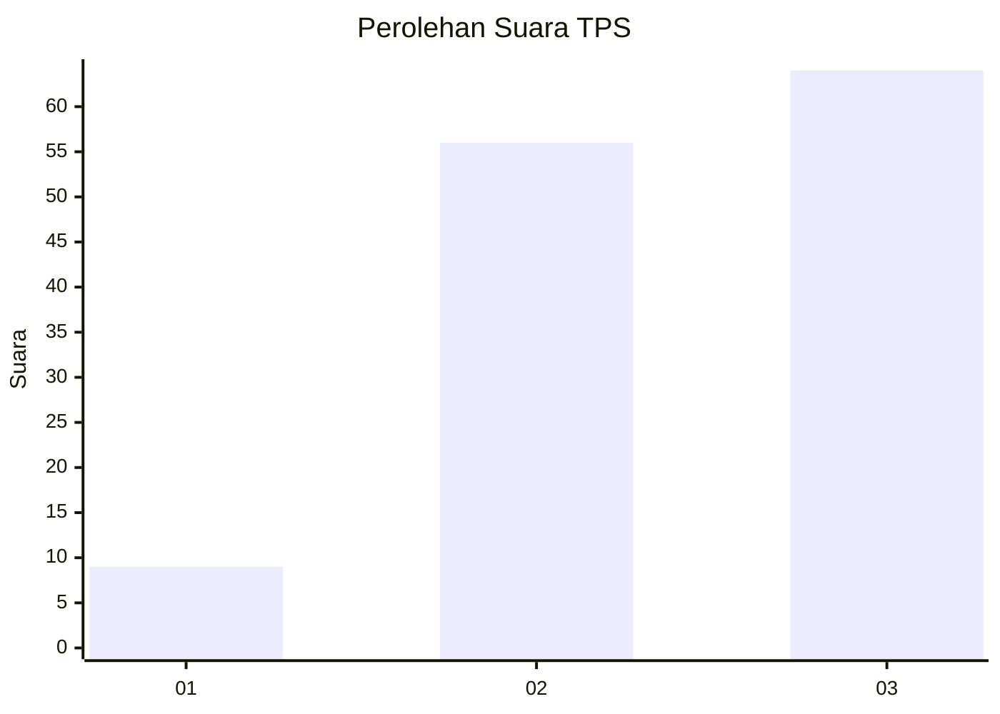
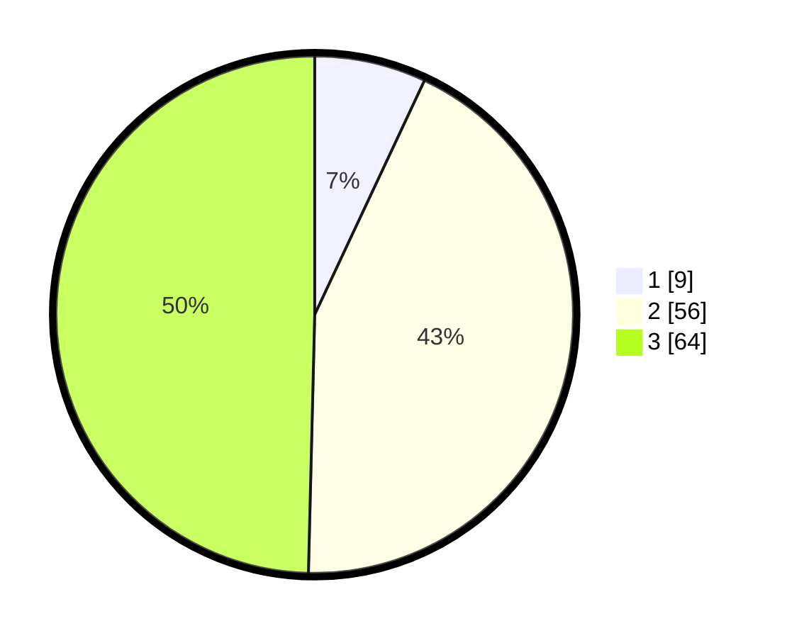

# Hasil

## Grafik

## Tabel

| No. | Nama Paslon    | Suara | Suara (raw) | Persentase |
|:--- |:-------------- | -----:| -----------:| ----------:|
| 1   | ANIES MUHAIMIN | 9     | [9][p-1]    | 6,98       |
| 2   | PRABOWO GIBRAN | 56    | [56][p-2]   | 43,41      |
| 3   | GANJAR MAHFUD  | 64    | [64][p-3]   | 49,61      |

[p-1]: https://github.com/gigit-pemilu/pemilu-2024-33-jawa-tengah/blob/main/pilpres/hitung-suara/sub/33-jawa-tengah/sub/12-wonogiri/sub/18-bulukerto/sub/2003-ngaglik/sub/001-tps/sub/paslon-1.txt
[p-2]: https://github.com/gigit-pemilu/pemilu-2024-33-jawa-tengah/blob/main/pilpres/hitung-suara/sub/33-jawa-tengah/sub/12-wonogiri/sub/18-bulukerto/sub/2003-ngaglik/sub/001-tps/sub/paslon-2.txt
[p-3]: https://github.com/gigit-pemilu/pemilu-2024-33-jawa-tengah/blob/main/pilpres/hitung-suara/sub/33-jawa-tengah/sub/12-wonogiri/sub/18-bulukerto/sub/2003-ngaglik/sub/001-tps/sub/paslon-3.txt

## Foto C Plano

https://sirekap-obj-formc.kpu.go.id/a8e0/pemilu/ppwp/33/12/18/20/03/3312182003001-20240216-185640--c9d87b63-6daf-4b68-9bdb-e610545cf6c4.jpg

https://sirekap-obj-formc.kpu.go.id/a8e0/pemilu/ppwp/33/12/18/20/03/3312182003001-20240216-120124--6b35f95d-89b7-4b98-98f9-685de7d49b4e.jpg

https://sirekap-obj-formc.kpu.go.id/a8e0/pemilu/ppwp/33/12/18/20/03/3312182003001-20240216-125400--cb366c34-9075-4d1c-811f-4a3a3fe80859.jpg

## Metadata

| Key        | Value               |
| ---------- | ------------------- |
| Time Stamp | 2024-02-16 21:01:00 |

