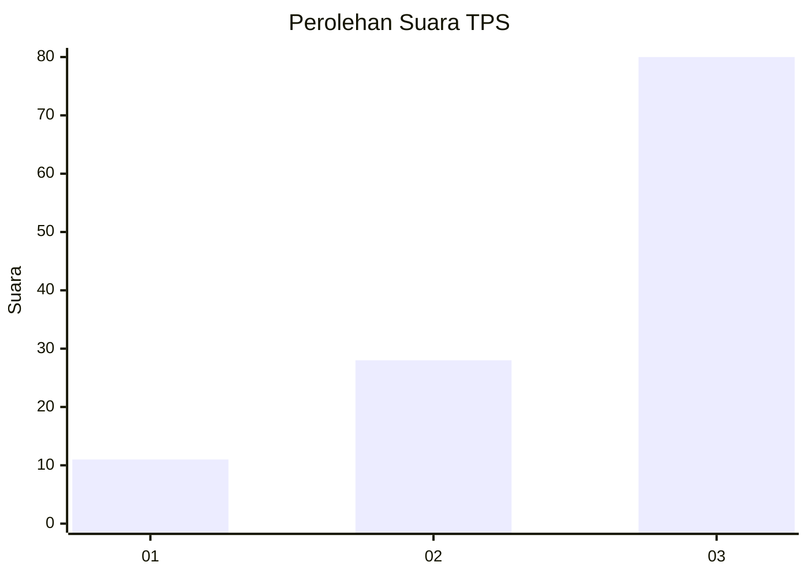
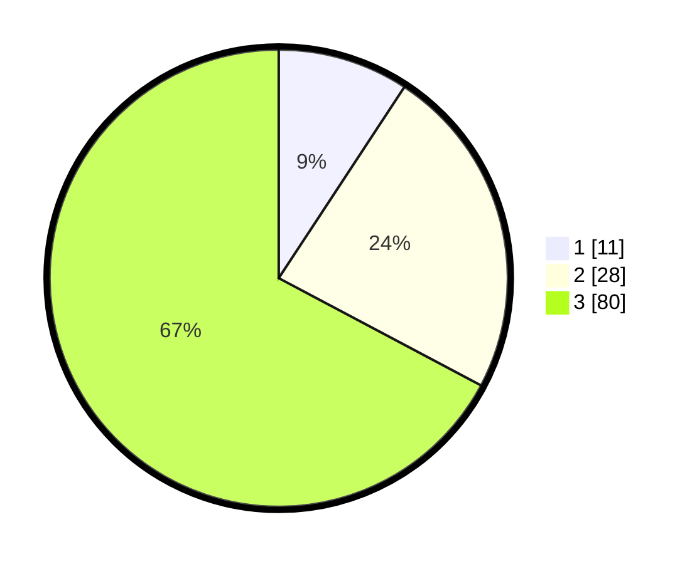

# Hasil

## Grafik

## Tabel

| No. | Nama Paslon    | Suara | Suara (raw) | Persentase |
|:--- |:-------------- | -----:| -----------:| ----------:|
| 1   | ANIES MUHAIMIN | 11    | [11][p-1]   | 9,24       |
| 2   | PRABOWO GIBRAN | 28    | [28][p-2]   | 23,53      |
| 3   | GANJAR MAHFUD  | 80    | [80][p-3]   | 67,23      |

[p-1]: https://github.com/gigit-pemilu/pemilu-2024-33-jawa-tengah/blob/main/pilpres/hitung-suara/sub/33-jawa-tengah/sub/12-wonogiri/sub/18-bulukerto/sub/2003-ngaglik/sub/011-tps/sub/paslon-1.txt
[p-2]: https://github.com/gigit-pemilu/pemilu-2024-33-jawa-tengah/blob/main/pilpres/hitung-suara/sub/33-jawa-tengah/sub/12-wonogiri/sub/18-bulukerto/sub/2003-ngaglik/sub/011-tps/sub/paslon-2.txt
[p-3]: https://github.com/gigit-pemilu/pemilu-2024-33-jawa-tengah/blob/main/pilpres/hitung-suara/sub/33-jawa-tengah/sub/12-wonogiri/sub/18-bulukerto/sub/2003-ngaglik/sub/011-tps/sub/paslon-3.txt

## Foto C Plano

https://sirekap-obj-formc.kpu.go.id/7d1b/pemilu/ppwp/33/12/18/20/03/3312182003011-20240215-002925--d175f39e-0570-4df2-8104-127d93eb3dc6.jpg

https://sirekap-obj-formc.kpu.go.id/7d1b/pemilu/ppwp/33/12/18/20/03/3312182003011-20240215-002944--e8faf7b3-483e-4005-beee-2c5bcfd41b85.jpg

https://sirekap-obj-formc.kpu.go.id/7d1b/pemilu/ppwp/33/12/18/20/03/3312182003011-20240215-003005--fe90f00f-cfea-408c-ae0d-3afb4d4dca11.jpg

## Metadata

| Key        | Value               |
| ---------- | ------------------- |
| Time Stamp | 2024-02-17 17:30:00 |

