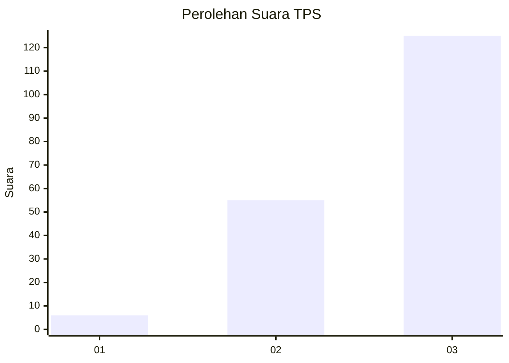
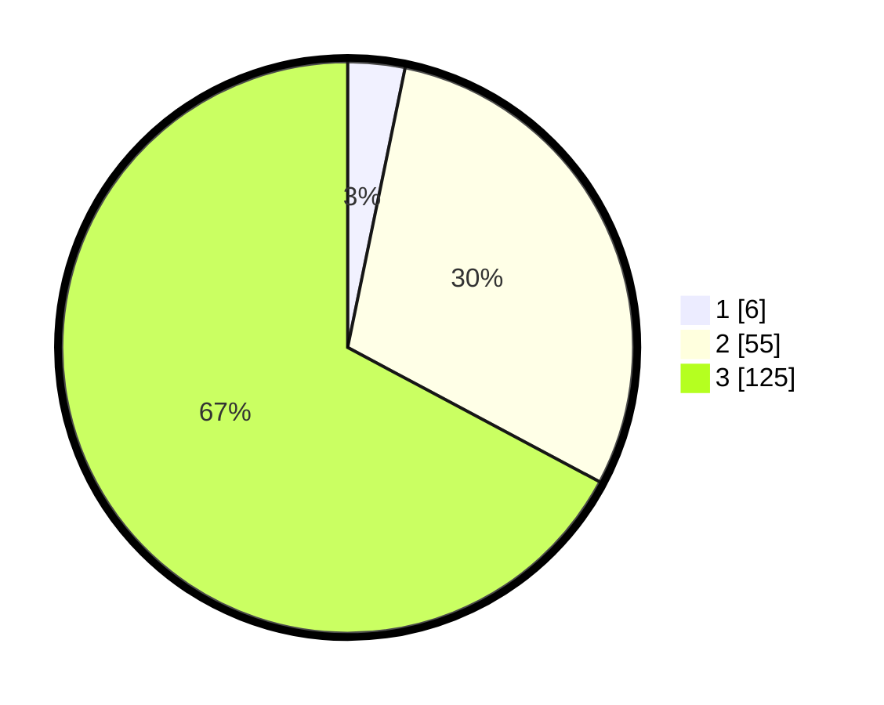

# Hasil

## Grafik

## Tabel

| No. | Nama Paslon    | Suara | Suara (raw) | Persentase |
|:--- |:-------------- | -----:| -----------:| ----------:|
| 1   | ANIES MUHAIMIN | 6     | [6][p-1]    | 3,23       |
| 2   | PRABOWO GIBRAN | 55    | [55][p-2]   | 29,57      |
| 3   | GANJAR MAHFUD  | 125   | [125][p-3]  | 67,20      |

[p-1]: https://github.com/gigit-pemilu/pemilu-2024-33-jawa-tengah/blob/main/pilpres/hitung-suara/sub/33-jawa-tengah/sub/12-wonogiri/sub/18-bulukerto/sub/2004-bulurejo/sub/011-tps/sub/paslon-1.txt
[p-2]: https://github.com/gigit-pemilu/pemilu-2024-33-jawa-tengah/blob/main/pilpres/hitung-suara/sub/33-jawa-tengah/sub/12-wonogiri/sub/18-bulukerto/sub/2004-bulurejo/sub/011-tps/sub/paslon-2.txt
[p-3]: https://github.com/gigit-pemilu/pemilu-2024-33-jawa-tengah/blob/main/pilpres/hitung-suara/sub/33-jawa-tengah/sub/12-wonogiri/sub/18-bulukerto/sub/2004-bulurejo/sub/011-tps/sub/paslon-3.txt

## Foto C Plano

https://sirekap-obj-formc.kpu.go.id/60d3/pemilu/ppwp/33/12/18/20/04/3312182004011-20240215-034219--612d36dc-4a8b-4348-8f2e-8b100efb345d.jpg

https://sirekap-obj-formc.kpu.go.id/60d3/pemilu/ppwp/33/12/18/20/04/3312182004011-20240215-034734--b352b9d6-b2a4-406d-a867-d523bf3b7a8a.jpg

https://sirekap-obj-formc.kpu.go.id/60d3/pemilu/ppwp/33/12/18/20/04/3312182004011-20240215-034111--15388c32-6afc-4b4b-b744-fa8a9c57ccd1.jpg

## Metadata

| Key        | Value               |
| ---------- | ------------------- |
| Time Stamp | 2024-02-17 17:30:00 |

