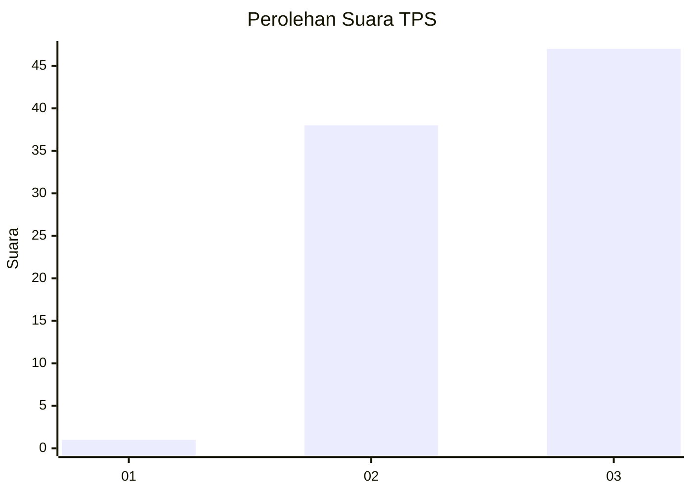
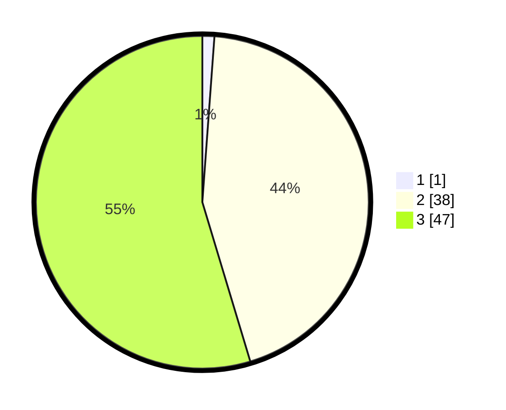

# Hasil

## Grafik

## Tabel

| No. | Nama Paslon    | Suara | Suara (raw) | Persentase |
|:--- |:-------------- | -----:| -----------:| ----------:|
| 1   | ANIES MUHAIMIN | 1     | [1][p-1]    | 1,16       |
| 2   | PRABOWO GIBRAN | 38    | [38][p-2]   | 44,19      |
| 3   | GANJAR MAHFUD  | 47    | [47][p-3]   | 54,65      |

[p-1]: https://github.com/gigit-pemilu/pemilu-2024/blob/main/pilpres/hitung-suara/sub/33-jawa-tengah/sub/12-wonogiri/sub/18-bulukerto/sub/2004-bulurejo/sub/014-tps/sub/paslon-1.txt
[p-2]: https://github.com/gigit-pemilu/pemilu-2024/blob/main/pilpres/hitung-suara/sub/33-jawa-tengah/sub/12-wonogiri/sub/18-bulukerto/sub/2004-bulurejo/sub/014-tps/sub/paslon-2.txt
[p-3]: https://github.com/gigit-pemilu/pemilu-2024/blob/main/pilpres/hitung-suara/sub/33-jawa-tengah/sub/12-wonogiri/sub/18-bulukerto/sub/2004-bulurejo/sub/014-tps/sub/paslon-3.txt

## Foto C Plano

https://sirekap-obj-formc.kpu.go.id/f4aa/pemilu/ppwp/33/12/18/20/04/3312182004014-20240216-140957--2278794b-9928-46e9-9bf6-970b689fa1af.jpg

https://sirekap-obj-formc.kpu.go.id/f4aa/pemilu/ppwp/33/12/18/20/04/3312182004014-20240216-165603--7870a923-20de-4b2d-aff8-2f3bff7a6d05.jpg

https://sirekap-obj-formc.kpu.go.id/f4aa/pemilu/ppwp/33/12/18/20/04/3312182004014-20240216-170307--44b78471-e134-41c9-af04-38b439f6e212.jpg

## Metadata

| Key        | Value               |
| ---------- | ------------------- |
| Time Stamp | 2024-02-16 17:30:00 |

