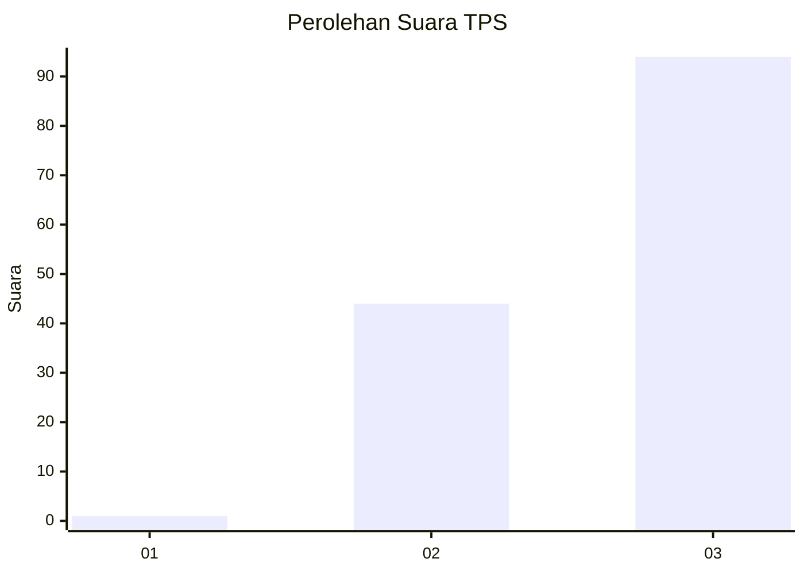
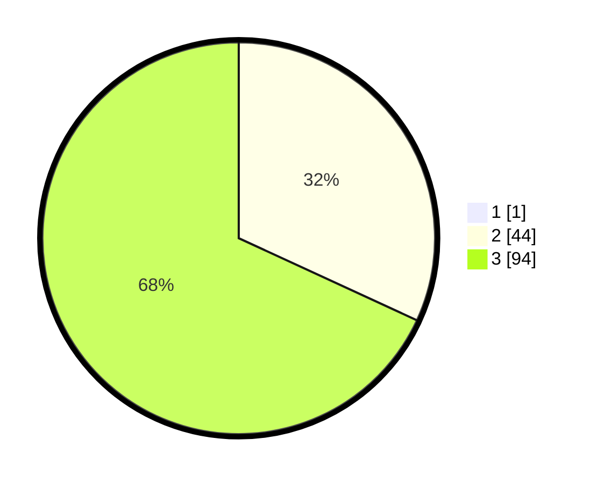

# Hasil

## Grafik

## Tabel

| No. | Nama Paslon    | Suara | Suara (raw) | Persentase |
|:--- |:-------------- | -----:| -----------:| ----------:|
| 1   | ANIES MUHAIMIN | 1     | [1][p-1]    | 0,72       |
| 2   | PRABOWO GIBRAN | 44    | [44][p-2]   | 31,65      |
| 3   | GANJAR MAHFUD  | 94    | [94][p-3]   | 67,63      |

[p-1]: https://github.com/gigit-pemilu/pemilu-2024/blob/main/pilpres/hitung-suara/sub/33-jawa-tengah/sub/12-wonogiri/sub/18-bulukerto/sub/2004-bulurejo/sub/016-tps/sub/paslon-1.txt
[p-2]: https://github.com/gigit-pemilu/pemilu-2024/blob/main/pilpres/hitung-suara/sub/33-jawa-tengah/sub/12-wonogiri/sub/18-bulukerto/sub/2004-bulurejo/sub/016-tps/sub/paslon-2.txt
[p-3]: https://github.com/gigit-pemilu/pemilu-2024/blob/main/pilpres/hitung-suara/sub/33-jawa-tengah/sub/12-wonogiri/sub/18-bulukerto/sub/2004-bulurejo/sub/016-tps/sub/paslon-3.txt

## Foto C Plano

https://sirekap-obj-formc.kpu.go.id/95b8/pemilu/ppwp/33/12/18/20/04/3312182004016-20240218-155109--2a970678-5082-4e28-ab94-d903113f2264.jpg

https://sirekap-obj-formc.kpu.go.id/95b8/pemilu/ppwp/33/12/18/20/04/3312182004016-20240215-034121--85edcdcd-4c5b-4580-9ce5-2be02246e4c6.jpg

https://sirekap-obj-formc.kpu.go.id/95b8/pemilu/ppwp/33/12/18/20/04/3312182004016-20240216-220541--b0333b67-2679-4d05-ae46-5f6feca015c9.jpg

## Metadata

| Key        | Value               |
| ---------- | ------------------- |
| Time Stamp | 2024-02-19 06:16:00 |

