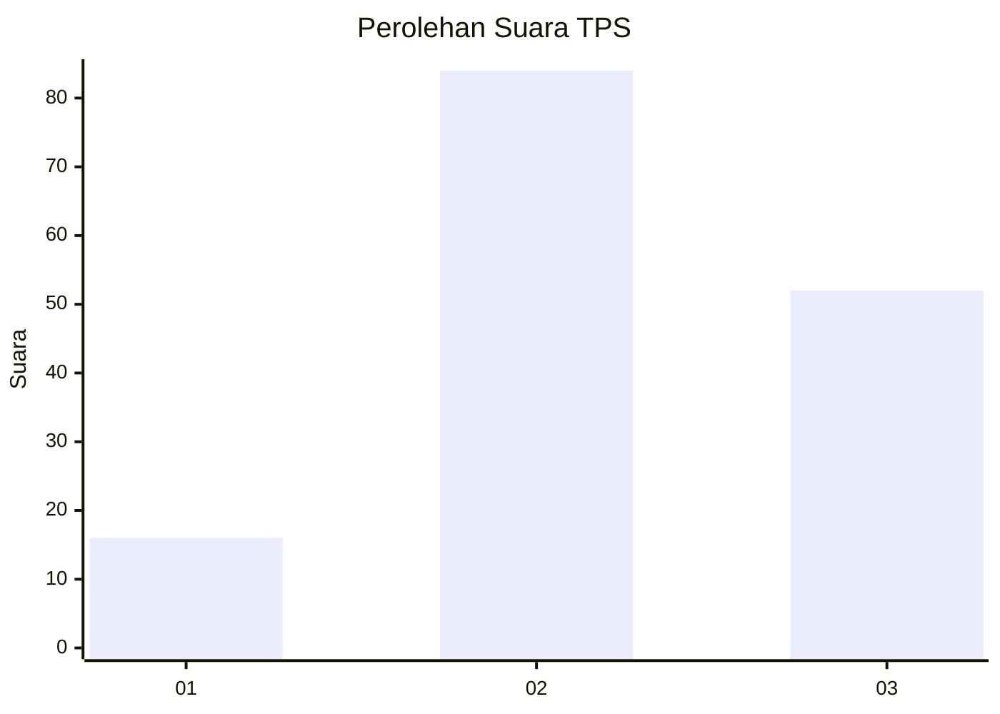
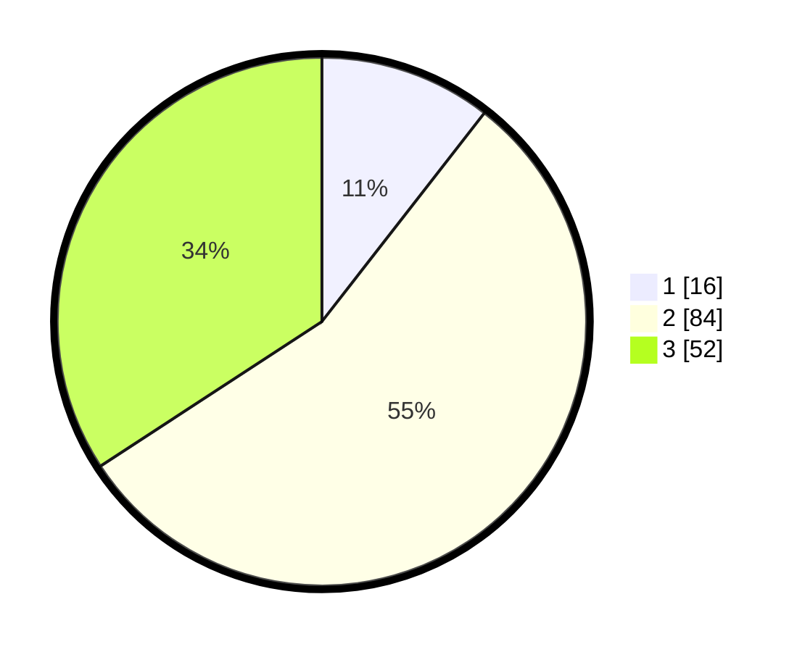

# Hasil

## Grafik

## Tabel

| No. | Nama Paslon    | Suara | Suara (raw) | Persentase |
|:--- |:-------------- | -----:| -----------:| ----------:|
| 1   | ANIES MUHAIMIN | 16    | [16][p-1]   | 10,53      |
| 2   | PRABOWO GIBRAN | 84    | [84][p-2]   | 55,26      |
| 3   | GANJAR MAHFUD  | 52    | [52][p-3]   | 34,21      |

[p-1]: https://github.com/gigit-pemilu/pemilu-2024/blob/main/pilpres/hitung-suara/sub/33-jawa-tengah/sub/12-wonogiri/sub/18-bulukerto/sub/2007-tanjung/sub/004-tps/sub/paslon-1.txt
[p-2]: https://github.com/gigit-pemilu/pemilu-2024/blob/main/pilpres/hitung-suara/sub/33-jawa-tengah/sub/12-wonogiri/sub/18-bulukerto/sub/2007-tanjung/sub/004-tps/sub/paslon-2.txt
[p-3]: https://github.com/gigit-pemilu/pemilu-2024/blob/main/pilpres/hitung-suara/sub/33-jawa-tengah/sub/12-wonogiri/sub/18-bulukerto/sub/2007-tanjung/sub/004-tps/sub/paslon-3.txt

## Foto C Plano

https://sirekap-obj-formc.kpu.go.id/d12b/pemilu/ppwp/33/12/18/20/07/3312182007004-20240214-141355--9dbbf776-c1ab-4bd5-8bb4-48a525b579cc.jpg

https://sirekap-obj-formc.kpu.go.id/d12b/pemilu/ppwp/33/12/18/20/07/3312182007004-20240214-141753--238bb92d-42c9-4215-bba8-38c114330791.jpg

https://sirekap-obj-formc.kpu.go.id/d12b/pemilu/ppwp/33/12/18/20/07/3312182007004-20240214-141904--aba107e3-3177-4d4c-9bee-f6d5e549e8d0.jpg

## Metadata

| Key        | Value               |
| ---------- | ------------------- |
| Time Stamp | 2024-02-17 18:00:00 |

