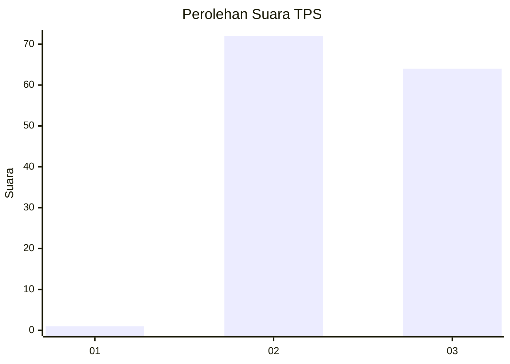
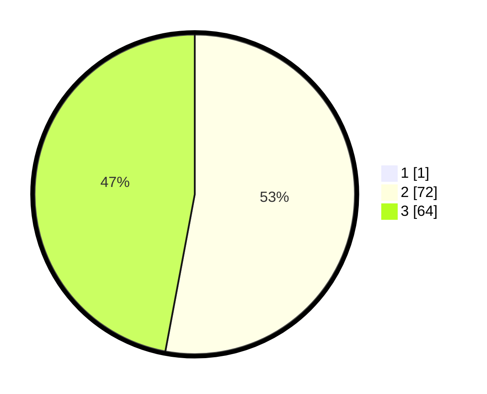

# Hasil

## Grafik

## Tabel

| No. | Nama Paslon    | Suara | Suara (raw) | Persentase |
|:--- |:-------------- | -----:| -----------:| ----------:|
| 1   | ANIES MUHAIMIN | 1     | [1][p-1]    | 0,73       |
| 2   | PRABOWO GIBRAN | 72    | [72][p-2]   | 52,55      |
| 3   | GANJAR MAHFUD  | 64    | [64][p-3]   | 46,72      |

[p-1]: https://github.com/gigit-pemilu/pemilu-2024/blob/main/pilpres/hitung-suara/sub/33-jawa-tengah/sub/12-wonogiri/sub/18-bulukerto/sub/2007-tanjung/sub/005-tps/sub/paslon-1.txt
[p-2]: https://github.com/gigit-pemilu/pemilu-2024/blob/main/pilpres/hitung-suara/sub/33-jawa-tengah/sub/12-wonogiri/sub/18-bulukerto/sub/2007-tanjung/sub/005-tps/sub/paslon-2.txt
[p-3]: https://github.com/gigit-pemilu/pemilu-2024/blob/main/pilpres/hitung-suara/sub/33-jawa-tengah/sub/12-wonogiri/sub/18-bulukerto/sub/2007-tanjung/sub/005-tps/sub/paslon-3.txt

## Foto C Plano

https://sirekap-obj-formc.kpu.go.id/40ee/pemilu/ppwp/33/12/18/20/07/3312182007005-20240217-151440--c8614884-eb3b-4f91-8f32-b883379570a2.jpg

https://sirekap-obj-formc.kpu.go.id/40ee/pemilu/ppwp/33/12/18/20/07/3312182007005-20240218-174051--128564aa-2e75-4a68-a789-d764b88e62c5.jpg

https://sirekap-obj-formc.kpu.go.id/40ee/pemilu/ppwp/33/12/18/20/07/3312182007005-20240218-174308--0283ef12-bc89-4a63-b034-e838c1e546cb.jpg

## Metadata

| Key        | Value               |
| ---------- | ------------------- |
| Time Stamp | 2024-02-19 23:00:00 |

