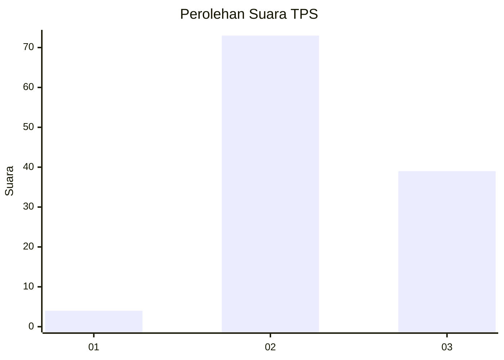
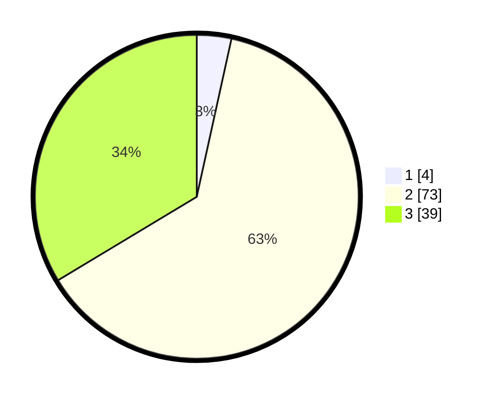

# Hasil

## Grafik

## Tabel

| No. | Nama Paslon    | Suara | Suara (raw) | Persentase |
|:--- |:-------------- | -----:| -----------:| ----------:|
| 1   | ANIES MUHAIMIN | 4     | [4][p-1]    | 3,45       |
| 2   | PRABOWO GIBRAN | 73    | [73][p-2]   | 62,93      |
| 3   | GANJAR MAHFUD  | 39    | [39][p-3]   | 33,62      |

[p-1]: https://github.com/gigit-pemilu/pemilu-2024/blob/main/pilpres/hitung-suara/sub/33-jawa-tengah/sub/12-wonogiri/sub/18-bulukerto/sub/2007-tanjung/sub/009-tps/sub/paslon-1.txt
[p-2]: https://github.com/gigit-pemilu/pemilu-2024/blob/main/pilpres/hitung-suara/sub/33-jawa-tengah/sub/12-wonogiri/sub/18-bulukerto/sub/2007-tanjung/sub/009-tps/sub/paslon-2.txt
[p-3]: https://github.com/gigit-pemilu/pemilu-2024/blob/main/pilpres/hitung-suara/sub/33-jawa-tengah/sub/12-wonogiri/sub/18-bulukerto/sub/2007-tanjung/sub/009-tps/sub/paslon-3.txt

## Foto C Plano

https://sirekap-obj-formc.kpu.go.id/7fd6/pemilu/ppwp/33/12/18/20/07/3312182007009-20240219-103440--cebb8d12-62fd-4264-85cf-98698e021455.jpg

https://sirekap-obj-formc.kpu.go.id/7fd6/pemilu/ppwp/33/12/18/20/07/3312182007009-20240219-092046--c41dca6c-5c07-4dea-b9c0-9edffb838f5e.jpg

https://sirekap-obj-formc.kpu.go.id/7fd6/pemilu/ppwp/33/12/18/20/07/3312182007009-20240219-092614--8242f333-08b6-44dc-abc0-aac2256de047.jpg

## Metadata

| Key        | Value               |
| ---------- | ------------------- |
| Time Stamp | 2024-02-19 13:00:00 |

