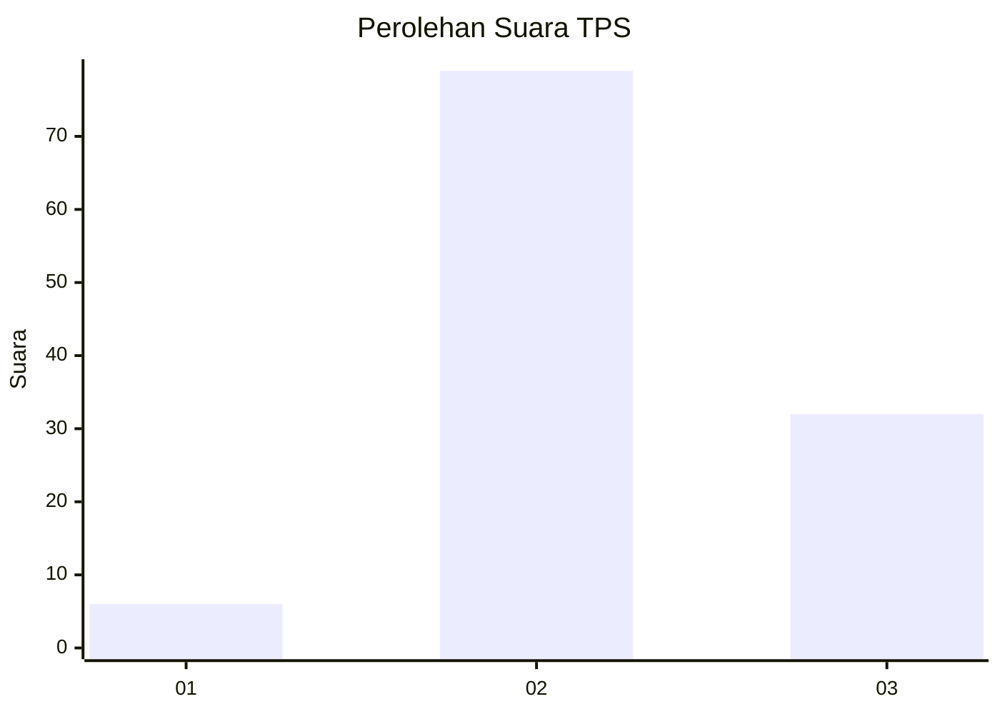
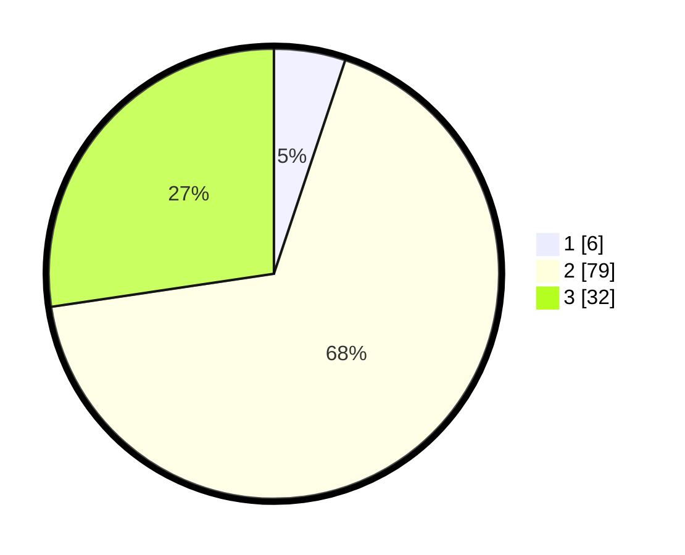

# Hasil

## Grafik

## Tabel

| No. | Nama Paslon    | Suara | Suara (raw) | Persentase |
|:--- |:-------------- | -----:| -----------:| ----------:|
| 1   | ANIES MUHAIMIN | 6     | [6][p-1]    | 5,13       |
| 2   | PRABOWO GIBRAN | 79    | [79][p-2]   | 67,52      |
| 3   | GANJAR MAHFUD  | 32    | [32][p-3]   | 27,35      |

[p-1]: https://github.com/gigit-pemilu/pemilu-2024-33-jawa-tengah/blob/main/pilpres/hitung-suara/sub/33-jawa-tengah/sub/12-wonogiri/sub/18-bulukerto/sub/2007-tanjung/sub/010-tps/sub/paslon-1.txt
[p-2]: https://github.com/gigit-pemilu/pemilu-2024-33-jawa-tengah/blob/main/pilpres/hitung-suara/sub/33-jawa-tengah/sub/12-wonogiri/sub/18-bulukerto/sub/2007-tanjung/sub/010-tps/sub/paslon-2.txt
[p-3]: https://github.com/gigit-pemilu/pemilu-2024-33-jawa-tengah/blob/main/pilpres/hitung-suara/sub/33-jawa-tengah/sub/12-wonogiri/sub/18-bulukerto/sub/2007-tanjung/sub/010-tps/sub/paslon-3.txt

## Foto C Plano

https://sirekap-obj-formc.kpu.go.id/4622/pemilu/ppwp/33/12/18/20/07/3312182007010-20240215-011643--cc5914e9-d6f8-4504-a534-ae530a2fceea.jpg

https://sirekap-obj-formc.kpu.go.id/4622/pemilu/ppwp/33/12/18/20/07/3312182007010-20240218-141011--70858e39-cd02-4341-85b5-31540a3733fb.jpg

https://sirekap-obj-formc.kpu.go.id/4622/pemilu/ppwp/33/12/18/20/07/3312182007010-20240218-051554--9e298a89-4fdd-4cfd-b466-7226705f200a.jpg

## Metadata

| Key        | Value               |
| ---------- | ------------------- |
| Time Stamp | 2024-02-19 23:00:00 |

