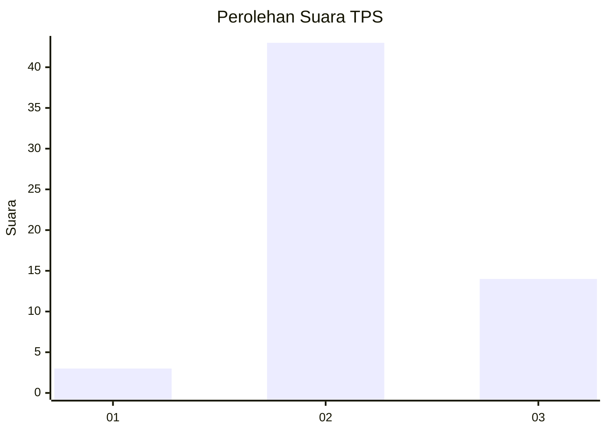
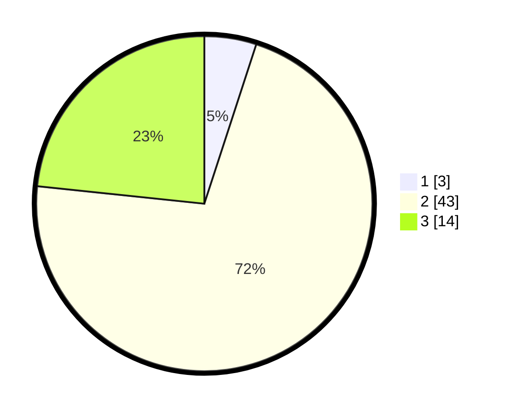

# Hasil

## Grafik

## Tabel

| No. | Nama Paslon    | Suara | Suara (raw) | Persentase |
|:--- |:-------------- | -----:| -----------:| ----------:|
| 1   | ANIES MUHAIMIN | 3     | [3][p-1]    | 5,00       |
| 2   | PRABOWO GIBRAN | 43    | [43][p-2]   | 71,67      |
| 3   | GANJAR MAHFUD  | 14    | [14][p-3]   | 23,33      |

[p-1]: https://github.com/gigit-pemilu/pemilu-2024/blob/main/pilpres/hitung-suara/sub/33-jawa-tengah/sub/12-wonogiri/sub/18-bulukerto/sub/2008-sugihan/sub/005-tps/sub/paslon-1.txt
[p-2]: https://github.com/gigit-pemilu/pemilu-2024/blob/main/pilpres/hitung-suara/sub/33-jawa-tengah/sub/12-wonogiri/sub/18-bulukerto/sub/2008-sugihan/sub/005-tps/sub/paslon-2.txt
[p-3]: https://github.com/gigit-pemilu/pemilu-2024/blob/main/pilpres/hitung-suara/sub/33-jawa-tengah/sub/12-wonogiri/sub/18-bulukerto/sub/2008-sugihan/sub/005-tps/sub/paslon-3.txt

## Foto C Plano

https://sirekap-obj-formc.kpu.go.id/d34b/pemilu/ppwp/33/12/18/20/08/3312182008005-20240218-065454--ba5164fd-c7ef-4319-a864-e9ed845ef1e6.jpg

https://sirekap-obj-formc.kpu.go.id/d34b/pemilu/ppwp/33/12/18/20/08/3312182008005-20240218-115654--02cff6cb-0665-4522-9ac5-0450ee213e5b.jpg

https://sirekap-obj-formc.kpu.go.id/d34b/pemilu/ppwp/33/12/18/20/08/3312182008005-20240218-114953--ea0d89d3-42f3-40d6-a910-c84dee2f0df6.jpg

## Metadata

| Key        | Value               |
| ---------- | ------------------- |
| Time Stamp | 2024-02-25 16:00:00 |

