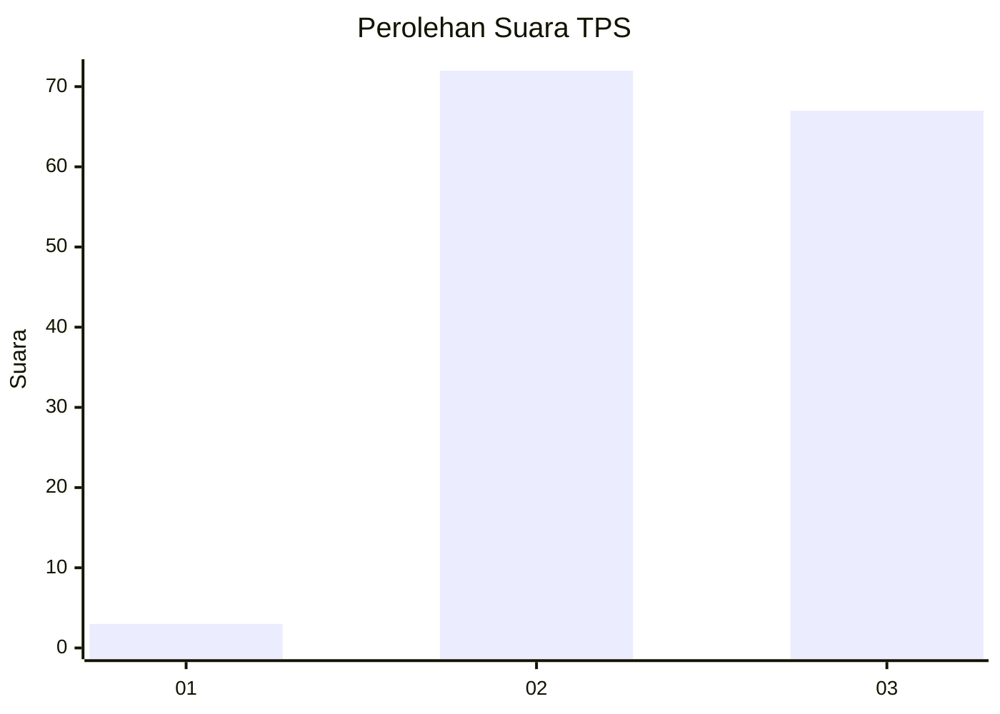
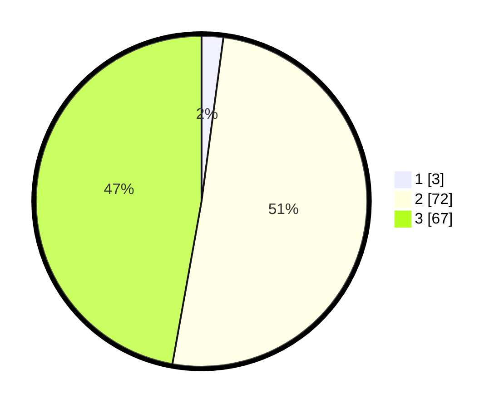

# Hasil

## Grafik

## Tabel

| No. | Nama Paslon    | Suara | Suara (raw) | Persentase |
|:--- |:-------------- | -----:| -----------:| ----------:|
| 1   | ANIES MUHAIMIN | 3     | [3][p-1]    | 2,11       |
| 2   | PRABOWO GIBRAN | 72    | [72][p-2]   | 50,70      |
| 3   | GANJAR MAHFUD  | 67    | [67][p-3]   | 47,18      |

[p-1]: https://github.com/gigit-pemilu/pemilu-2024/blob/main/pilpres/hitung-suara/sub/33-jawa-tengah/sub/12-wonogiri/sub/18-bulukerto/sub/2009-conto/sub/001-tps/sub/paslon-1.txt
[p-2]: https://github.com/gigit-pemilu/pemilu-2024/blob/main/pilpres/hitung-suara/sub/33-jawa-tengah/sub/12-wonogiri/sub/18-bulukerto/sub/2009-conto/sub/001-tps/sub/paslon-2.txt
[p-3]: https://github.com/gigit-pemilu/pemilu-2024/blob/main/pilpres/hitung-suara/sub/33-jawa-tengah/sub/12-wonogiri/sub/18-bulukerto/sub/2009-conto/sub/001-tps/sub/paslon-3.txt

## Foto C Plano

https://sirekap-obj-formc.kpu.go.id/8363/pemilu/ppwp/33/12/18/20/09/3312182009001-20240218-132235--83f793a4-7837-48ce-9f42-8d350c01d5e6.jpg

https://sirekap-obj-formc.kpu.go.id/8363/pemilu/ppwp/33/12/18/20/09/3312182009001-20240218-132239--01f49d03-62e1-4636-83d2-81b49d606319.jpg

https://sirekap-obj-formc.kpu.go.id/8363/pemilu/ppwp/33/12/18/20/09/3312182009001-20240218-132244--24ba9cfb-ae13-4f15-afbd-441301a5ccf3.jpg

## Metadata

| Key        | Value               |
| ---------- | ------------------- |
| Time Stamp | 2024-02-25 14:00:00 |

