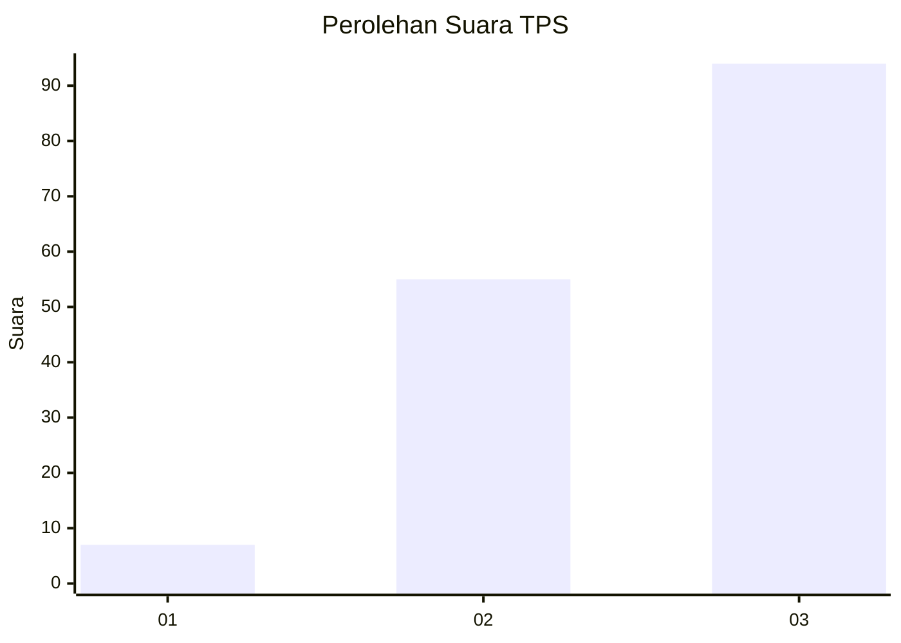
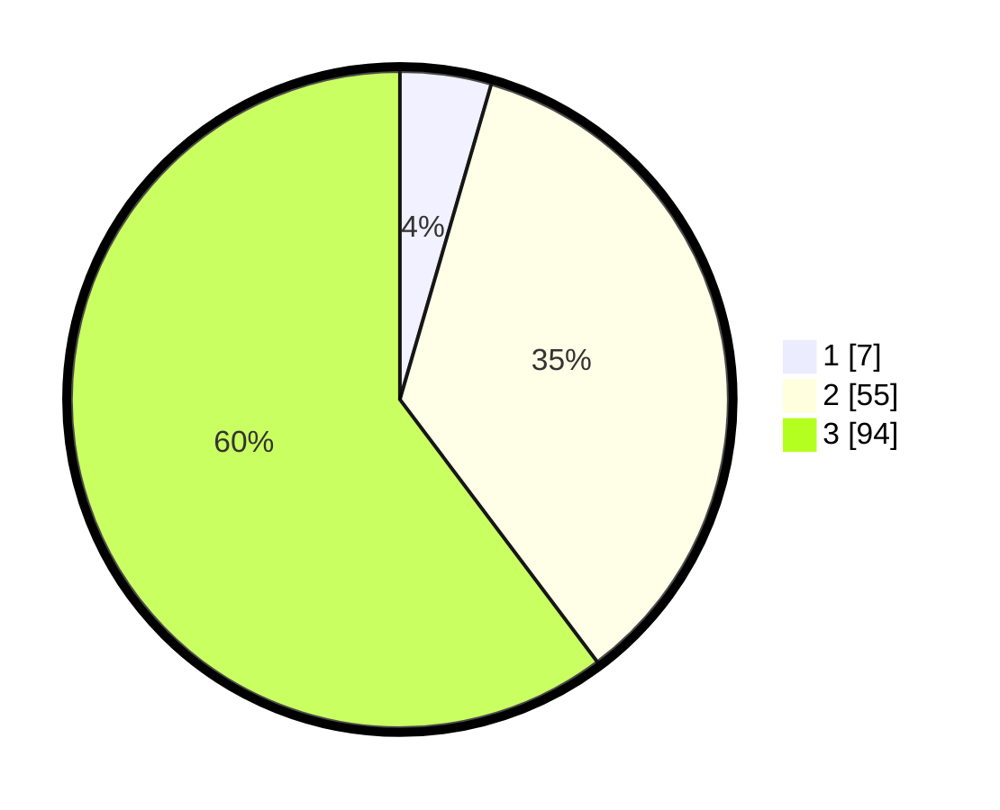

# Hasil

## Grafik

## Tabel

| No. | Nama Paslon    | Suara | Suara (raw) | Persentase |
|:--- |:-------------- | -----:| -----------:| ----------:|
| 1   | ANIES MUHAIMIN | 7     | [7][p-1]    | 4,49       |
| 2   | PRABOWO GIBRAN | 55    | [55][p-2]   | 35,26      |
| 3   | GANJAR MAHFUD  | 94    | [94][p-3]   | 60,26      |

[p-1]: https://github.com/gigit-pemilu/pemilu-2024-33-jawa-tengah/blob/main/pilpres/hitung-suara/sub/33-jawa-tengah/sub/12-wonogiri/sub/18-bulukerto/sub/2009-conto/sub/006-tps/sub/paslon-1.txt
[p-2]: https://github.com/gigit-pemilu/pemilu-2024-33-jawa-tengah/blob/main/pilpres/hitung-suara/sub/33-jawa-tengah/sub/12-wonogiri/sub/18-bulukerto/sub/2009-conto/sub/006-tps/sub/paslon-2.txt
[p-3]: https://github.com/gigit-pemilu/pemilu-2024-33-jawa-tengah/blob/main/pilpres/hitung-suara/sub/33-jawa-tengah/sub/12-wonogiri/sub/18-bulukerto/sub/2009-conto/sub/006-tps/sub/paslon-3.txt

## Foto C Plano

https://sirekap-obj-formc.kpu.go.id/12db/pemilu/ppwp/33/12/18/20/09/3312182009006-20240214-212619--ba0d692a-ca99-4303-94a2-ea4cba617822.jpg

https://sirekap-obj-formc.kpu.go.id/12db/pemilu/ppwp/33/12/18/20/09/3312182009006-20240214-212636--6fa3cba5-ded1-464a-be79-83d8528ea222.jpg

https://sirekap-obj-formc.kpu.go.id/12db/pemilu/ppwp/33/12/18/20/09/3312182009006-20240216-103802--f0fa5e7e-dfd5-46b2-afe2-f7fd97faaee0.jpg

## Metadata

| Key        | Value               |
| ---------- | ------------------- |
| Time Stamp | 2024-02-16 11:00:29 |

