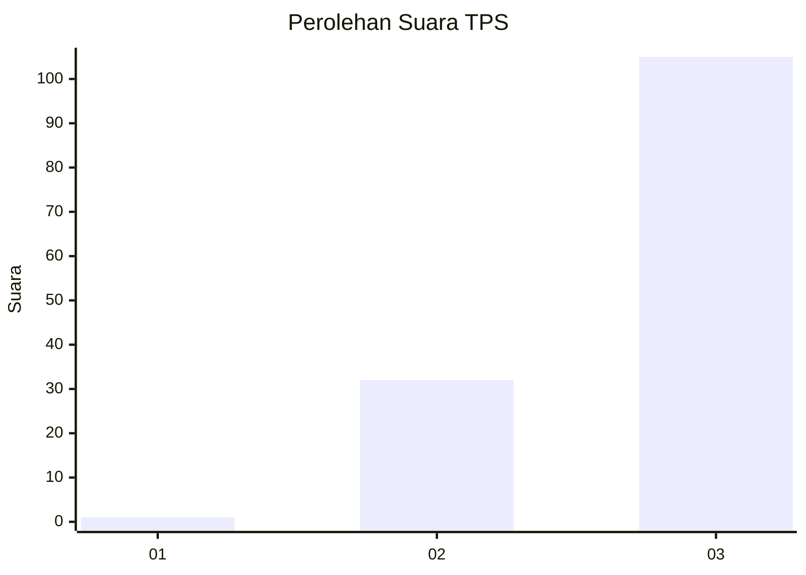
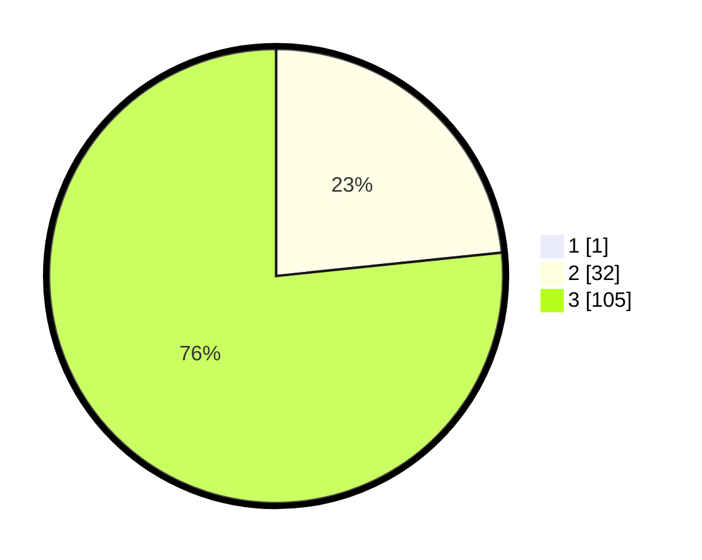

# Hasil

## Grafik

## Tabel

| No. | Nama Paslon    | Suara | Suara (raw) | Persentase |
|:--- |:-------------- | -----:| -----------:| ----------:|
| 1   | ANIES MUHAIMIN | 1     | [1][p-1]    | 0,72       |
| 2   | PRABOWO GIBRAN | 32    | [32][p-2]   | 23,19      |
| 3   | GANJAR MAHFUD  | 105   | [105][p-3]  | 76,09      |

[p-1]: https://github.com/gigit-pemilu/pemilu-2024/blob/main/pilpres/hitung-suara/sub/33-jawa-tengah/sub/12-wonogiri/sub/18-bulukerto/sub/2010-geneng/sub/007-tps/sub/paslon-1.txt
[p-2]: https://github.com/gigit-pemilu/pemilu-2024/blob/main/pilpres/hitung-suara/sub/33-jawa-tengah/sub/12-wonogiri/sub/18-bulukerto/sub/2010-geneng/sub/007-tps/sub/paslon-2.txt
[p-3]: https://github.com/gigit-pemilu/pemilu-2024/blob/main/pilpres/hitung-suara/sub/33-jawa-tengah/sub/12-wonogiri/sub/18-bulukerto/sub/2010-geneng/sub/007-tps/sub/paslon-3.txt

## Foto C Plano

https://sirekap-obj-formc.kpu.go.id/4cb4/pemilu/ppwp/33/12/18/20/10/3312182010007-20240217-102314--39f89a31-3b15-49ab-95e2-7afff4f365c3.jpg

https://sirekap-obj-formc.kpu.go.id/4cb4/pemilu/ppwp/33/12/18/20/10/3312182010007-20240217-102752--ba4753b3-3891-45d7-8322-47b9070ccf67.jpg

https://sirekap-obj-formc.kpu.go.id/4cb4/pemilu/ppwp/33/12/18/20/10/3312182010007-20240217-103010--a92ddb15-a1fb-4e72-833b-0538396818d8.jpg

## Metadata

| Key        | Value               |
| ---------- | ------------------- |
| Time Stamp | 2024-02-24 22:31:28 |

