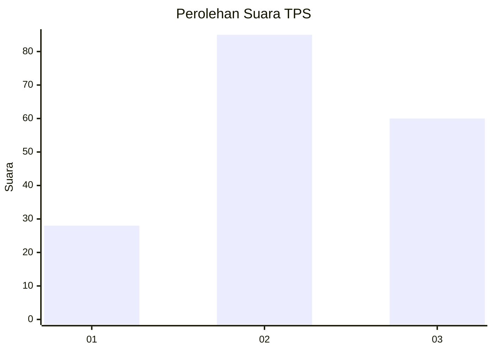
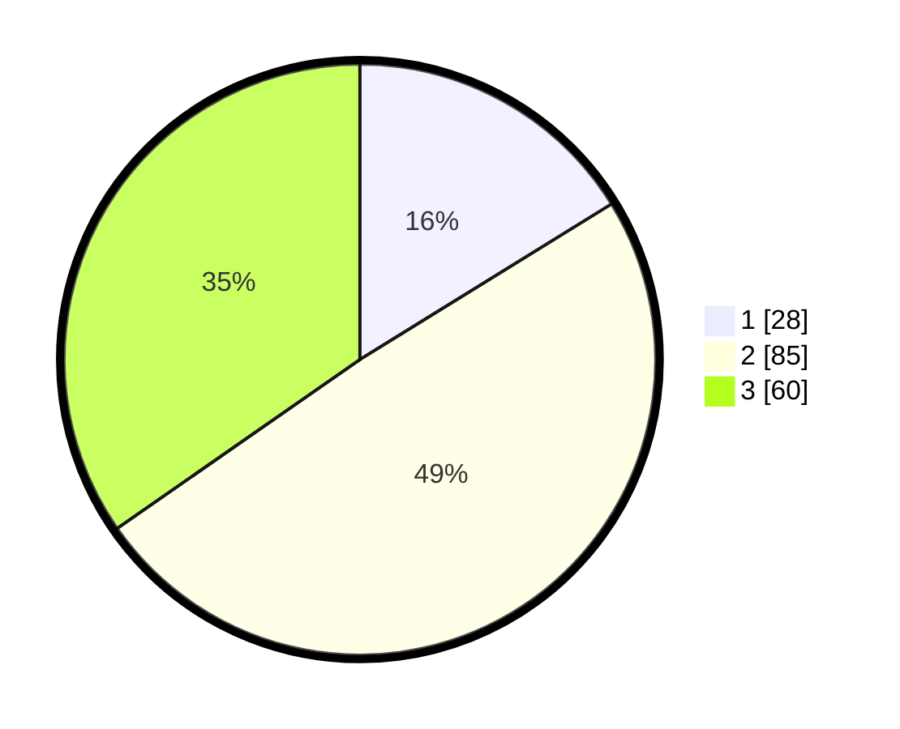

# Hasil

## Grafik

## Tabel

| No. | Nama Paslon    | Suara | Suara (raw) | Persentase |
|:--- |:-------------- | -----:| -----------:| ----------:|
| 1   | ANIES MUHAIMIN | 28    | [28][p-1]   | 16,18      |
| 2   | PRABOWO GIBRAN | 85    | [85][p-2]   | 49,13      |
| 3   | GANJAR MAHFUD  | 60    | [60][p-3]   | 34,68      |

[p-1]: https://github.com/gigit-pemilu/pemilu-2024-33-jawa-tengah/blob/main/pilpres/hitung-suara/sub/33-jawa-tengah/sub/12-wonogiri/sub/19-slogohimo/sub/1008-bulusari/sub/001-tps/sub/paslon-1.txt
[p-2]: https://github.com/gigit-pemilu/pemilu-2024-33-jawa-tengah/blob/main/pilpres/hitung-suara/sub/33-jawa-tengah/sub/12-wonogiri/sub/19-slogohimo/sub/1008-bulusari/sub/001-tps/sub/paslon-2.txt
[p-3]: https://github.com/gigit-pemilu/pemilu-2024-33-jawa-tengah/blob/main/pilpres/hitung-suara/sub/33-jawa-tengah/sub/12-wonogiri/sub/19-slogohimo/sub/1008-bulusari/sub/001-tps/sub/paslon-3.txt

## Foto C Plano

https://sirekap-obj-formc.kpu.go.id/0600/pemilu/ppwp/33/12/19/10/08/3312191008001-20240316-141721--ee826b3c-dd56-434e-afd3-4025d6005fd9.jpg

https://sirekap-obj-formc.kpu.go.id/0600/pemilu/ppwp/33/12/19/10/08/3312191008001-20240217-101243--2dba85f0-0e8d-4be2-846d-8c4aca75ceb9.jpg

https://sirekap-obj-formc.kpu.go.id/0600/pemilu/ppwp/33/12/19/10/08/3312191008001-20240217-095555--8505821c-efe4-41e8-9a43-f70d599e1f96.jpg

## Metadata

| Key        | Value               |
| ---------- | ------------------- |
| Time Stamp | 2024-03-16 14:30:00 |

