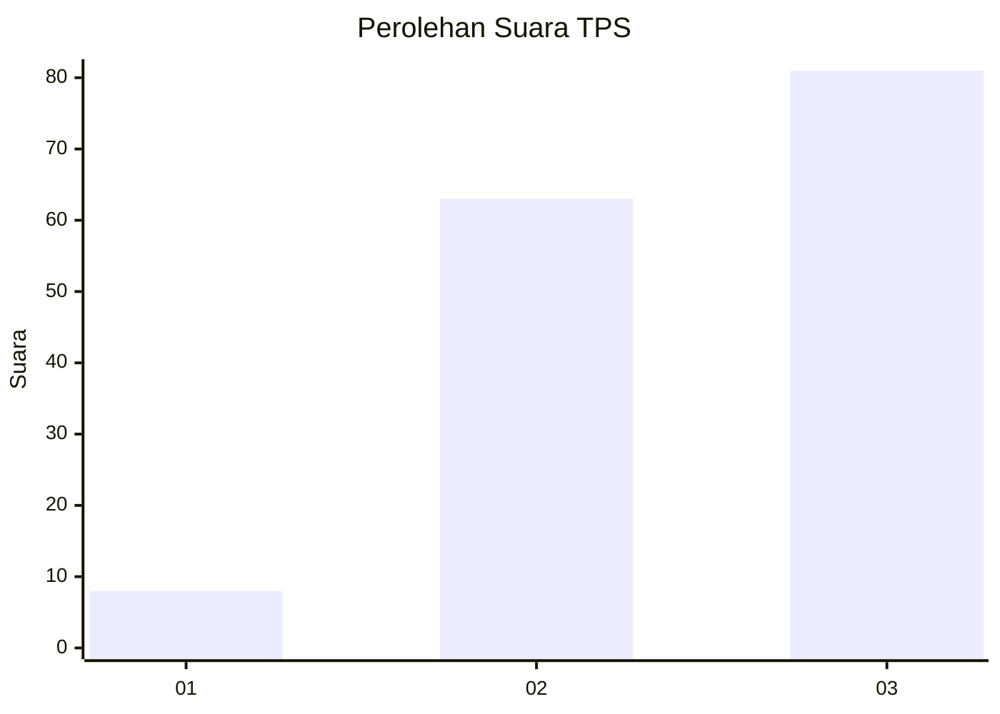
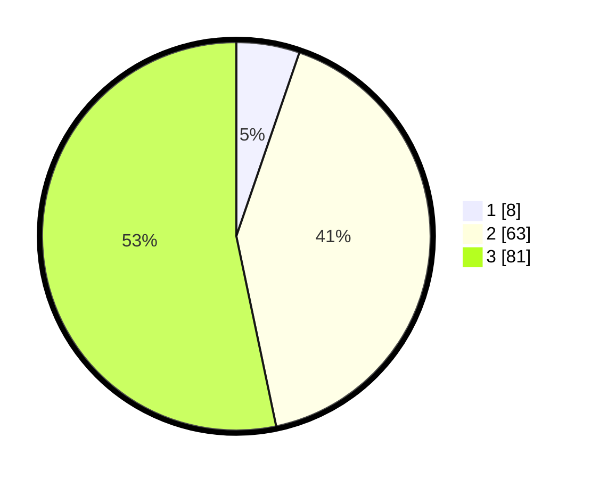

# Hasil

## Grafik

## Tabel

| No. | Nama Paslon    | Suara | Suara (raw) | Persentase |
|:--- |:-------------- | -----:| -----------:| ----------:|
| 1   | ANIES MUHAIMIN | 8     | [8][p-1]    | 5,26       |
| 2   | PRABOWO GIBRAN | 63    | [63][p-2]   | 41,45      |
| 3   | GANJAR MAHFUD  | 81    | [81][p-3]   | 53,29      |

[p-1]: https://github.com/gigit-pemilu/pemilu-2024/blob/main/pilpres/hitung-suara/sub/33-jawa-tengah/sub/12-wonogiri/sub/19-slogohimo/sub/1008-bulusari/sub/013-tps/sub/paslon-1.txt
[p-2]: https://github.com/gigit-pemilu/pemilu-2024/blob/main/pilpres/hitung-suara/sub/33-jawa-tengah/sub/12-wonogiri/sub/19-slogohimo/sub/1008-bulusari/sub/013-tps/sub/paslon-2.txt
[p-3]: https://github.com/gigit-pemilu/pemilu-2024/blob/main/pilpres/hitung-suara/sub/33-jawa-tengah/sub/12-wonogiri/sub/19-slogohimo/sub/1008-bulusari/sub/013-tps/sub/paslon-3.txt

## Foto C Plano

https://sirekap-obj-formc.kpu.go.id/5771/pemilu/ppwp/33/12/19/10/08/3312191008013-20240218-165004--f3a756bb-6cec-4d49-baf4-9e139c16df9f.jpg

https://sirekap-obj-formc.kpu.go.id/5771/pemilu/ppwp/33/12/19/10/08/3312191008013-20240218-163159--6eed9cae-c9f1-492f-8b15-f89898de0a8a.jpg

https://sirekap-obj-formc.kpu.go.id/5771/pemilu/ppwp/33/12/19/10/08/3312191008013-20240218-165131--0d9d5553-6a07-4838-8fb7-99c0c1afbceb.jpg

## Metadata

| Key        | Value               |
| ---------- | ------------------- |
| Time Stamp | 2024-02-19 06:16:00 |

