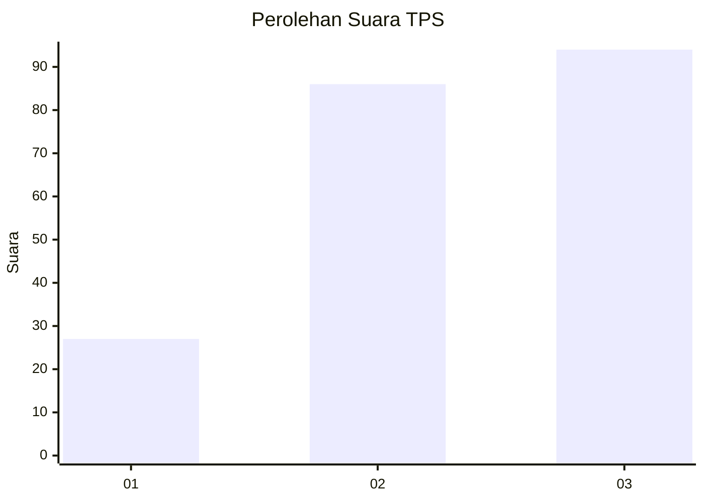
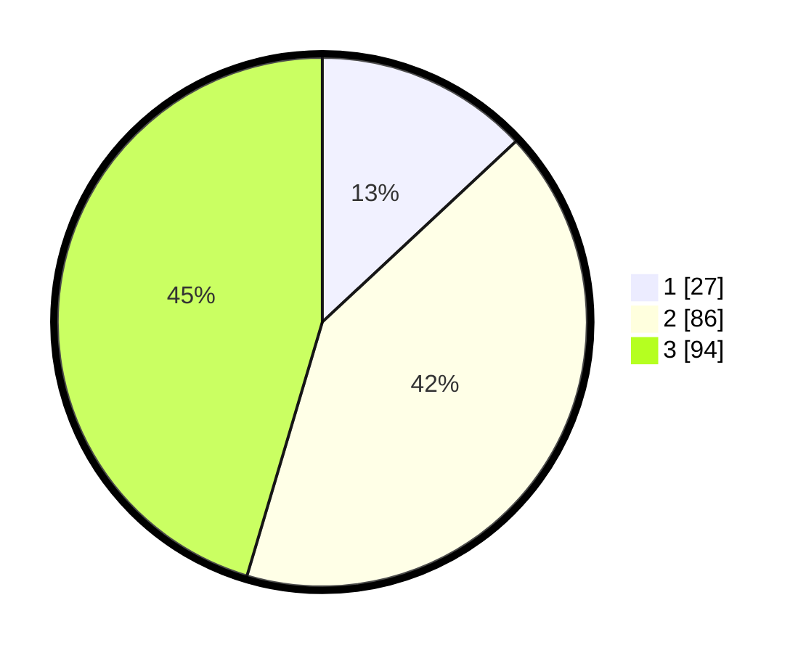

# Hasil

## Grafik

## Tabel

| No. | Nama Paslon    | Suara | Suara (raw) | Persentase |
|:--- |:-------------- | -----:| -----------:| ----------:|
| 1   | ANIES MUHAIMIN | 27    | [27][p-1]   | 13,04      |
| 2   | PRABOWO GIBRAN | 86    | [86][p-2]   | 41,55      |
| 3   | GANJAR MAHFUD  | 94    | [94][p-3]   | 45,41      |

[p-1]: https://github.com/gigit-pemilu/pemilu-2024-33-jawa-tengah/blob/main/pilpres/hitung-suara/sub/33-jawa-tengah/sub/12-wonogiri/sub/19-slogohimo/sub/2003-sambirejo/sub/005-tps/sub/paslon-1.txt
[p-2]: https://github.com/gigit-pemilu/pemilu-2024-33-jawa-tengah/blob/main/pilpres/hitung-suara/sub/33-jawa-tengah/sub/12-wonogiri/sub/19-slogohimo/sub/2003-sambirejo/sub/005-tps/sub/paslon-2.txt
[p-3]: https://github.com/gigit-pemilu/pemilu-2024-33-jawa-tengah/blob/main/pilpres/hitung-suara/sub/33-jawa-tengah/sub/12-wonogiri/sub/19-slogohimo/sub/2003-sambirejo/sub/005-tps/sub/paslon-3.txt

## Foto C Plano

https://sirekap-obj-formc.kpu.go.id/bc26/pemilu/ppwp/33/12/19/20/03/3312192003005-20240316-184027--bc7e7c5b-4cbb-405e-acd2-b394bcead260.jpg

https://sirekap-obj-formc.kpu.go.id/bc26/pemilu/ppwp/33/12/19/20/03/3312192003005-20240316-184111--2c5807a8-b564-45a4-ae73-42ccaab8b66f.jpg

https://sirekap-obj-formc.kpu.go.id/bc26/pemilu/ppwp/33/12/19/20/03/3312192003005-20240316-184252--7e9a6555-3a9f-4889-9832-7716c22c0128.jpg

## Metadata

| Key        | Value               |
| ---------- | ------------------- |
| Time Stamp | 2024-03-16 19:00:00 |

## DATA PEMILIH TETAP

Jumlah pemilih dalam DPT: **730**.
 * L: **444**.
 * P: **372**.

## DATA PENGGUNA HAK PILIH

Jumlah pengguna hak pilih dalam DPT: **80**.
 * L: **444**.
 * P: **52**.

Jumlah pengguna hak pilih dalam DPTb: **20**.
 * L: **464**.
 * P: **4**.

Jumlah pengguna hak pilih dalam DPK: **10**.
 * L: **444**.
 * P: **4**.

Jumlah pengguna hak pilih: **110**.
 * L: **444**.
 * P: **54**.

## JUMLAH SUARA SAH DAN TIDAK SAH

JUMLAH SELURUH SUARA SAH: **206**.

JUMLAH SUARA TIDAK SAH: **5**.

JUMLAH SELURUH SUARA SAH DAN SUARA TIDAK SAH: **211**.

