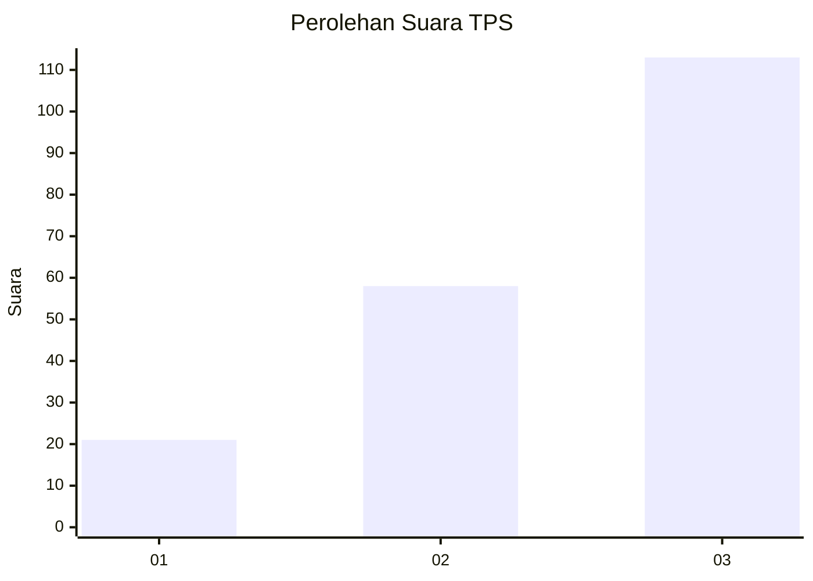
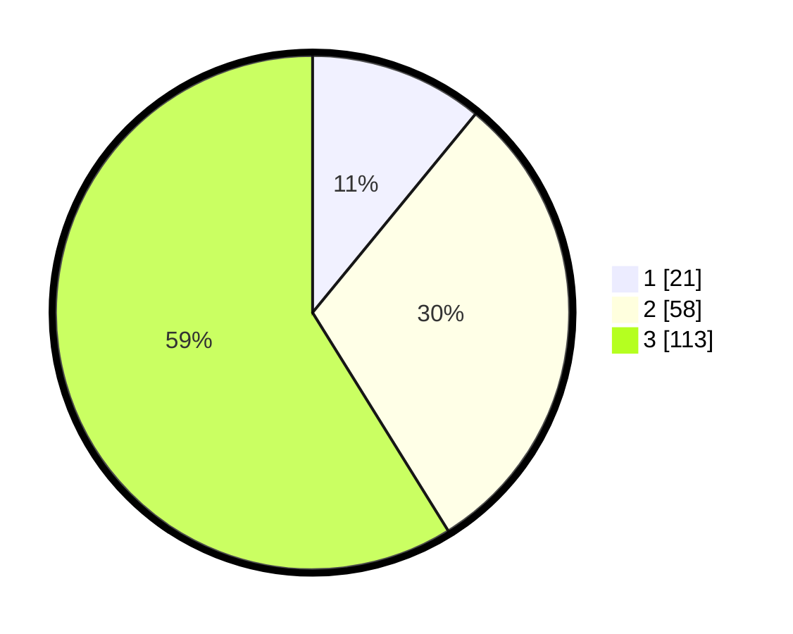

# Hasil

## Grafik

## Tabel

| No. | Nama Paslon    | Suara | Suara (raw) | Persentase |
|:--- |:-------------- | -----:| -----------:| ----------:|
| 1   | ANIES MUHAIMIN | 21    | [21][p-1]   | 10,94      |
| 2   | PRABOWO GIBRAN | 58    | [58][p-2]   | 30,21      |
| 3   | GANJAR MAHFUD  | 113   | [113][p-3]  | 58,85      |

[p-1]: https://github.com/gigit-pemilu/pemilu-2024-33-jawa-tengah/blob/main/pilpres/hitung-suara/sub/33-jawa-tengah/sub/12-wonogiri/sub/19-slogohimo/sub/2003-sambirejo/sub/009-tps/sub/paslon-1.txt
[p-2]: https://github.com/gigit-pemilu/pemilu-2024-33-jawa-tengah/blob/main/pilpres/hitung-suara/sub/33-jawa-tengah/sub/12-wonogiri/sub/19-slogohimo/sub/2003-sambirejo/sub/009-tps/sub/paslon-2.txt
[p-3]: https://github.com/gigit-pemilu/pemilu-2024-33-jawa-tengah/blob/main/pilpres/hitung-suara/sub/33-jawa-tengah/sub/12-wonogiri/sub/19-slogohimo/sub/2003-sambirejo/sub/009-tps/sub/paslon-3.txt

## Foto C Plano

https://sirekap-obj-formc.kpu.go.id/fa8f/pemilu/ppwp/33/12/19/20/03/3312192003009-20240316-105140--d8675416-112d-40f1-8823-95f300b7bf9f.jpg

https://sirekap-obj-formc.kpu.go.id/fa8f/pemilu/ppwp/33/12/19/20/03/3312192003009-20240316-105255--9bbb4ef0-82e6-4035-918f-52c1228885eb.jpg

https://sirekap-obj-formc.kpu.go.id/fa8f/pemilu/ppwp/33/12/19/20/03/3312192003009-20240316-105441--3b7c84ac-282c-461c-ac2c-5d41c5718a0f.jpg

## Metadata

| Key        | Value               |
| ---------- | ------------------- |
| Time Stamp | 2024-03-16 11:00:00 |

