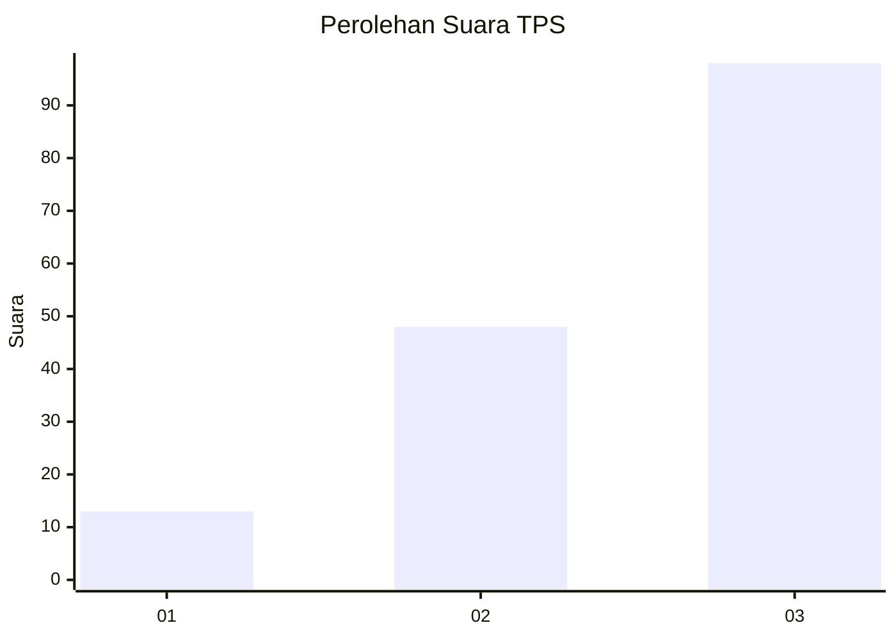
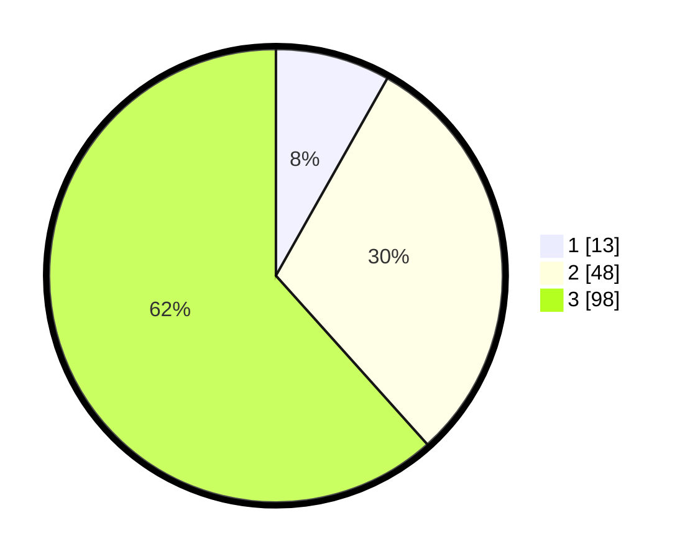

# Hasil

## Grafik

## Tabel

| No. | Nama Paslon    | Suara | Suara (raw) | Persentase |
|:--- |:-------------- | -----:| -----------:| ----------:|
| 1   | ANIES MUHAIMIN | 13    | [13][p-1]   | 8,18       |
| 2   | PRABOWO GIBRAN | 48    | [48][p-2]   | 30,19      |
| 3   | GANJAR MAHFUD  | 98    | [98][p-3]   | 61,64      |

[p-1]: https://github.com/gigit-pemilu/pemilu-2024/blob/main/pilpres/hitung-suara/sub/33-jawa-tengah/sub/12-wonogiri/sub/19-slogohimo/sub/2006-tunggur/sub/004-tps/sub/paslon-1.txt
[p-2]: https://github.com/gigit-pemilu/pemilu-2024/blob/main/pilpres/hitung-suara/sub/33-jawa-tengah/sub/12-wonogiri/sub/19-slogohimo/sub/2006-tunggur/sub/004-tps/sub/paslon-2.txt
[p-3]: https://github.com/gigit-pemilu/pemilu-2024/blob/main/pilpres/hitung-suara/sub/33-jawa-tengah/sub/12-wonogiri/sub/19-slogohimo/sub/2006-tunggur/sub/004-tps/sub/paslon-3.txt

## Foto C Plano

https://sirekap-obj-formc.kpu.go.id/0e53/pemilu/ppwp/33/12/19/20/06/3312192006004-20240214-160109--2ae43c19-f341-4063-a682-0f1594cb3a88.jpg

https://sirekap-obj-formc.kpu.go.id/0e53/pemilu/ppwp/33/12/19/20/06/3312192006004-20240214-155200--5b9cbb27-8f1b-4456-bb53-37f76bbdb716.jpg

https://sirekap-obj-formc.kpu.go.id/0e53/pemilu/ppwp/33/12/19/20/06/3312192006004-20240216-140056--078a3258-d008-4d03-80fe-f94677238489.jpg

## Metadata

| Key        | Value               |
| ---------- | ------------------- |
| Time Stamp | 2024-02-16 14:30:33 |

