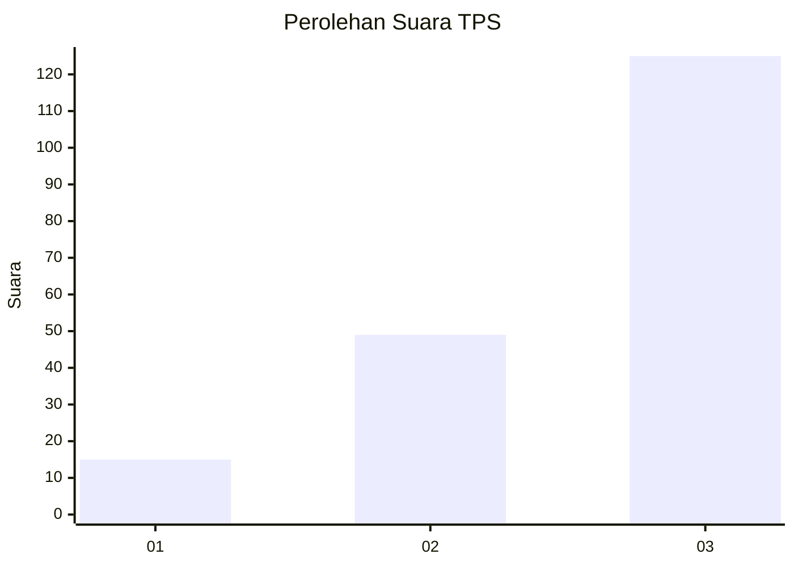
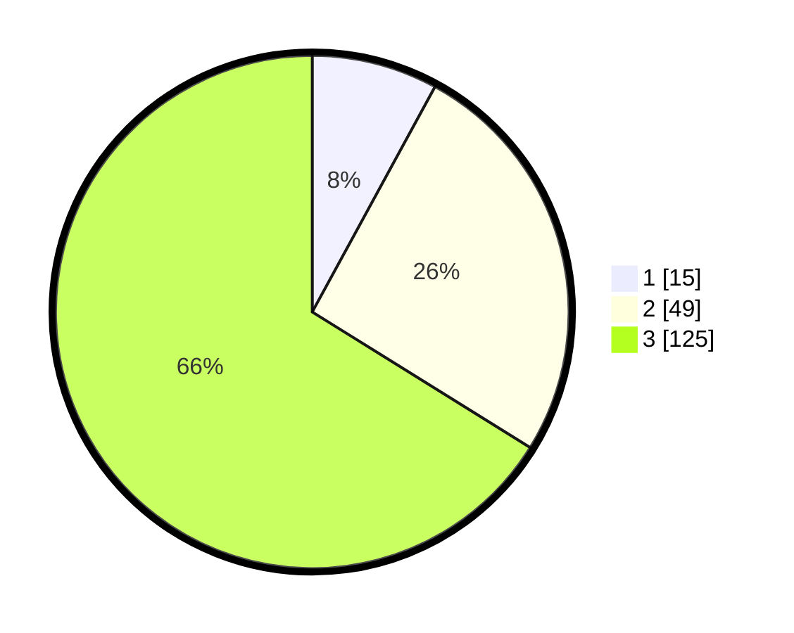

# Hasil

## Grafik

## Tabel

| No. | Nama Paslon    | Suara | Suara (raw) | Persentase |
|:--- |:-------------- | -----:| -----------:| ----------:|
| 1   | ANIES MUHAIMIN | 15    | [15][p-1]   | 7,94       |
| 2   | PRABOWO GIBRAN | 49    | [49][p-2]   | 25,93      |
| 3   | GANJAR MAHFUD  | 125   | [125][p-3]  | 66,14      |

[p-1]: https://github.com/gigit-pemilu/pemilu-2024/blob/main/pilpres/hitung-suara/sub/33-jawa-tengah/sub/12-wonogiri/sub/19-slogohimo/sub/2007-waru/sub/004-tps/sub/paslon-1.txt
[p-2]: https://github.com/gigit-pemilu/pemilu-2024/blob/main/pilpres/hitung-suara/sub/33-jawa-tengah/sub/12-wonogiri/sub/19-slogohimo/sub/2007-waru/sub/004-tps/sub/paslon-2.txt
[p-3]: https://github.com/gigit-pemilu/pemilu-2024/blob/main/pilpres/hitung-suara/sub/33-jawa-tengah/sub/12-wonogiri/sub/19-slogohimo/sub/2007-waru/sub/004-tps/sub/paslon-3.txt

## Foto C Plano

https://sirekap-obj-formc.kpu.go.id/e583/pemilu/ppwp/33/12/19/20/07/3312192007004-20240216-080330--e2fafce1-d2dd-4341-8937-df6ed6a416c1.jpg

https://sirekap-obj-formc.kpu.go.id/e583/pemilu/ppwp/33/12/19/20/07/3312192007004-20240216-080957--ce32e6f8-59d0-43d9-8a6f-d720f6a2c99d.jpg

https://sirekap-obj-formc.kpu.go.id/e583/pemilu/ppwp/33/12/19/20/07/3312192007004-20240216-081556--0d47d203-82d8-42d2-b7de-d79e14495e94.jpg

## Metadata

| Key        | Value               |
| ---------- | ------------------- |
| Time Stamp | 2024-02-16 08:30:27 |

