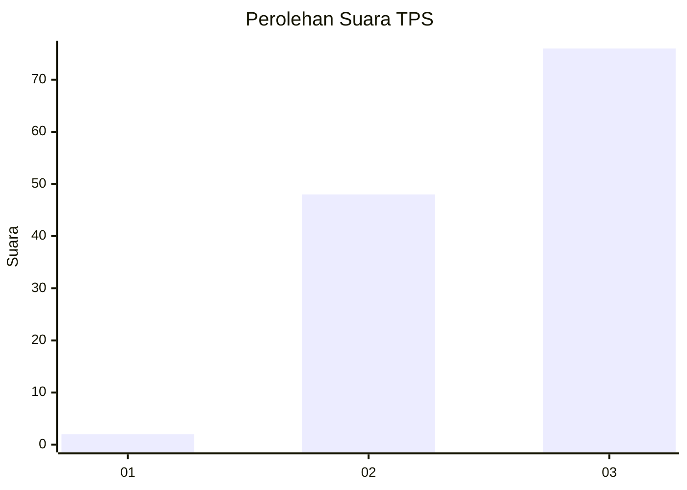
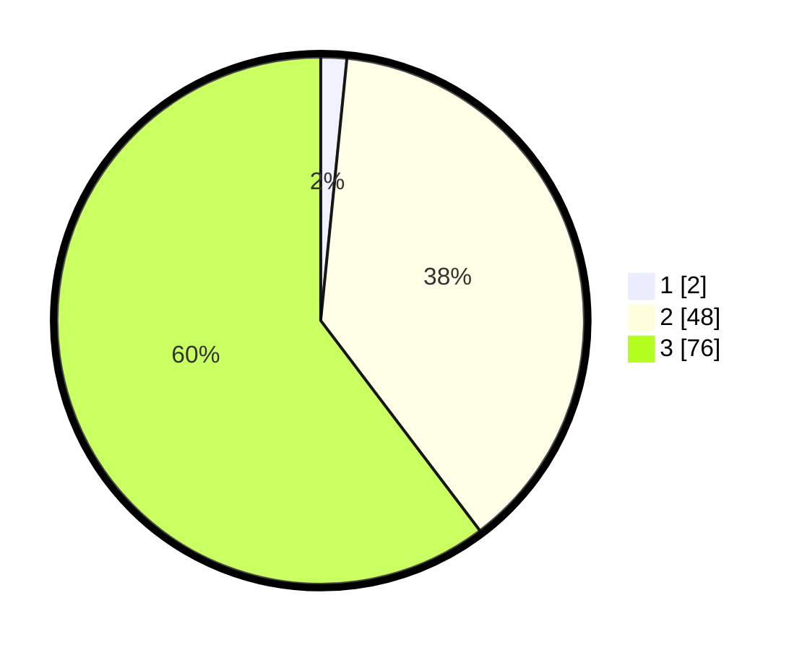

# Hasil

## Grafik

## Tabel

| No. | Nama Paslon    | Suara | Suara (raw) | Persentase |
|:--- |:-------------- | -----:| -----------:| ----------:|
| 1   | ANIES MUHAIMIN | 2     | [2][p-1]    | 1,59       |
| 2   | PRABOWO GIBRAN | 48    | [48][p-2]   | 38,10      |
| 3   | GANJAR MAHFUD  | 76    | [76][p-3]   | 60,32      |

[p-1]: https://github.com/gigit-pemilu/pemilu-2024/blob/main/pilpres/hitung-suara/sub/33-jawa-tengah/sub/12-wonogiri/sub/19-slogohimo/sub/2012-sedayu/sub/010-tps/sub/paslon-1.txt
[p-2]: https://github.com/gigit-pemilu/pemilu-2024/blob/main/pilpres/hitung-suara/sub/33-jawa-tengah/sub/12-wonogiri/sub/19-slogohimo/sub/2012-sedayu/sub/010-tps/sub/paslon-2.txt
[p-3]: https://github.com/gigit-pemilu/pemilu-2024/blob/main/pilpres/hitung-suara/sub/33-jawa-tengah/sub/12-wonogiri/sub/19-slogohimo/sub/2012-sedayu/sub/010-tps/sub/paslon-3.txt

## Foto C Plano

https://sirekap-obj-formc.kpu.go.id/8894/pemilu/ppwp/33/12/19/20/12/3312192012010-20240214-224204--5a348b8b-5a3a-4df5-abfe-c3ec7a393911.jpg

https://sirekap-obj-formc.kpu.go.id/8894/pemilu/ppwp/33/12/19/20/12/3312192012010-20240215-003019--27607378-4483-4763-9ff7-aecb209d6d93.jpg

https://sirekap-obj-formc.kpu.go.id/8894/pemilu/ppwp/33/12/19/20/12/3312192012010-20240215-003149--f4042a94-6759-41f3-bf87-e883a24e6c98.jpg

## Metadata

| Key        | Value               |
| ---------- | ------------------- |
| Time Stamp | 2024-02-16 14:30:33 |

