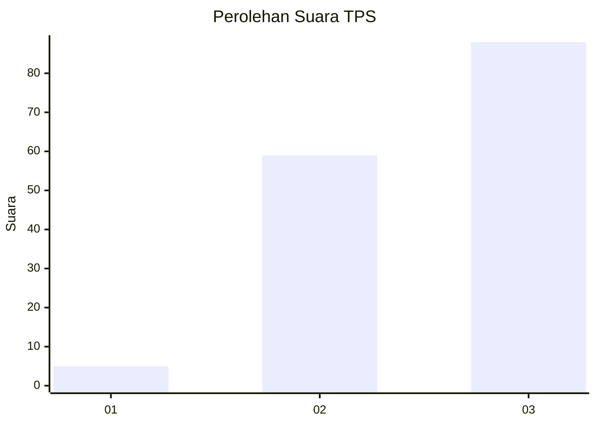
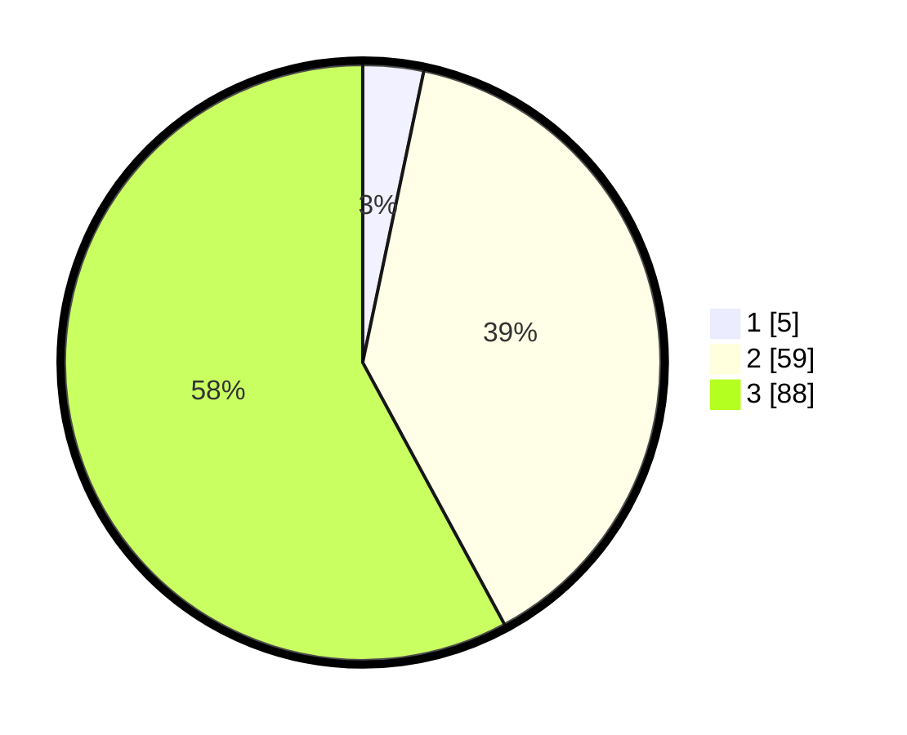

# Hasil

## Grafik

## Tabel

| No. | Nama Paslon    | Suara | Suara (raw) | Persentase |
|:--- |:-------------- | -----:| -----------:| ----------:|
| 1   | ANIES MUHAIMIN | 5     | [5][p-1]    | 3,29       |
| 2   | PRABOWO GIBRAN | 59    | [59][p-2]   | 38,82      |
| 3   | GANJAR MAHFUD  | 88    | [88][p-3]   | 57,89      |

[p-1]: https://github.com/gigit-pemilu/pemilu-2024-33-jawa-tengah/blob/main/pilpres/hitung-suara/sub/33-jawa-tengah/sub/12-wonogiri/sub/19-slogohimo/sub/2017-setren/sub/001-tps/sub/paslon-1.txt
[p-2]: https://github.com/gigit-pemilu/pemilu-2024-33-jawa-tengah/blob/main/pilpres/hitung-suara/sub/33-jawa-tengah/sub/12-wonogiri/sub/19-slogohimo/sub/2017-setren/sub/001-tps/sub/paslon-2.txt
[p-3]: https://github.com/gigit-pemilu/pemilu-2024-33-jawa-tengah/blob/main/pilpres/hitung-suara/sub/33-jawa-tengah/sub/12-wonogiri/sub/19-slogohimo/sub/2017-setren/sub/001-tps/sub/paslon-3.txt

## Foto C Plano

https://sirekap-obj-formc.kpu.go.id/b044/pemilu/ppwp/33/12/19/20/17/3312192017001-20240217-164337--ef5ed515-f1b6-42a6-9d93-161aaf670d35.jpg

https://sirekap-obj-formc.kpu.go.id/b044/pemilu/ppwp/33/12/19/20/17/3312192017001-20240217-163314--7ce4b68f-3136-4119-9ab0-f842f057279c.jpg

https://sirekap-obj-formc.kpu.go.id/b044/pemilu/ppwp/33/12/19/20/17/3312192017001-20240217-174101--ba695151-1f7a-49a4-acd1-67118dc9b726.jpg

## Metadata

| Key        | Value               |
| ---------- | ------------------- |
| Time Stamp | 2024-02-17 18:00:00 |

