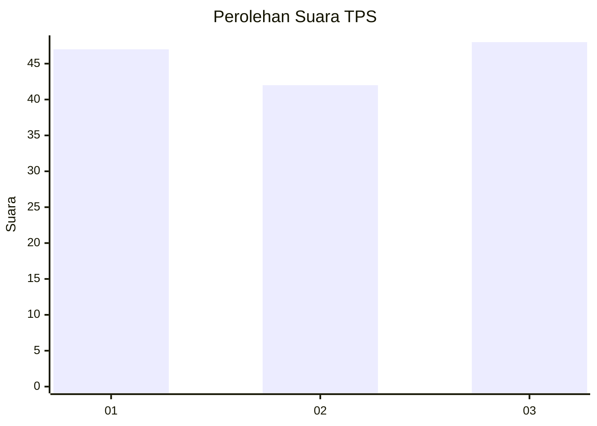
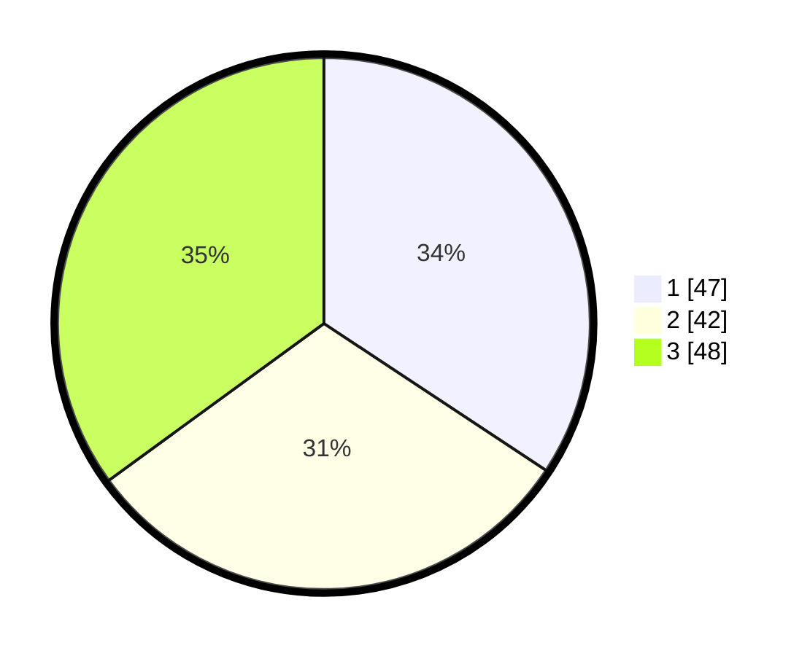

# Hasil

## Grafik

## Tabel

| No. | Nama Paslon    | Suara | Suara (raw) | Persentase |
|:--- |:-------------- | -----:| -----------:| ----------:|
| 1   | ANIES MUHAIMIN | 47    | [47][p-1]   | 34,31      |
| 2   | PRABOWO GIBRAN | 42    | [42][p-2]   | 30,66      |
| 3   | GANJAR MAHFUD  | 48    | [48][p-3]   | 35,04      |

[p-1]: https://github.com/gigit-pemilu/pemilu-2024/blob/main/pilpres/hitung-suara/sub/33-jawa-tengah/sub/12-wonogiri/sub/19-slogohimo/sub/2017-setren/sub/006-tps/sub/paslon-1.txt
[p-2]: https://github.com/gigit-pemilu/pemilu-2024/blob/main/pilpres/hitung-suara/sub/33-jawa-tengah/sub/12-wonogiri/sub/19-slogohimo/sub/2017-setren/sub/006-tps/sub/paslon-2.txt
[p-3]: https://github.com/gigit-pemilu/pemilu-2024/blob/main/pilpres/hitung-suara/sub/33-jawa-tengah/sub/12-wonogiri/sub/19-slogohimo/sub/2017-setren/sub/006-tps/sub/paslon-3.txt

## Foto C Plano

https://sirekap-obj-formc.kpu.go.id/3c5a/pemilu/ppwp/33/12/19/20/17/3312192017006-20240216-112128--d0e317f1-a316-427b-95b3-4d8c6f51a3d5.jpg

https://sirekap-obj-formc.kpu.go.id/3c5a/pemilu/ppwp/33/12/19/20/17/3312192017006-20240216-113247--31e3de98-70db-43bc-9cdd-dde1d65ebfff.jpg

https://sirekap-obj-formc.kpu.go.id/3c5a/pemilu/ppwp/33/12/19/20/17/3312192017006-20240216-112407--5877be8c-29b7-4b6c-a977-f97d98bae9dc.jpg

## Metadata

| Key        | Value               |
| ---------- | ------------------- |
| Time Stamp | 2024-02-16 14:30:33 |

