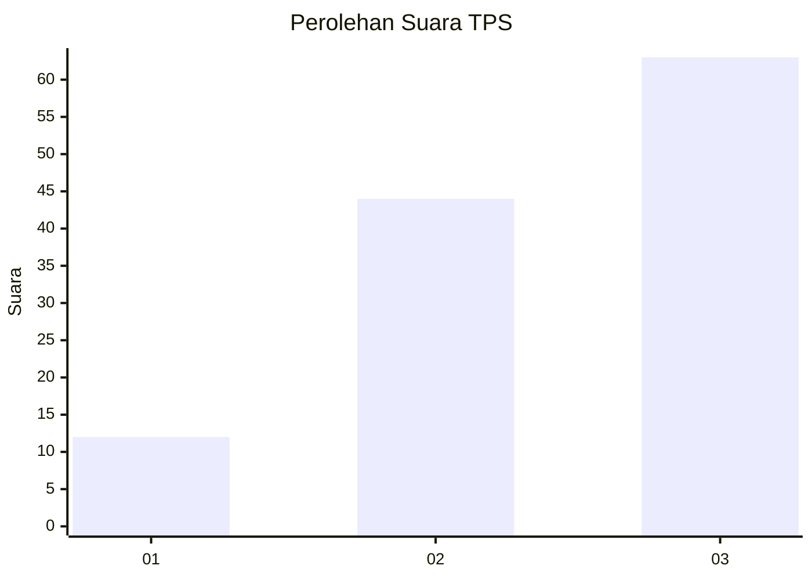
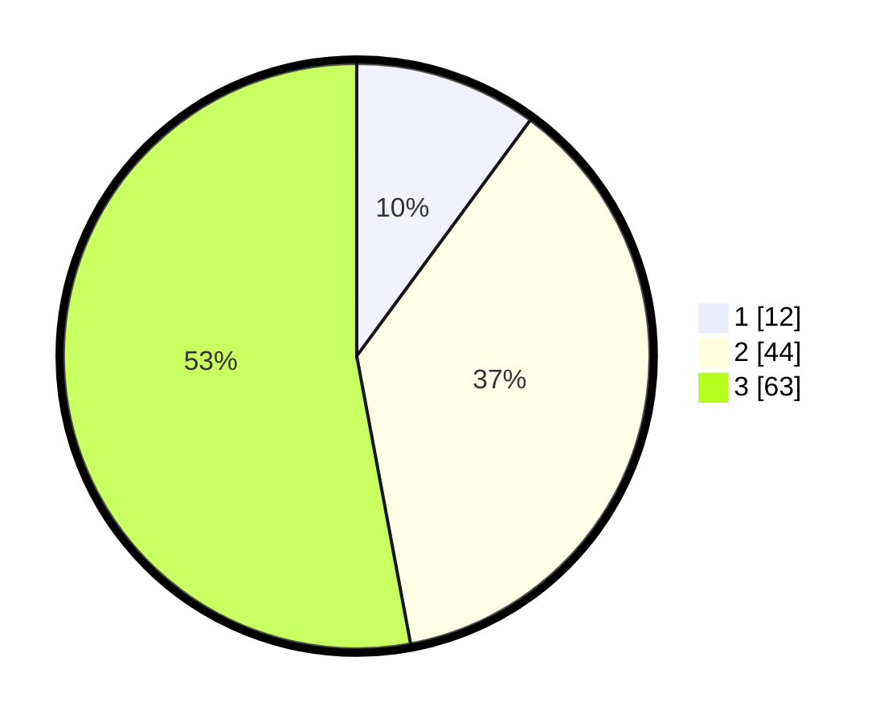

# Hasil

## Grafik

## Tabel

| No. | Nama Paslon    | Suara | Suara (raw) | Persentase |
|:--- |:-------------- | -----:| -----------:| ----------:|
| 1   | ANIES MUHAIMIN | 12    | [12][p-1]   | 10,08      |
| 2   | PRABOWO GIBRAN | 44    | [44][p-2]   | 36,97      |
| 3   | GANJAR MAHFUD  | 63    | [63][p-3]   | 52,94      |

[p-1]: https://github.com/gigit-pemilu/pemilu-2024/blob/main/pilpres/hitung-suara/sub/33-jawa-tengah/sub/12-wonogiri/sub/19-slogohimo/sub/2017-setren/sub/010-tps/sub/paslon-1.txt
[p-2]: https://github.com/gigit-pemilu/pemilu-2024/blob/main/pilpres/hitung-suara/sub/33-jawa-tengah/sub/12-wonogiri/sub/19-slogohimo/sub/2017-setren/sub/010-tps/sub/paslon-2.txt
[p-3]: https://github.com/gigit-pemilu/pemilu-2024/blob/main/pilpres/hitung-suara/sub/33-jawa-tengah/sub/12-wonogiri/sub/19-slogohimo/sub/2017-setren/sub/010-tps/sub/paslon-3.txt

## Foto C Plano

https://sirekap-obj-formc.kpu.go.id/b65a/pemilu/ppwp/33/12/19/20/17/3312192017010-20240216-181111--ff4ab39b-1374-4997-ac20-67a74a6fc4f4.jpg

https://sirekap-obj-formc.kpu.go.id/b65a/pemilu/ppwp/33/12/19/20/17/3312192017010-20240216-224821--55c0426a-d10a-4b0a-be0f-3b7daf95d9e8.jpg

https://sirekap-obj-formc.kpu.go.id/b65a/pemilu/ppwp/33/12/19/20/17/3312192017010-20240216-225421--d1b6785d-2d4f-4f72-8739-68bba3084b1d.jpg

## Metadata

| Key        | Value               |
| ---------- | ------------------- |
| Time Stamp | 2024-02-16 23:00:00 |

