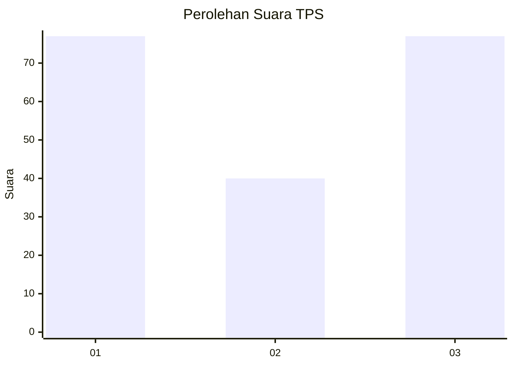
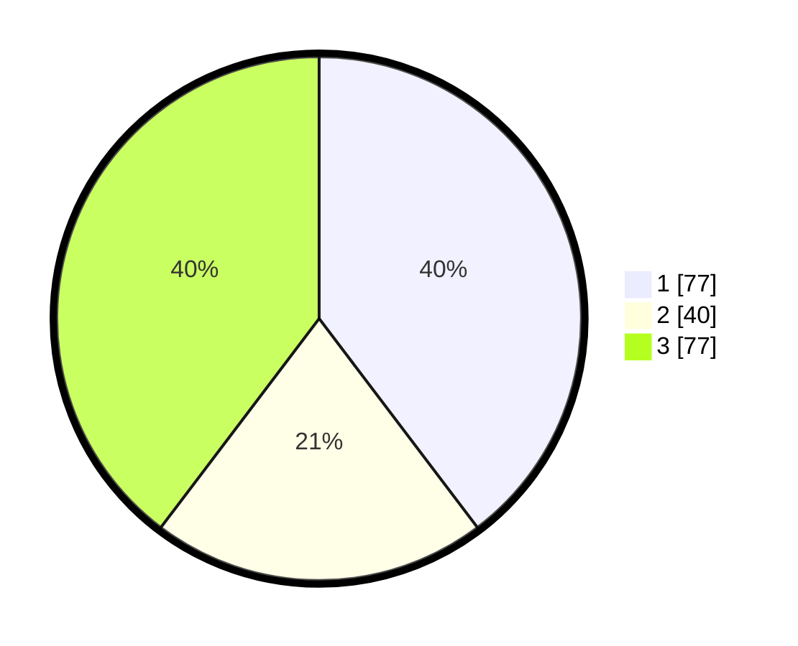

# Hasil

## Grafik

## Tabel

| No. | Nama Paslon    | Suara | Suara (raw) | Persentase |
|:--- |:-------------- | -----:| -----------:| ----------:|
| 1   | ANIES MUHAIMIN | 77    | [77][p-1]   | 39,69      |
| 2   | PRABOWO GIBRAN | 40    | [40][p-2]   | 20,62      |
| 3   | GANJAR MAHFUD  | 77    | [77][p-3]   | 39,69      |

[p-1]: https://github.com/gigit-pemilu/pemilu-2024-33-jawa-tengah/blob/main/pilpres/hitung-suara/sub/33-jawa-tengah/sub/12-wonogiri/sub/20-jatisrono/sub/2005-sidorejo/sub/008-tps/sub/paslon-1.txt
[p-2]: https://github.com/gigit-pemilu/pemilu-2024-33-jawa-tengah/blob/main/pilpres/hitung-suara/sub/33-jawa-tengah/sub/12-wonogiri/sub/20-jatisrono/sub/2005-sidorejo/sub/008-tps/sub/paslon-2.txt
[p-3]: https://github.com/gigit-pemilu/pemilu-2024-33-jawa-tengah/blob/main/pilpres/hitung-suara/sub/33-jawa-tengah/sub/12-wonogiri/sub/20-jatisrono/sub/2005-sidorejo/sub/008-tps/sub/paslon-3.txt

## Foto C Plano

https://sirekap-obj-formc.kpu.go.id/9c9d/pemilu/ppwp/33/12/20/20/05/3312202005008-20240214-141144--48e7f5cd-51e6-4834-ad97-165dc3a9fd31.jpg

https://sirekap-obj-formc.kpu.go.id/9c9d/pemilu/ppwp/33/12/20/20/05/3312202005008-20240214-141118--c3394bb5-83a9-450f-ad39-b0af809e985f.jpg

https://sirekap-obj-formc.kpu.go.id/9c9d/pemilu/ppwp/33/12/20/20/05/3312202005008-20240214-141258--f0eb22c5-8ff1-4ebb-a5e8-c938bed62ad0.jpg

## Metadata

| Key        | Value               |
| ---------- | ------------------- |
| Time Stamp | 2024-02-15 00:41:44 |

