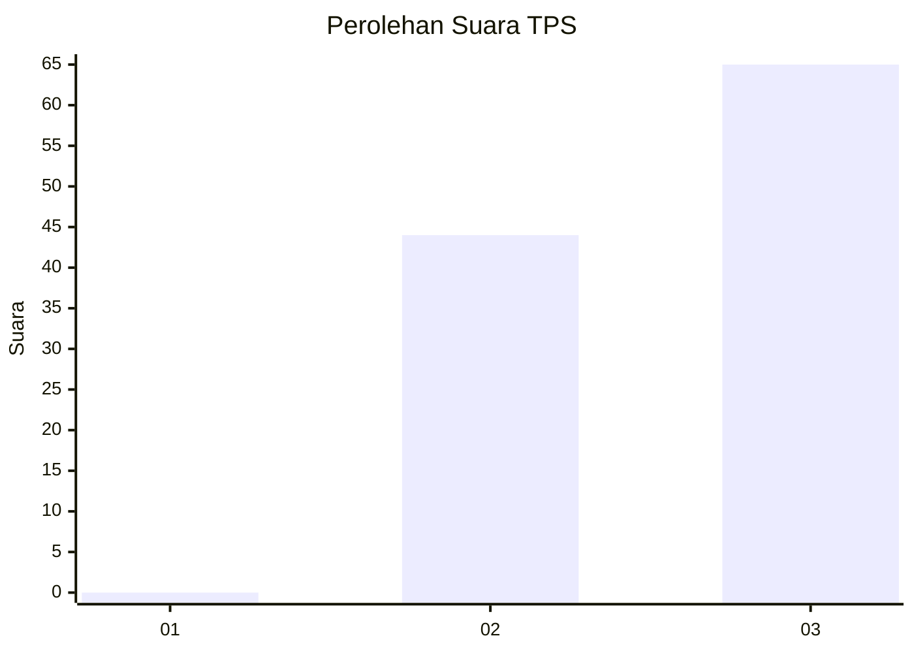
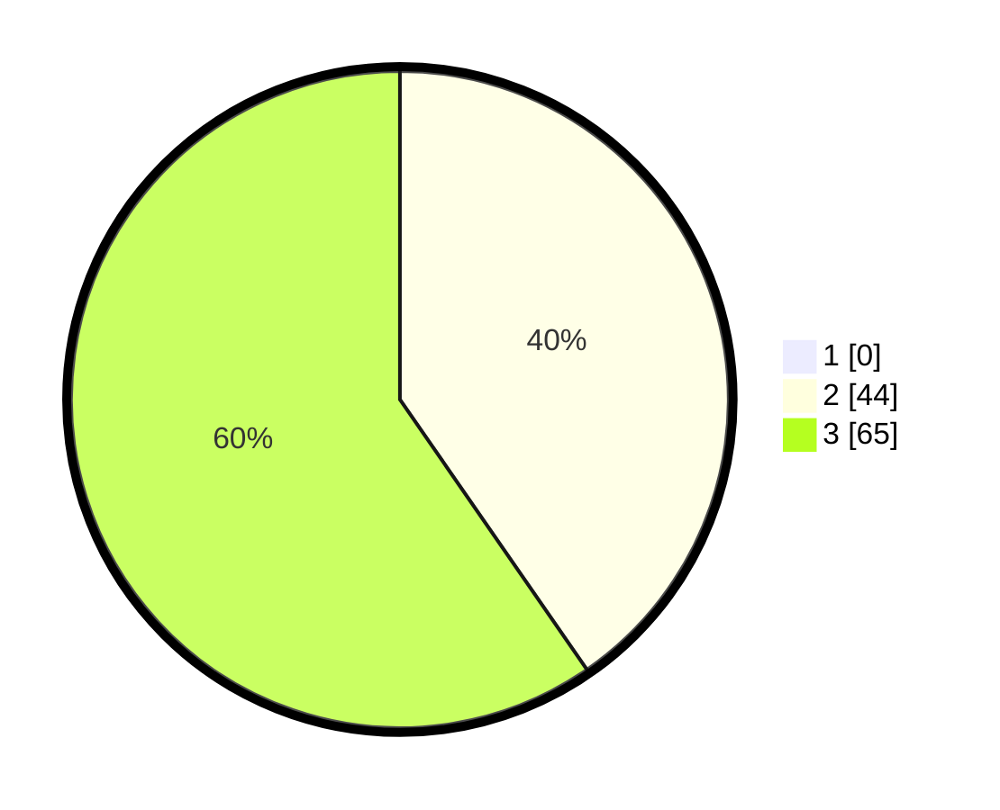

# Hasil

## Grafik

## Tabel

| No. | Nama Paslon    | Suara | Suara (raw) | Persentase |
|:--- |:-------------- | -----:| -----------:| ----------:|
| 1   | ANIES MUHAIMIN | 0     | [0][p-1]    | 0,00       |
| 2   | PRABOWO GIBRAN | 44    | [44][p-2]   | 40,37      |
| 3   | GANJAR MAHFUD  | 65    | [65][p-3]   | 59,63      |

[p-1]: https://github.com/gigit-pemilu/pemilu-2024/blob/main/pilpres/hitung-suara/sub/33-jawa-tengah/sub/12-wonogiri/sub/21-jatipurno/sub/1009-balepanjang/sub/006-tps/sub/paslon-1.txt
[p-2]: https://github.com/gigit-pemilu/pemilu-2024/blob/main/pilpres/hitung-suara/sub/33-jawa-tengah/sub/12-wonogiri/sub/21-jatipurno/sub/1009-balepanjang/sub/006-tps/sub/paslon-2.txt
[p-3]: https://github.com/gigit-pemilu/pemilu-2024/blob/main/pilpres/hitung-suara/sub/33-jawa-tengah/sub/12-wonogiri/sub/21-jatipurno/sub/1009-balepanjang/sub/006-tps/sub/paslon-3.txt

## Foto C Plano

https://sirekap-obj-formc.kpu.go.id/f24c/pemilu/ppwp/33/12/21/10/09/3312211009006-20240214-141405--e1e0dbe1-b508-4684-a298-77ad67e0ba67.jpg

https://sirekap-obj-formc.kpu.go.id/f24c/pemilu/ppwp/33/12/21/10/09/3312211009006-20240214-141843--9d6606ec-1fa0-4113-a967-dba42a0b5eaf.jpg

https://sirekap-obj-formc.kpu.go.id/f24c/pemilu/ppwp/33/12/21/10/09/3312211009006-20240214-141938--f598fde8-3bb4-40ca-892f-19e99d0c7bbf.jpg

## Metadata

| Key        | Value               |
| ---------- | ------------------- |
| Time Stamp | 2024-02-16 00:30:27 |

