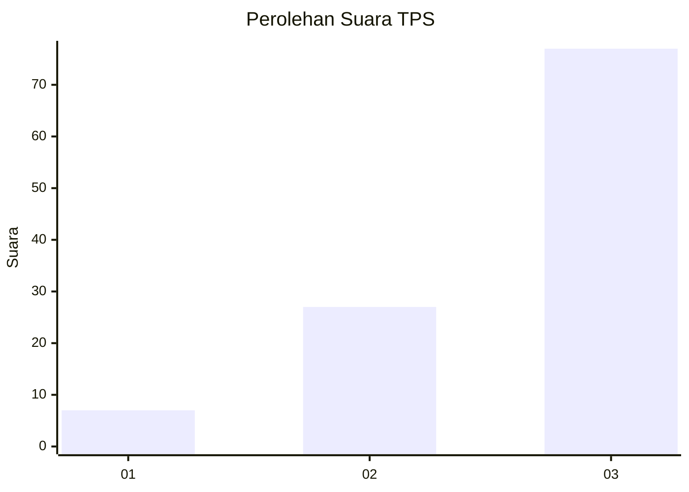
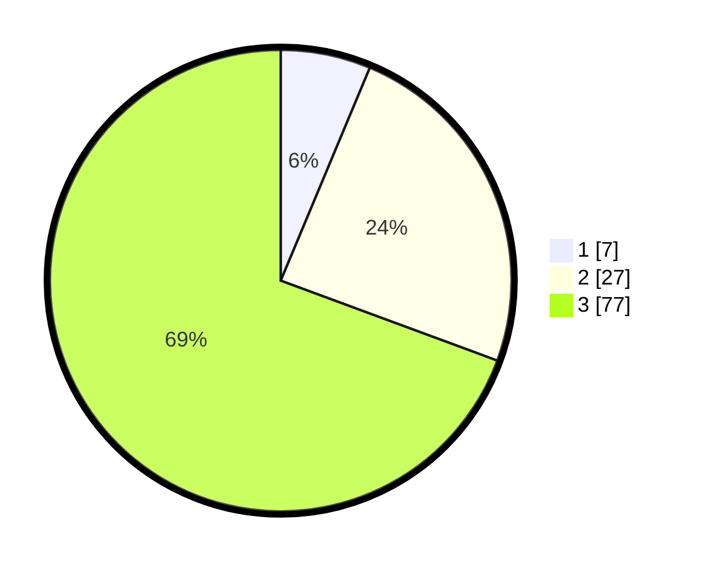

# Hasil

## Grafik

## Tabel

| No. | Nama Paslon    | Suara | Suara (raw) | Persentase |
|:--- |:-------------- | -----:| -----------:| ----------:|
| 1   | ANIES MUHAIMIN | 7     | [7][p-1]    | 6,31       |
| 2   | PRABOWO GIBRAN | 27    | [27][p-2]   | 24,32      |
| 3   | GANJAR MAHFUD  | 77    | [77][p-3]   | 69,37      |

[p-1]: https://github.com/gigit-pemilu/pemilu-2024/blob/main/pilpres/hitung-suara/sub/33-jawa-tengah/sub/12-wonogiri/sub/21-jatipurno/sub/2001-giriyoso/sub/007-tps/sub/paslon-1.txt
[p-2]: https://github.com/gigit-pemilu/pemilu-2024/blob/main/pilpres/hitung-suara/sub/33-jawa-tengah/sub/12-wonogiri/sub/21-jatipurno/sub/2001-giriyoso/sub/007-tps/sub/paslon-2.txt
[p-3]: https://github.com/gigit-pemilu/pemilu-2024/blob/main/pilpres/hitung-suara/sub/33-jawa-tengah/sub/12-wonogiri/sub/21-jatipurno/sub/2001-giriyoso/sub/007-tps/sub/paslon-3.txt

## Foto C Plano

https://sirekap-obj-formc.kpu.go.id/8935/pemilu/ppwp/33/12/21/20/01/3312212001007-20240215-083104--f457a71f-9771-46e5-957a-0f9611ff1d45.jpg

https://sirekap-obj-formc.kpu.go.id/8935/pemilu/ppwp/33/12/21/20/01/3312212001007-20240214-155134--c27615e6-72ed-4d75-861b-83690c4e9b2f.jpg

https://sirekap-obj-formc.kpu.go.id/8935/pemilu/ppwp/33/12/21/20/01/3312212001007-20240214-211914--16ade497-6f02-4a3e-af12-2c5b805f1fd9.jpg

## Metadata

| Key        | Value               |
| ---------- | ------------------- |
| Time Stamp | 2024-02-15 17:30:25 |

