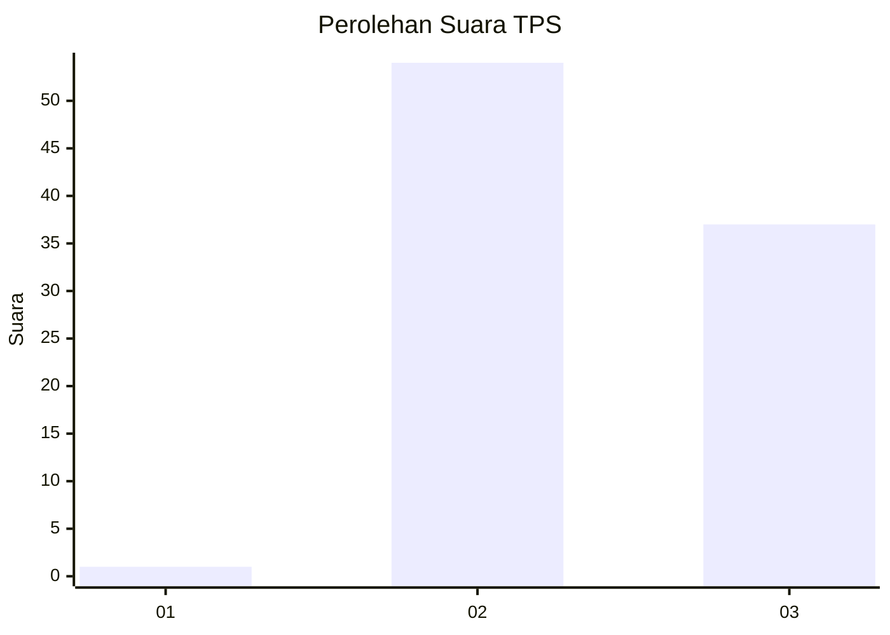
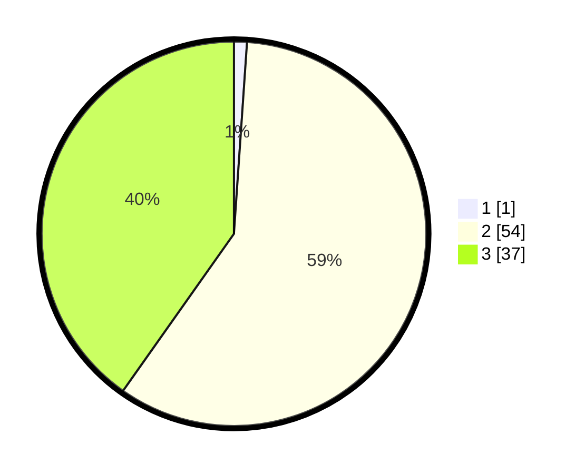

# Hasil

## Grafik

## Tabel

| No. | Nama Paslon    | Suara | Suara (raw) | Persentase |
|:--- |:-------------- | -----:| -----------:| ----------:|
| 1   | ANIES MUHAIMIN | 1     | [1][p-1]    | 1,09       |
| 2   | PRABOWO GIBRAN | 54    | [54][p-2]   | 58,70      |
| 3   | GANJAR MAHFUD  | 37    | [37][p-3]   | 40,22      |

[p-1]: https://github.com/gigit-pemilu/pemilu-2024-33-jawa-tengah/blob/main/pilpres/hitung-suara/sub/33-jawa-tengah/sub/12-wonogiri/sub/21-jatipurno/sub/2001-giriyoso/sub/012-tps/sub/paslon-1.txt
[p-2]: https://github.com/gigit-pemilu/pemilu-2024-33-jawa-tengah/blob/main/pilpres/hitung-suara/sub/33-jawa-tengah/sub/12-wonogiri/sub/21-jatipurno/sub/2001-giriyoso/sub/012-tps/sub/paslon-2.txt
[p-3]: https://github.com/gigit-pemilu/pemilu-2024-33-jawa-tengah/blob/main/pilpres/hitung-suara/sub/33-jawa-tengah/sub/12-wonogiri/sub/21-jatipurno/sub/2001-giriyoso/sub/012-tps/sub/paslon-3.txt

## Foto C Plano

https://sirekap-obj-formc.kpu.go.id/1bc9/pemilu/ppwp/33/12/21/20/01/3312212001012-20240215-025503--8b60cbd8-4f6d-4e60-b289-34de26aa6e6f.jpg

https://sirekap-obj-formc.kpu.go.id/1bc9/pemilu/ppwp/33/12/21/20/01/3312212001012-20240215-025511--195e1faa-e13d-43cf-95a5-91818e5114fc.jpg

https://sirekap-obj-formc.kpu.go.id/1bc9/pemilu/ppwp/33/12/21/20/01/3312212001012-20240215-025519--2593db96-1479-494b-87d4-b5f470318695.jpg

## Metadata

| Key        | Value               |
| ---------- | ------------------- |
| Time Stamp | 2024-02-16 00:30:27 |

