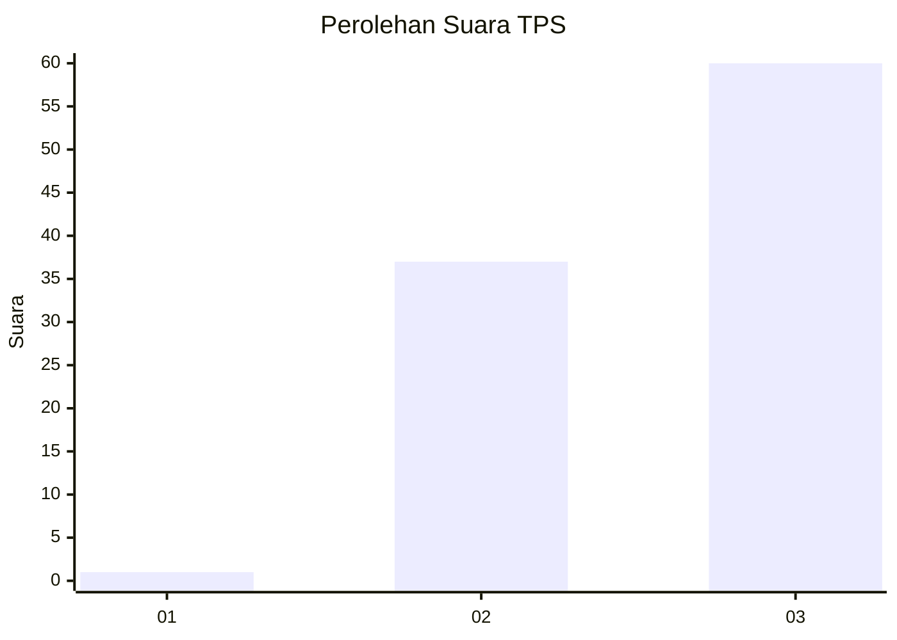
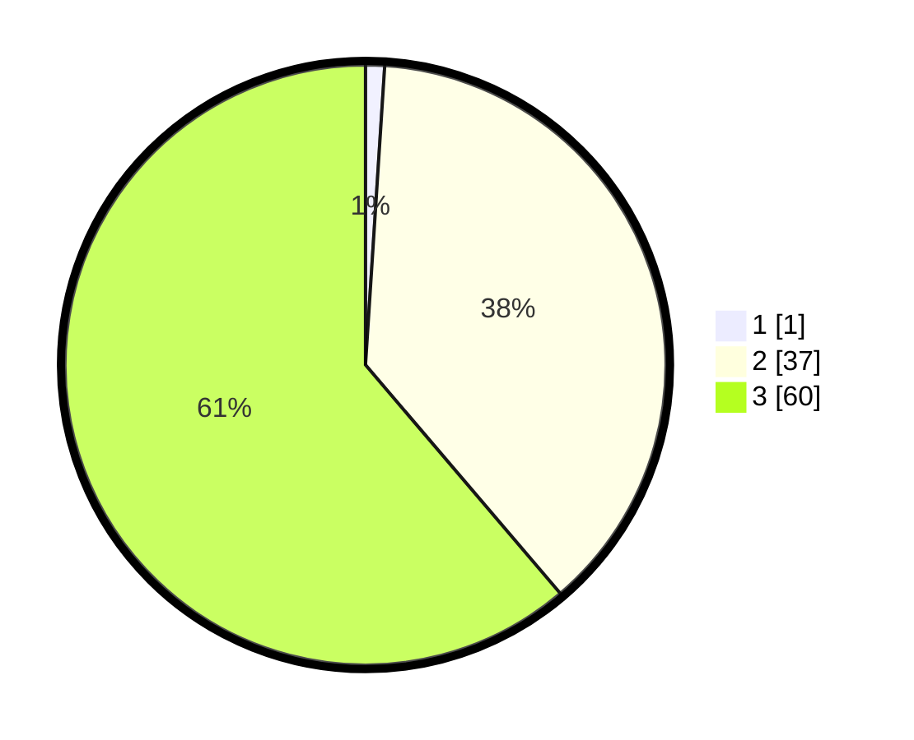

# Hasil

## Grafik

## Tabel

| No. | Nama Paslon    | Suara | Suara (raw) | Persentase |
|:--- |:-------------- | -----:| -----------:| ----------:|
| 1   | ANIES MUHAIMIN | 1     | [1][p-1]    | 1,02       |
| 2   | PRABOWO GIBRAN | 37    | [37][p-2]   | 37,76      |
| 3   | GANJAR MAHFUD  | 60    | [60][p-3]   | 61,22      |

[p-1]: https://github.com/gigit-pemilu/pemilu-2024/blob/main/pilpres/hitung-suara/sub/33-jawa-tengah/sub/12-wonogiri/sub/21-jatipurno/sub/2002-kopen/sub/006-tps/sub/paslon-1.txt
[p-2]: https://github.com/gigit-pemilu/pemilu-2024/blob/main/pilpres/hitung-suara/sub/33-jawa-tengah/sub/12-wonogiri/sub/21-jatipurno/sub/2002-kopen/sub/006-tps/sub/paslon-2.txt
[p-3]: https://github.com/gigit-pemilu/pemilu-2024/blob/main/pilpres/hitung-suara/sub/33-jawa-tengah/sub/12-wonogiri/sub/21-jatipurno/sub/2002-kopen/sub/006-tps/sub/paslon-3.txt

## Foto C Plano

https://sirekap-obj-formc.kpu.go.id/e6cd/pemilu/ppwp/33/12/21/20/02/3312212002006-20240216-142541--e9e05ab4-c42c-439c-ad1e-a0312674500c.jpg

https://sirekap-obj-formc.kpu.go.id/e6cd/pemilu/ppwp/33/12/21/20/02/3312212002006-20240216-142236--5fdb79e7-745b-4b04-9f92-374c3fbe93d6.jpg

https://sirekap-obj-formc.kpu.go.id/e6cd/pemilu/ppwp/33/12/21/20/02/3312212002006-20240216-142429--36f8c34d-98f4-4aa7-8322-6195d6388e5f.jpg

## Metadata

| Key        | Value               |
| ---------- | ------------------- |
| Time Stamp | 2024-02-19 06:16:00 |

