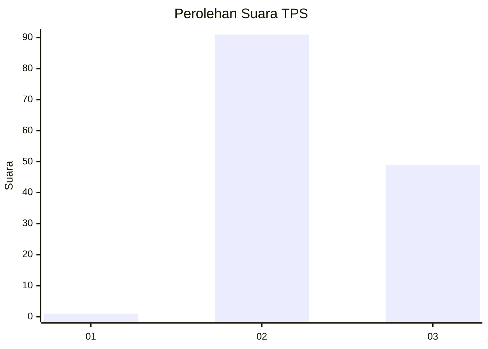
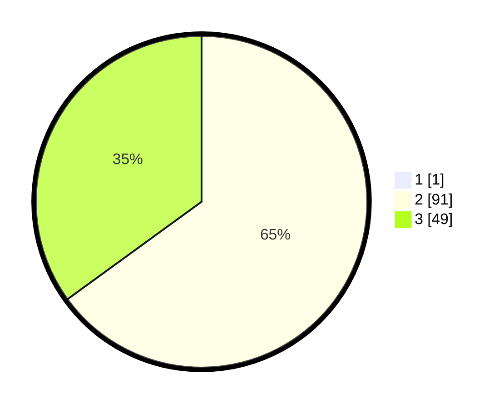

# Hasil

## Grafik

## Tabel

| No. | Nama Paslon    | Suara | Suara (raw) | Persentase |
|:--- |:-------------- | -----:| -----------:| ----------:|
| 1   | ANIES MUHAIMIN | 1     | [1][p-1]    | 0,71       |
| 2   | PRABOWO GIBRAN | 91    | [91][p-2]   | 64,54      |
| 3   | GANJAR MAHFUD  | 49    | [49][p-3]   | 34,75      |

[p-1]: https://github.com/gigit-pemilu/pemilu-2024-33-jawa-tengah/blob/main/pilpres/hitung-suara/sub/33-jawa-tengah/sub/12-wonogiri/sub/21-jatipurno/sub/2003-jatipurwo/sub/004-tps/sub/paslon-1.txt
[p-2]: https://github.com/gigit-pemilu/pemilu-2024-33-jawa-tengah/blob/main/pilpres/hitung-suara/sub/33-jawa-tengah/sub/12-wonogiri/sub/21-jatipurno/sub/2003-jatipurwo/sub/004-tps/sub/paslon-2.txt
[p-3]: https://github.com/gigit-pemilu/pemilu-2024-33-jawa-tengah/blob/main/pilpres/hitung-suara/sub/33-jawa-tengah/sub/12-wonogiri/sub/21-jatipurno/sub/2003-jatipurwo/sub/004-tps/sub/paslon-3.txt

## Foto C Plano

https://sirekap-obj-formc.kpu.go.id/387e/pemilu/ppwp/33/12/21/20/03/3312212003004-20240216-163414--6bceb5ac-ef2c-481d-a854-90f3a8b2ece1.jpg

https://sirekap-obj-formc.kpu.go.id/387e/pemilu/ppwp/33/12/21/20/03/3312212003004-20240216-170415--7ada0825-a8f7-4afd-8f88-ee616ba3bac4.jpg

https://sirekap-obj-formc.kpu.go.id/387e/pemilu/ppwp/33/12/21/20/03/3312212003004-20240216-163641--9d81f089-b6eb-4231-9687-7aec6f15e9ec.jpg

## Metadata

| Key        | Value               |
| ---------- | ------------------- |
| Time Stamp | 2024-02-19 06:16:00 |

## DATA PEMILIH TETAP

Jumlah pemilih dalam DPT: **186**.
 * L: **95**.
 * P: **91**.

## DATA PENGGUNA HAK PILIH

Jumlah pengguna hak pilih dalam DPT: **239**.
 * L: **71**.
 * P: **68**.

Jumlah pengguna hak pilih dalam DPTb: **335**.
 * L: **375**.
 * P: **735**.

Jumlah pengguna hak pilih dalam DPK: **3**.
 * L: **82**.
 * P: **1**.

Jumlah pengguna hak pilih: **442**.
 * L: **73**.
 * P: **869**.

## JUMLAH SUARA SAH DAN TIDAK SAH

JUMLAH SELURUH SUARA SAH: **141**.

JUMLAH SUARA TIDAK SAH: **1**.

JUMLAH SELURUH SUARA SAH DAN SUARA TIDAK SAH: **142**.

