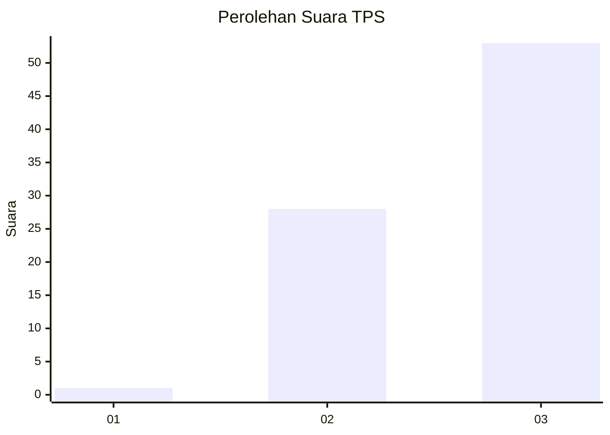
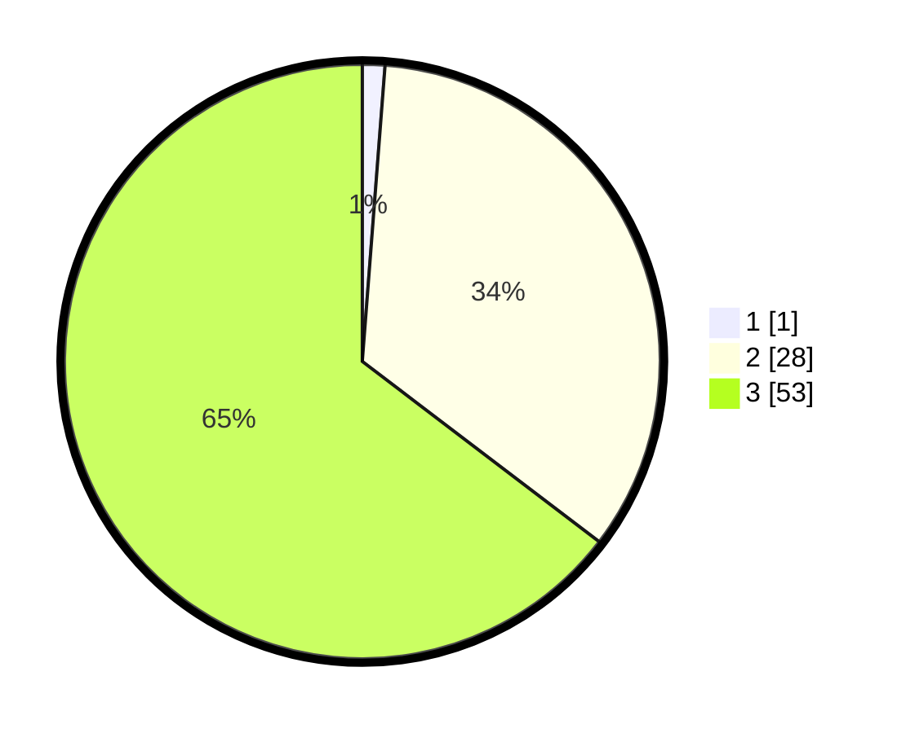

# Hasil

## Grafik

## Tabel

| No. | Nama Paslon    | Suara | Suara (raw) | Persentase |
|:--- |:-------------- | -----:| -----------:| ----------:|
| 1   | ANIES MUHAIMIN | 1     | [1][p-1]    | 1,22       |
| 2   | PRABOWO GIBRAN | 28    | [28][p-2]   | 34,15      |
| 3   | GANJAR MAHFUD  | 53    | [53][p-3]   | 64,63      |

[p-1]: https://github.com/gigit-pemilu/pemilu-2024-33-jawa-tengah/blob/main/pilpres/hitung-suara/sub/33-jawa-tengah/sub/12-wonogiri/sub/21-jatipurno/sub/2008-girimulyo/sub/008-tps/sub/paslon-1.txt
[p-2]: https://github.com/gigit-pemilu/pemilu-2024-33-jawa-tengah/blob/main/pilpres/hitung-suara/sub/33-jawa-tengah/sub/12-wonogiri/sub/21-jatipurno/sub/2008-girimulyo/sub/008-tps/sub/paslon-2.txt
[p-3]: https://github.com/gigit-pemilu/pemilu-2024-33-jawa-tengah/blob/main/pilpres/hitung-suara/sub/33-jawa-tengah/sub/12-wonogiri/sub/21-jatipurno/sub/2008-girimulyo/sub/008-tps/sub/paslon-3.txt

## Foto C Plano

https://sirekap-obj-formc.kpu.go.id/9e00/pemilu/ppwp/33/12/21/20/08/3312212008008-20240215-202421--47487671-7bbf-4842-b368-7377a2574721.jpg

https://sirekap-obj-formc.kpu.go.id/9e00/pemilu/ppwp/33/12/21/20/08/3312212008008-20240215-102020--477b6a22-d2bb-4774-93b1-81a5c1ea45a1.jpg

https://sirekap-obj-formc.kpu.go.id/9e00/pemilu/ppwp/33/12/21/20/08/3312212008008-20240215-202237--c9a60887-b0e7-41a4-ab3e-dc09528c45a7.jpg

## Metadata

| Key        | Value               |
| ---------- | ------------------- |
| Time Stamp | 2024-02-15 20:30:46 |

