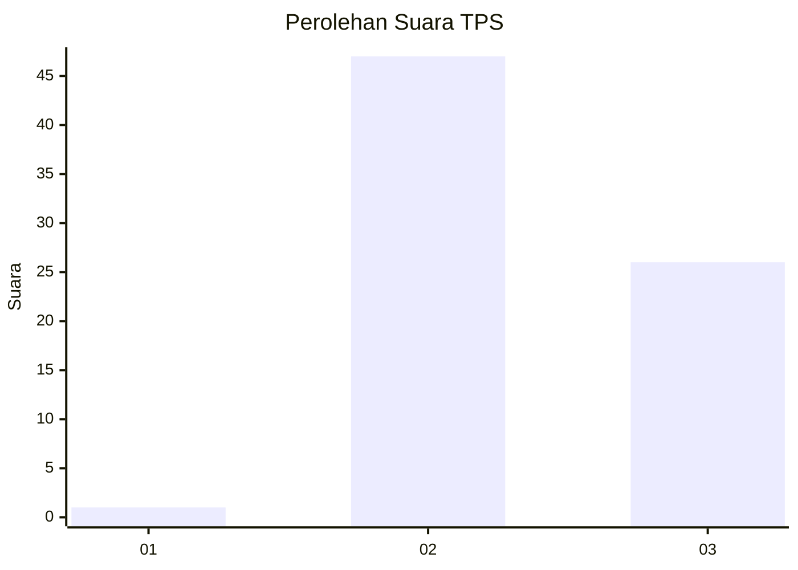
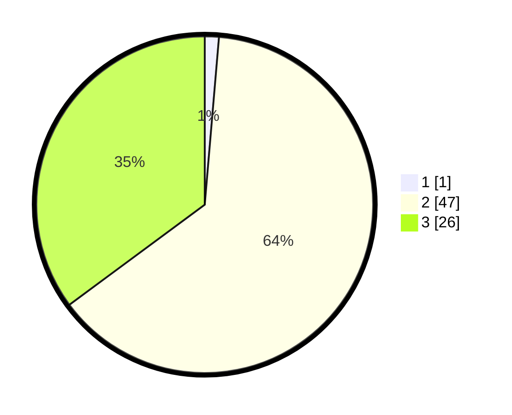

# Hasil

## Grafik

## Tabel

| No. | Nama Paslon    | Suara | Suara (raw) | Persentase |
|:--- |:-------------- | -----:| -----------:| ----------:|
| 1   | ANIES MUHAIMIN | 1     | [1][p-1]    | 1,35       |
| 2   | PRABOWO GIBRAN | 47    | [47][p-2]   | 63,51      |
| 3   | GANJAR MAHFUD  | 26    | [26][p-3]   | 35,14      |

[p-1]: https://github.com/gigit-pemilu/pemilu-2024/blob/main/pilpres/hitung-suara/sub/33-jawa-tengah/sub/12-wonogiri/sub/21-jatipurno/sub/2010-jeporo/sub/002-tps/sub/paslon-1.txt
[p-2]: https://github.com/gigit-pemilu/pemilu-2024/blob/main/pilpres/hitung-suara/sub/33-jawa-tengah/sub/12-wonogiri/sub/21-jatipurno/sub/2010-jeporo/sub/002-tps/sub/paslon-2.txt
[p-3]: https://github.com/gigit-pemilu/pemilu-2024/blob/main/pilpres/hitung-suara/sub/33-jawa-tengah/sub/12-wonogiri/sub/21-jatipurno/sub/2010-jeporo/sub/002-tps/sub/paslon-3.txt

## Foto C Plano

https://sirekap-obj-formc.kpu.go.id/35bb/pemilu/ppwp/33/12/21/20/10/3312212010002-20240214-141003--254358a8-7072-4d73-8637-9ecffa9432e7.jpg

https://sirekap-obj-formc.kpu.go.id/35bb/pemilu/ppwp/33/12/21/20/10/3312212010002-20240214-141029--cd15ee01-aa75-4db2-8233-d34b36f6770b.jpg

https://sirekap-obj-formc.kpu.go.id/35bb/pemilu/ppwp/33/12/21/20/10/3312212010002-20240214-141053--8b60a70d-10c9-492c-99d9-c32320ae1ce1.jpg

## Metadata

| Key        | Value               |
| ---------- | ------------------- |
| Time Stamp | 2024-02-14 21:46:01 |

