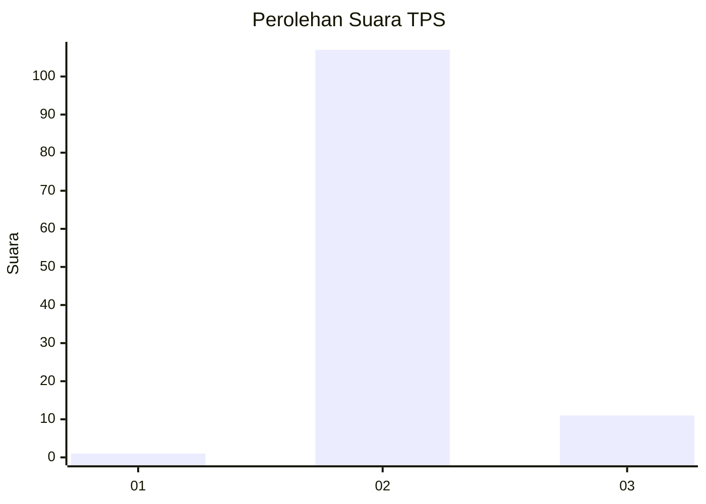
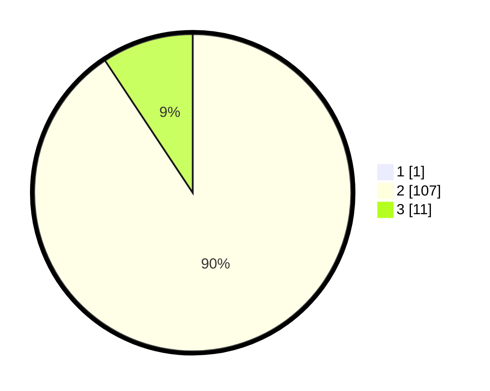

# Hasil

## Grafik

## Tabel

| No. | Nama Paslon    | Suara | Suara (raw) | Persentase |
|:--- |:-------------- | -----:| -----------:| ----------:|
| 1   | ANIES MUHAIMIN | 1     | [1][p-1]    | 0,84       |
| 2   | PRABOWO GIBRAN | 107   | [107][p-2]  | 89,92      |
| 3   | GANJAR MAHFUD  | 11    | [11][p-3]   | 9,24       |

[p-1]: https://github.com/gigit-pemilu/pemilu-2024/blob/main/pilpres/hitung-suara/sub/33-jawa-tengah/sub/12-wonogiri/sub/21-jatipurno/sub/2010-jeporo/sub/019-tps/sub/paslon-1.txt
[p-2]: https://github.com/gigit-pemilu/pemilu-2024/blob/main/pilpres/hitung-suara/sub/33-jawa-tengah/sub/12-wonogiri/sub/21-jatipurno/sub/2010-jeporo/sub/019-tps/sub/paslon-2.txt
[p-3]: https://github.com/gigit-pemilu/pemilu-2024/blob/main/pilpres/hitung-suara/sub/33-jawa-tengah/sub/12-wonogiri/sub/21-jatipurno/sub/2010-jeporo/sub/019-tps/sub/paslon-3.txt

## Foto C Plano

https://sirekap-obj-formc.kpu.go.id/2f08/pemilu/ppwp/33/12/21/20/10/3312212010019-20240214-141620--00f58241-f989-410d-9981-17b4101d44b5.jpg

https://sirekap-obj-formc.kpu.go.id/2f08/pemilu/ppwp/33/12/21/20/10/3312212010019-20240214-141717--4e5f6bee-4e7d-4e8c-8fdf-4a67e1a252cf.jpg

https://sirekap-obj-formc.kpu.go.id/2f08/pemilu/ppwp/33/12/21/20/10/3312212010019-20240214-141755--53bc0a05-c5a5-4f2b-a67b-cec7bcd68451.jpg

## Metadata

| Key        | Value               |
| ---------- | ------------------- |
| Time Stamp | 2024-02-14 21:46:01 |

