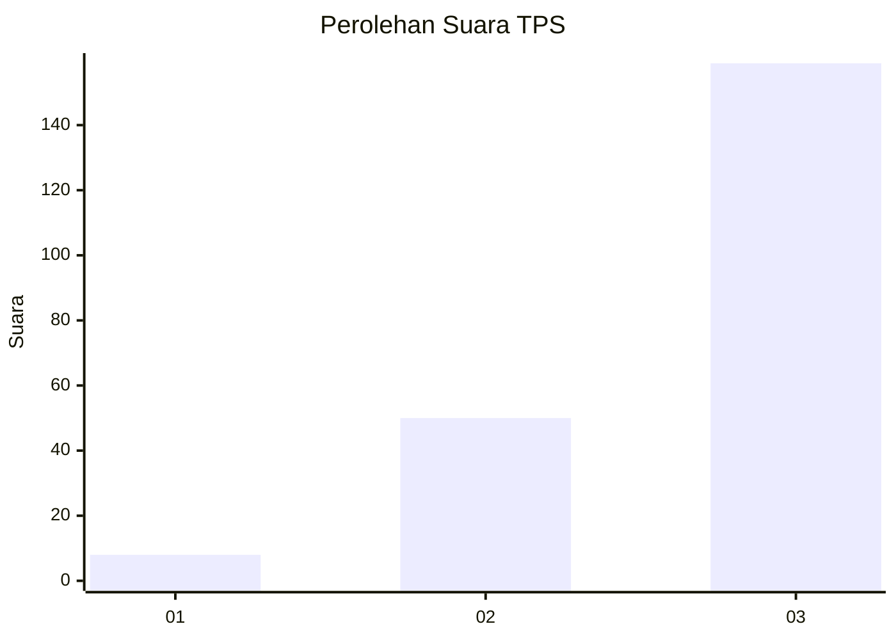
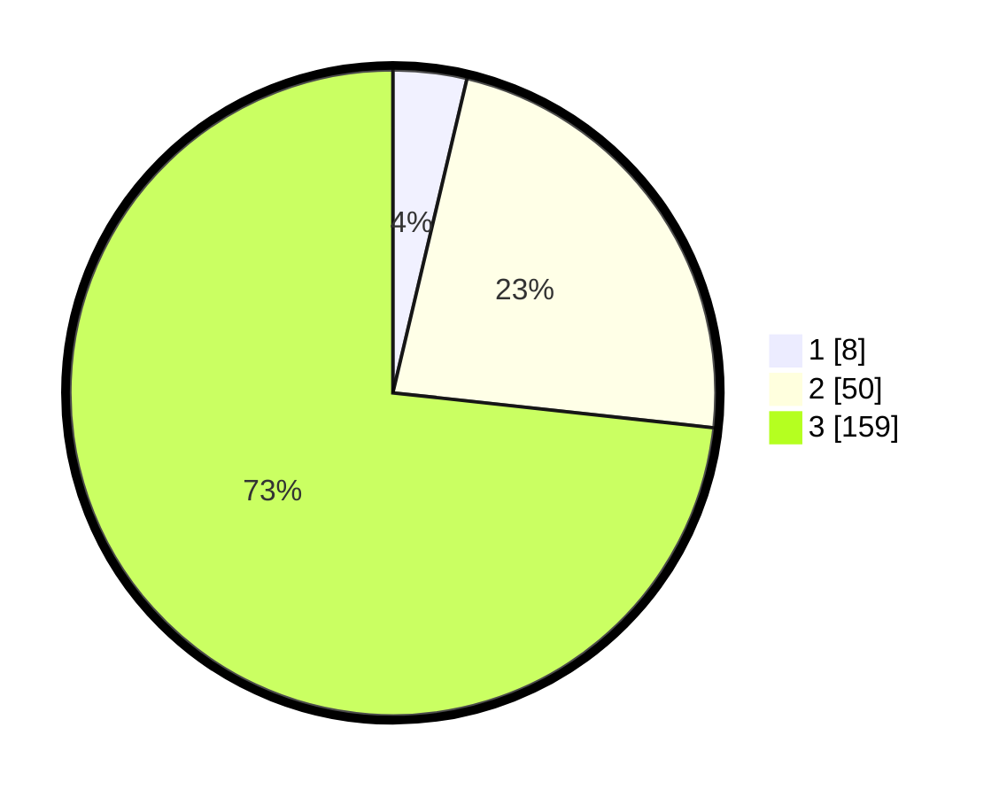

# Hasil

## Grafik

## Tabel

| No. | Nama Paslon    | Suara | Suara (raw) | Persentase |
|:--- |:-------------- | -----:| -----------:| ----------:|
| 1   | ANIES MUHAIMIN | 8     | [8][p-1]    | 3,69       |
| 2   | PRABOWO GIBRAN | 50    | [50][p-2]   | 23,04      |
| 3   | GANJAR MAHFUD  | 159   | [159][p-3]  | 73,27      |

[p-1]: https://github.com/gigit-pemilu/pemilu-2024-33-jawa-tengah/blob/main/pilpres/hitung-suara/sub/33-jawa-tengah/sub/12-wonogiri/sub/22-girimarto/sub/2002-doho/sub/007-tps/sub/paslon-1.txt
[p-2]: https://github.com/gigit-pemilu/pemilu-2024-33-jawa-tengah/blob/main/pilpres/hitung-suara/sub/33-jawa-tengah/sub/12-wonogiri/sub/22-girimarto/sub/2002-doho/sub/007-tps/sub/paslon-2.txt
[p-3]: https://github.com/gigit-pemilu/pemilu-2024-33-jawa-tengah/blob/main/pilpres/hitung-suara/sub/33-jawa-tengah/sub/12-wonogiri/sub/22-girimarto/sub/2002-doho/sub/007-tps/sub/paslon-3.txt

## Foto C Plano

https://sirekap-obj-formc.kpu.go.id/7f3f/pemilu/ppwp/33/12/22/20/02/3312222002007-20240217-164759--cdea6023-a056-4da3-8976-f129f4524dd5.jpg

https://sirekap-obj-formc.kpu.go.id/7f3f/pemilu/ppwp/33/12/22/20/02/3312222002007-20240216-170114--c738d9cb-0beb-4a02-85e8-63c065e9acae.jpg

https://sirekap-obj-formc.kpu.go.id/7f3f/pemilu/ppwp/33/12/22/20/02/3312222002007-20240216-170234--f91c644b-22c1-4b20-9092-7c45c810a697.jpg

## Metadata

| Key        | Value               |
| ---------- | ------------------- |
| Time Stamp | 2024-02-24 22:31:28 |

