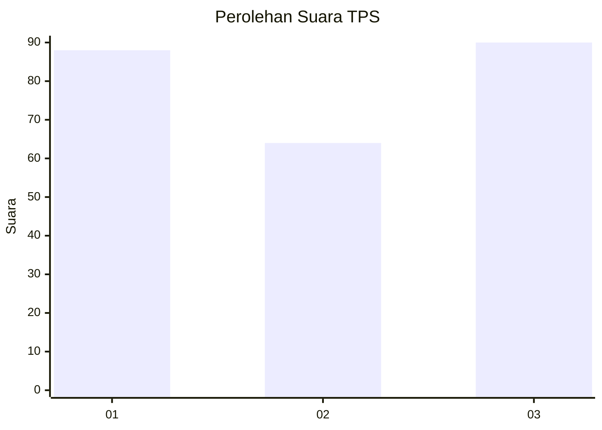
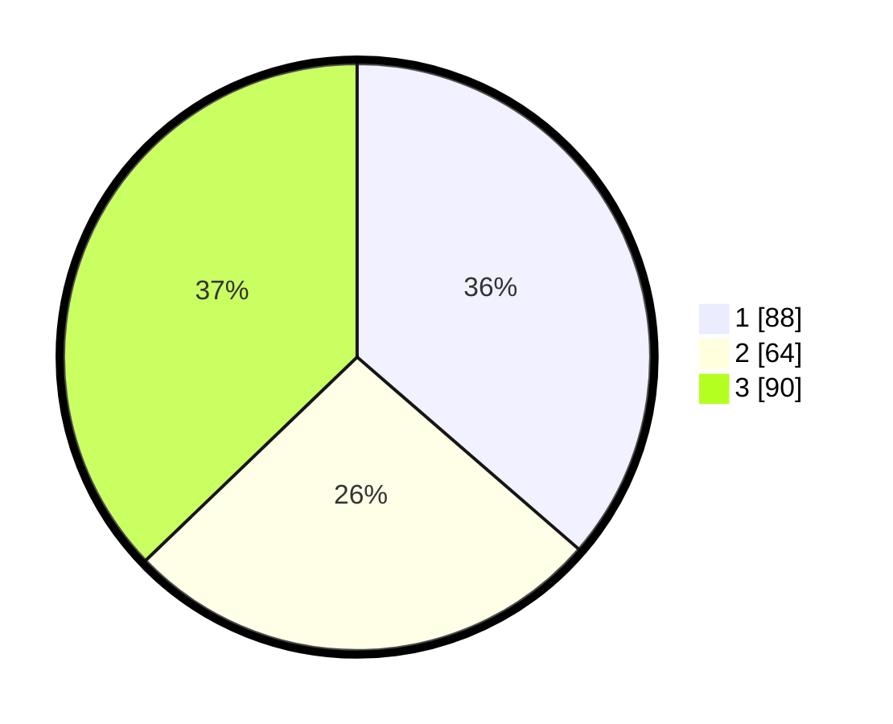

# Hasil

## Grafik

## Tabel

| No. | Nama Paslon    | Suara | Suara (raw) | Persentase |
|:--- |:-------------- | -----:| -----------:| ----------:|
| 1   | ANIES MUHAIMIN | 88    | [88][p-1]   | 36,36      |
| 2   | PRABOWO GIBRAN | 64    | [64][p-2]   | 26,45      |
| 3   | GANJAR MAHFUD  | 90    | [90][p-3]   | 37,19      |

[p-1]: https://github.com/gigit-pemilu/pemilu-2024-33-jawa-tengah/blob/main/pilpres/hitung-suara/sub/33-jawa-tengah/sub/12-wonogiri/sub/22-girimarto/sub/2004-girimarto/sub/003-tps/sub/paslon-1.txt
[p-2]: https://github.com/gigit-pemilu/pemilu-2024-33-jawa-tengah/blob/main/pilpres/hitung-suara/sub/33-jawa-tengah/sub/12-wonogiri/sub/22-girimarto/sub/2004-girimarto/sub/003-tps/sub/paslon-2.txt
[p-3]: https://github.com/gigit-pemilu/pemilu-2024-33-jawa-tengah/blob/main/pilpres/hitung-suara/sub/33-jawa-tengah/sub/12-wonogiri/sub/22-girimarto/sub/2004-girimarto/sub/003-tps/sub/paslon-3.txt

## Foto C Plano

https://sirekap-obj-formc.kpu.go.id/a879/pemilu/ppwp/33/12/22/20/04/3312222004003-20240217-124637--6628354f-7b6f-4c47-97e6-f8e9bf13b1a8.jpg

https://sirekap-obj-formc.kpu.go.id/a879/pemilu/ppwp/33/12/22/20/04/3312222004003-20240217-081211--9abf50d8-e825-4850-9137-ea6f806b82a7.jpg

https://sirekap-obj-formc.kpu.go.id/a879/pemilu/ppwp/33/12/22/20/04/3312222004003-20240217-081611--7d12c338-8319-482b-873c-bd365333d255.jpg

## Metadata

| Key        | Value               |
| ---------- | ------------------- |
| Time Stamp | 2024-02-17 13:37:34 |

