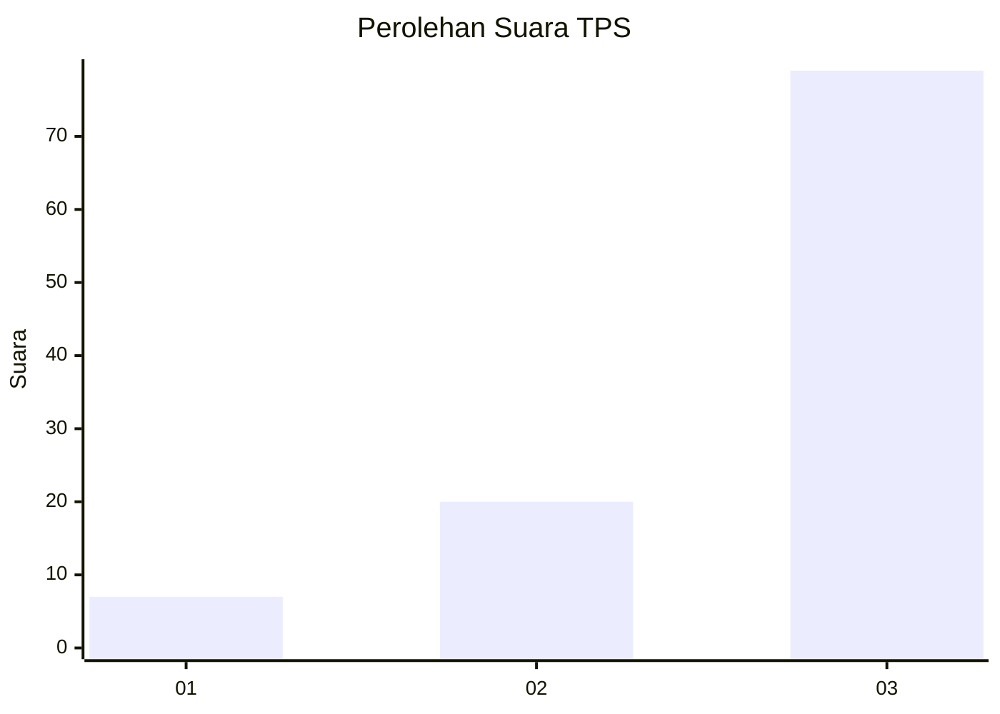
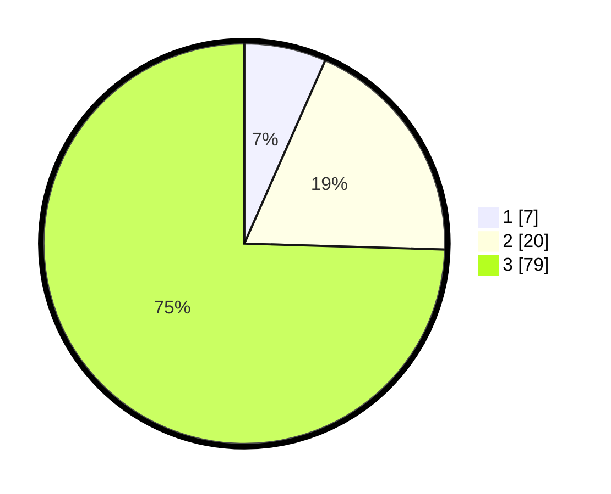

# Hasil

## Grafik

## Tabel

| No. | Nama Paslon    | Suara | Suara (raw) | Persentase |
|:--- |:-------------- | -----:| -----------:| ----------:|
| 1   | ANIES MUHAIMIN | 7     | [7][p-1]    | 6,60       |
| 2   | PRABOWO GIBRAN | 20    | [20][p-2]   | 18,87      |
| 3   | GANJAR MAHFUD  | 79    | [79][p-3]   | 74,53      |

[p-1]: https://github.com/gigit-pemilu/pemilu-2024-33-jawa-tengah/blob/main/pilpres/hitung-suara/sub/33-jawa-tengah/sub/12-wonogiri/sub/22-girimarto/sub/2009-jatirejo/sub/003-tps/sub/paslon-1.txt
[p-2]: https://github.com/gigit-pemilu/pemilu-2024-33-jawa-tengah/blob/main/pilpres/hitung-suara/sub/33-jawa-tengah/sub/12-wonogiri/sub/22-girimarto/sub/2009-jatirejo/sub/003-tps/sub/paslon-2.txt
[p-3]: https://github.com/gigit-pemilu/pemilu-2024-33-jawa-tengah/blob/main/pilpres/hitung-suara/sub/33-jawa-tengah/sub/12-wonogiri/sub/22-girimarto/sub/2009-jatirejo/sub/003-tps/sub/paslon-3.txt

## Foto C Plano

https://sirekap-obj-formc.kpu.go.id/008c/pemilu/ppwp/33/12/22/20/09/3312222009003-20240214-210348--79a09609-fc76-45f1-821f-aa584daef0bf.jpg

https://sirekap-obj-formc.kpu.go.id/008c/pemilu/ppwp/33/12/22/20/09/3312222009003-20240214-210501--a526fefb-24a0-49fb-8fa9-78dbcb3e8572.jpg

https://sirekap-obj-formc.kpu.go.id/008c/pemilu/ppwp/33/12/22/20/09/3312222009003-20240214-210558--74ebf8ae-0b1b-4ab3-be24-3d7466ad9c3f.jpg

## Metadata

| Key        | Value               |
| ---------- | ------------------- |
| Time Stamp | 2024-02-15 22:30:27 |

