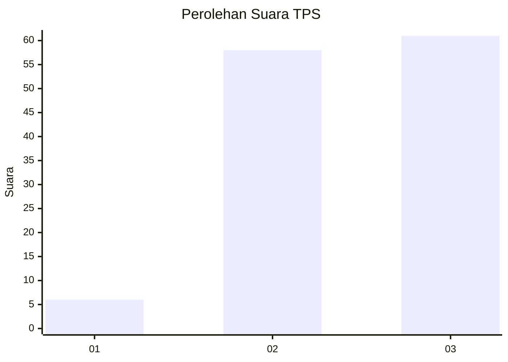
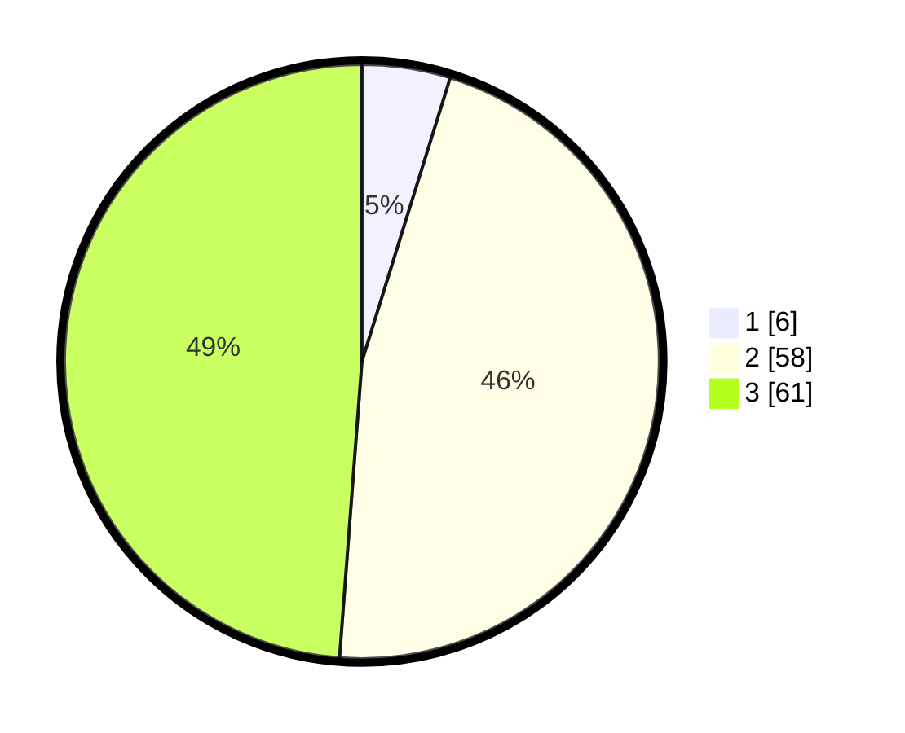

# Hasil

## Grafik

## Tabel

| No. | Nama Paslon    | Suara | Suara (raw) | Persentase |
|:--- |:-------------- | -----:| -----------:| ----------:|
| 1   | ANIES MUHAIMIN | 6     | [6][p-1]    | 4,80       |
| 2   | PRABOWO GIBRAN | 58    | [58][p-2]   | 46,40      |
| 3   | GANJAR MAHFUD  | 61    | [61][p-3]   | 48,80      |

[p-1]: https://github.com/gigit-pemilu/pemilu-2024/blob/main/pilpres/hitung-suara/sub/33-jawa-tengah/sub/12-wonogiri/sub/22-girimarto/sub/2014-bubakan/sub/003-tps/sub/paslon-1.txt
[p-2]: https://github.com/gigit-pemilu/pemilu-2024/blob/main/pilpres/hitung-suara/sub/33-jawa-tengah/sub/12-wonogiri/sub/22-girimarto/sub/2014-bubakan/sub/003-tps/sub/paslon-2.txt
[p-3]: https://github.com/gigit-pemilu/pemilu-2024/blob/main/pilpres/hitung-suara/sub/33-jawa-tengah/sub/12-wonogiri/sub/22-girimarto/sub/2014-bubakan/sub/003-tps/sub/paslon-3.txt

## Foto C Plano

https://sirekap-obj-formc.kpu.go.id/e1ff/pemilu/ppwp/33/12/22/20/14/3312222014003-20240215-193939--0d635bc8-94d6-4bef-8d2c-d84873ca4cea.jpg

https://sirekap-obj-formc.kpu.go.id/e1ff/pemilu/ppwp/33/12/22/20/14/3312222014003-20240215-184356--69c51641-f937-4031-8a7b-2ace1697f41d.jpg

https://sirekap-obj-formc.kpu.go.id/e1ff/pemilu/ppwp/33/12/22/20/14/3312222014003-20240215-184435--81cd5dcc-f6ec-4fea-a3eb-ce8131375398.jpg

## Metadata

| Key        | Value               |
| ---------- | ------------------- |
| Time Stamp | 2024-02-16 01:00:27 |

