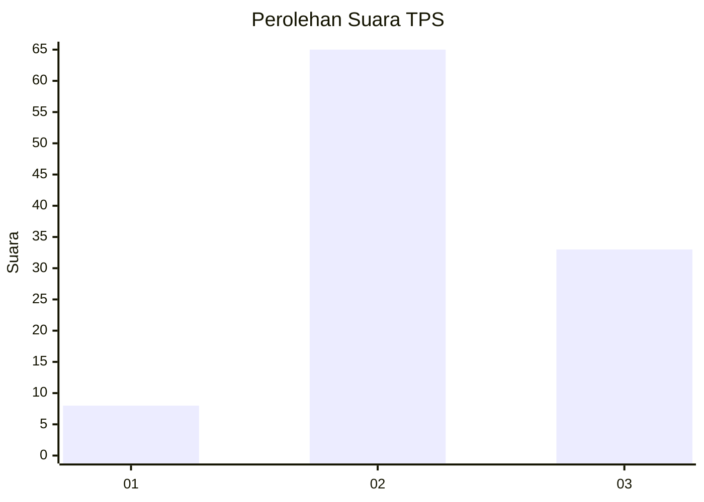
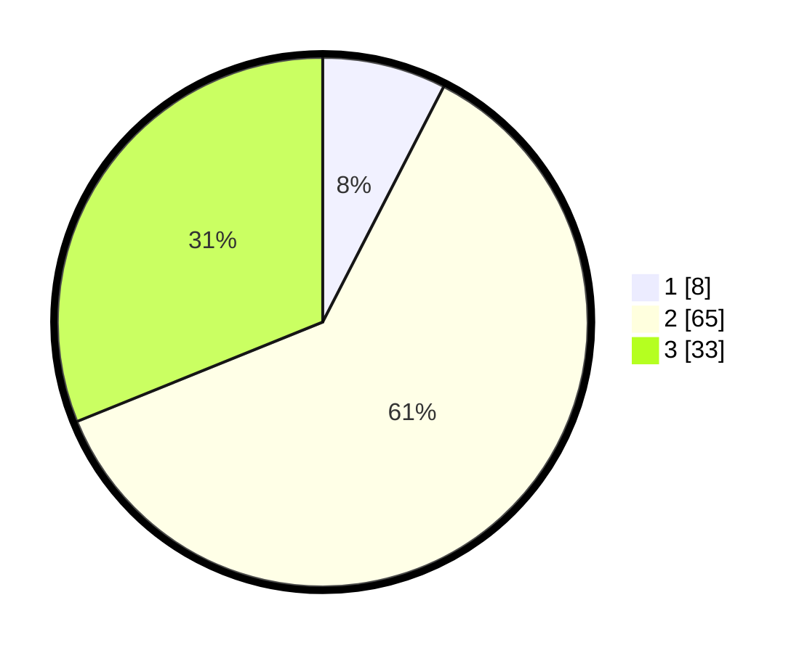

# Hasil

## Grafik

## Tabel

| No. | Nama Paslon    | Suara | Suara (raw) | Persentase |
|:--- |:-------------- | -----:| -----------:| ----------:|
| 1   | ANIES MUHAIMIN | 8     | [8][p-1]    | 7,55       |
| 2   | PRABOWO GIBRAN | 65    | [65][p-2]   | 61,32      |
| 3   | GANJAR MAHFUD  | 33    | [33][p-3]   | 31,13      |

[p-1]: https://github.com/gigit-pemilu/pemilu-2024-33-jawa-tengah/blob/main/pilpres/hitung-suara/sub/33-jawa-tengah/sub/12-wonogiri/sub/22-girimarto/sub/2014-bubakan/sub/014-tps/sub/paslon-1.txt
[p-2]: https://github.com/gigit-pemilu/pemilu-2024-33-jawa-tengah/blob/main/pilpres/hitung-suara/sub/33-jawa-tengah/sub/12-wonogiri/sub/22-girimarto/sub/2014-bubakan/sub/014-tps/sub/paslon-2.txt
[p-3]: https://github.com/gigit-pemilu/pemilu-2024-33-jawa-tengah/blob/main/pilpres/hitung-suara/sub/33-jawa-tengah/sub/12-wonogiri/sub/22-girimarto/sub/2014-bubakan/sub/014-tps/sub/paslon-3.txt

## Foto C Plano

https://sirekap-obj-formc.kpu.go.id/7189/pemilu/ppwp/33/12/22/20/14/3312222014014-20240214-140945--5d2a21d8-38a1-4223-a856-e3097fad7c7e.jpg

https://sirekap-obj-formc.kpu.go.id/7189/pemilu/ppwp/33/12/22/20/14/3312222014014-20240214-141121--ab5233cf-1d41-4853-96ad-594f2a8f1ecd.jpg

https://sirekap-obj-formc.kpu.go.id/7189/pemilu/ppwp/33/12/22/20/14/3312222014014-20240215-194718--d427ed08-e592-428a-9357-db7d354869b9.jpg

## Metadata

| Key        | Value               |
| ---------- | ------------------- |
| Time Stamp | 2024-02-16 00:00:26 |

