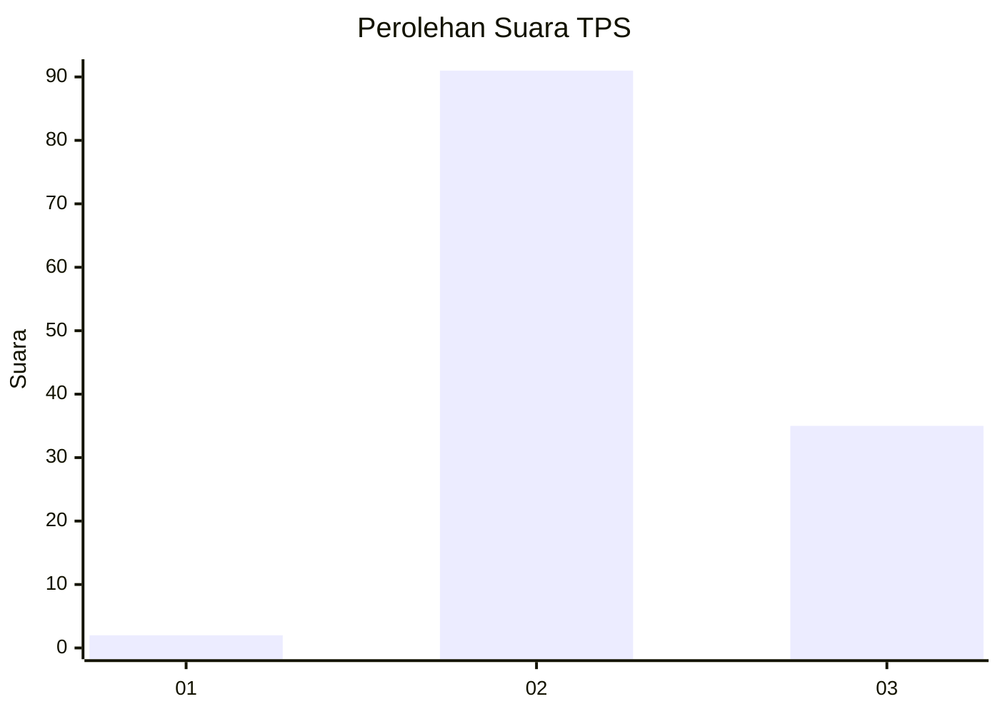
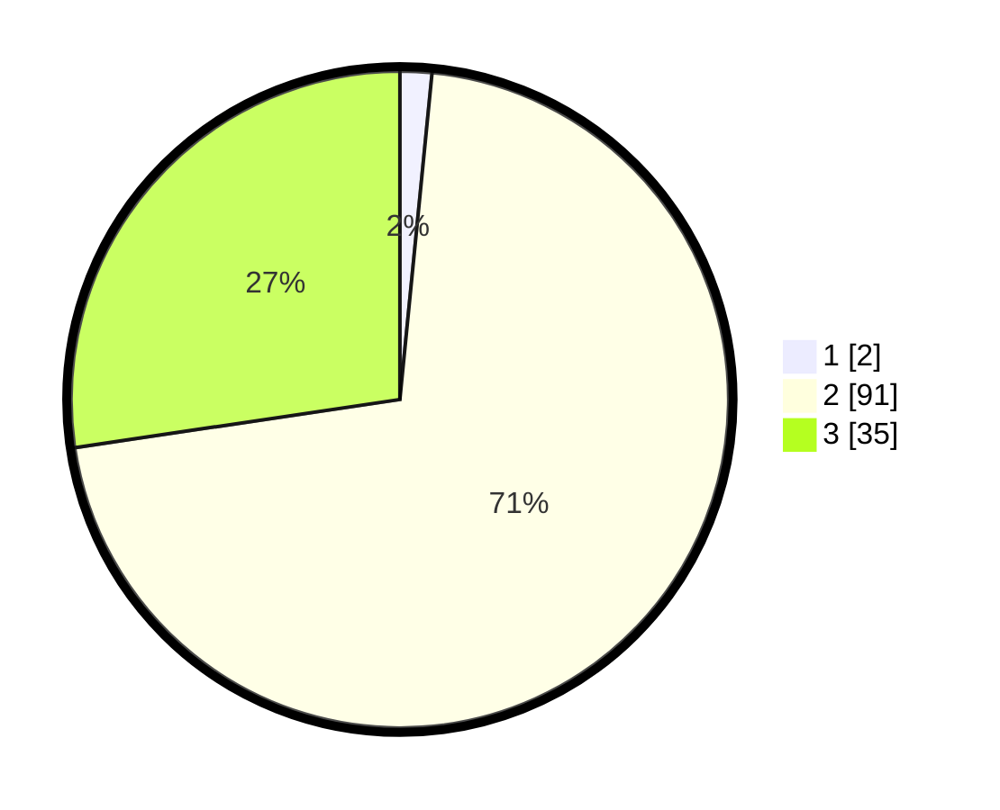

# Hasil

## Grafik

## Tabel

| No. | Nama Paslon    | Suara | Suara (raw) | Persentase |
|:--- |:-------------- | -----:| -----------:| ----------:|
| 1   | ANIES MUHAIMIN | 2     | [2][p-1]    | 1,56       |
| 2   | PRABOWO GIBRAN | 91    | [91][p-2]   | 71,09      |
| 3   | GANJAR MAHFUD  | 35    | [35][p-3]   | 27,34      |

[p-1]: https://github.com/gigit-pemilu/pemilu-2024/blob/main/pilpres/hitung-suara/sub/33-jawa-tengah/sub/12-wonogiri/sub/23-karangtengah/sub/2004-jeblogan/sub/011-tps/sub/paslon-1.txt
[p-2]: https://github.com/gigit-pemilu/pemilu-2024/blob/main/pilpres/hitung-suara/sub/33-jawa-tengah/sub/12-wonogiri/sub/23-karangtengah/sub/2004-jeblogan/sub/011-tps/sub/paslon-2.txt
[p-3]: https://github.com/gigit-pemilu/pemilu-2024/blob/main/pilpres/hitung-suara/sub/33-jawa-tengah/sub/12-wonogiri/sub/23-karangtengah/sub/2004-jeblogan/sub/011-tps/sub/paslon-3.txt

## Foto C Plano

https://sirekap-obj-formc.kpu.go.id/b5a0/pemilu/ppwp/33/12/23/20/04/3312232004011-20240220-164101--be967e1d-ed44-43b4-9f00-6a8b4f934dcd.jpg

https://sirekap-obj-formc.kpu.go.id/b5a0/pemilu/ppwp/33/12/23/20/04/3312232004011-20240220-164650--2b69ec71-bde6-4016-bd74-9315a10b06b5.jpg

https://sirekap-obj-formc.kpu.go.id/b5a0/pemilu/ppwp/33/12/23/20/04/3312232004011-20240220-165001--224eba99-eb54-4cb4-8040-59910b424034.jpg

## Metadata

| Key        | Value               |
| ---------- | ------------------- |
| Time Stamp | 2024-02-22 10:00:00 |

## DATA PEMILIH TETAP

Jumlah pemilih dalam DPT: **238**.
 * L: **320**.
 * P: **720**.

## DATA PENGGUNA HAK PILIH

Jumlah pengguna hak pilih dalam DPT: **230**.
 * L: **888**.
 * P: **880**.

Jumlah pengguna hak pilih dalam DPTb: **884**.
 * L: **832**.
 * P: **882**.

Jumlah pengguna hak pilih dalam DPK: **382**.
 * L: **888**.
 * P: **882**.

Jumlah pengguna hak pilih: **83**.
 * L: **82**.
 * P: **888**.

## JUMLAH SUARA SAH DAN TIDAK SAH

JUMLAH SELURUH SUARA SAH: **228**.

JUMLAH SUARA TIDAK SAH: **2**.

JUMLAH SELURUH SUARA SAH DAN SUARA TIDAK SAH: **230**.

