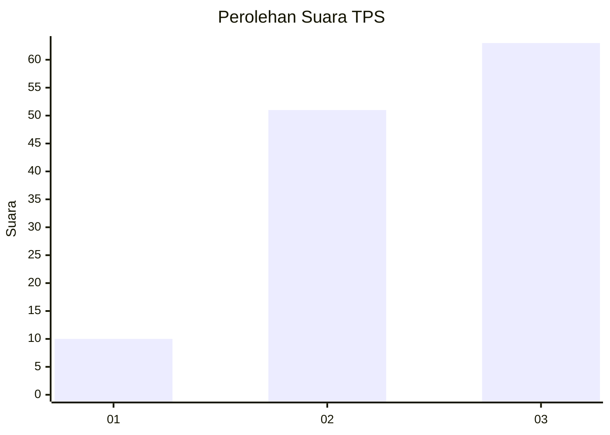
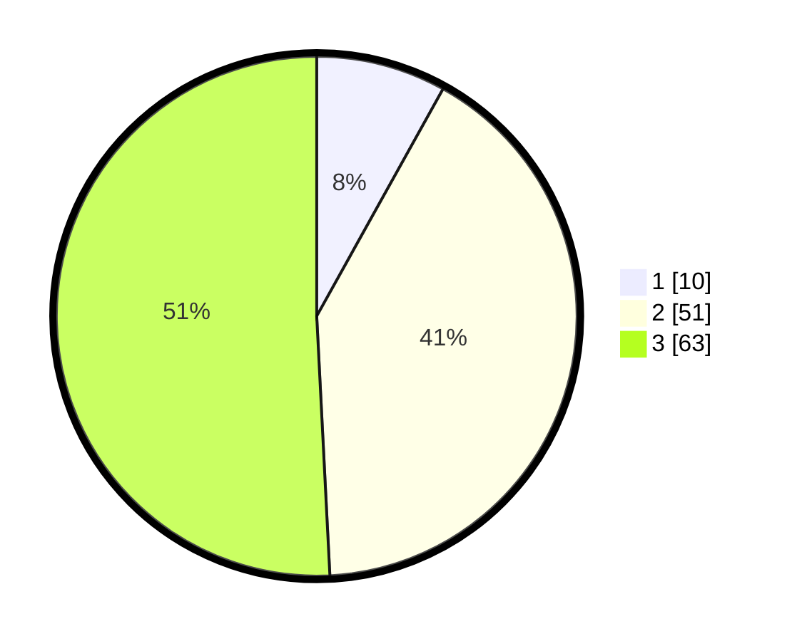

# Hasil

## Grafik

## Tabel

| No. | Nama Paslon    | Suara | Suara (raw) | Persentase |
|:--- |:-------------- | -----:| -----------:| ----------:|
| 1   | ANIES MUHAIMIN | 10    | [10][p-1]   | 8,06       |
| 2   | PRABOWO GIBRAN | 51    | [51][p-2]   | 41,13      |
| 3   | GANJAR MAHFUD  | 63    | [63][p-3]   | 50,81      |

[p-1]: https://github.com/gigit-pemilu/pemilu-2024-33-jawa-tengah/blob/main/pilpres/hitung-suara/sub/33-jawa-tengah/sub/12-wonogiri/sub/24-paranggupito/sub/2005-gunturharjo/sub/009-tps/sub/paslon-1.txt
[p-2]: https://github.com/gigit-pemilu/pemilu-2024-33-jawa-tengah/blob/main/pilpres/hitung-suara/sub/33-jawa-tengah/sub/12-wonogiri/sub/24-paranggupito/sub/2005-gunturharjo/sub/009-tps/sub/paslon-2.txt
[p-3]: https://github.com/gigit-pemilu/pemilu-2024-33-jawa-tengah/blob/main/pilpres/hitung-suara/sub/33-jawa-tengah/sub/12-wonogiri/sub/24-paranggupito/sub/2005-gunturharjo/sub/009-tps/sub/paslon-3.txt

## Foto C Plano

https://sirekap-obj-formc.kpu.go.id/624e/pemilu/ppwp/33/12/24/20/05/3312242005009-20240214-233158--5d9a827b-e7b2-4d18-aeaa-90e482bcb16f.jpg

https://sirekap-obj-formc.kpu.go.id/624e/pemilu/ppwp/33/12/24/20/05/3312242005009-20240214-233422--46480854-734c-4f1d-827c-ce048fac5d82.jpg

https://sirekap-obj-formc.kpu.go.id/624e/pemilu/ppwp/33/12/24/20/05/3312242005009-20240214-233552--bebc376f-dc08-4660-b737-cd2253ec00da.jpg

## Metadata

| Key        | Value               |
| ---------- | ------------------- |
| Time Stamp | 2024-02-15 15:00:29 |

