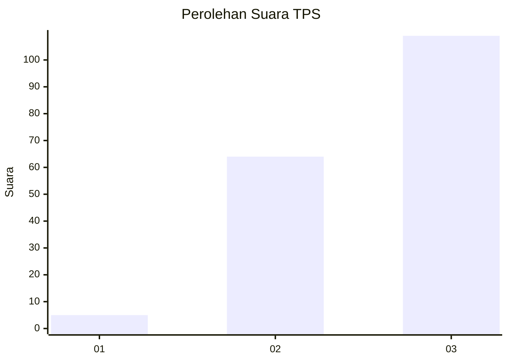
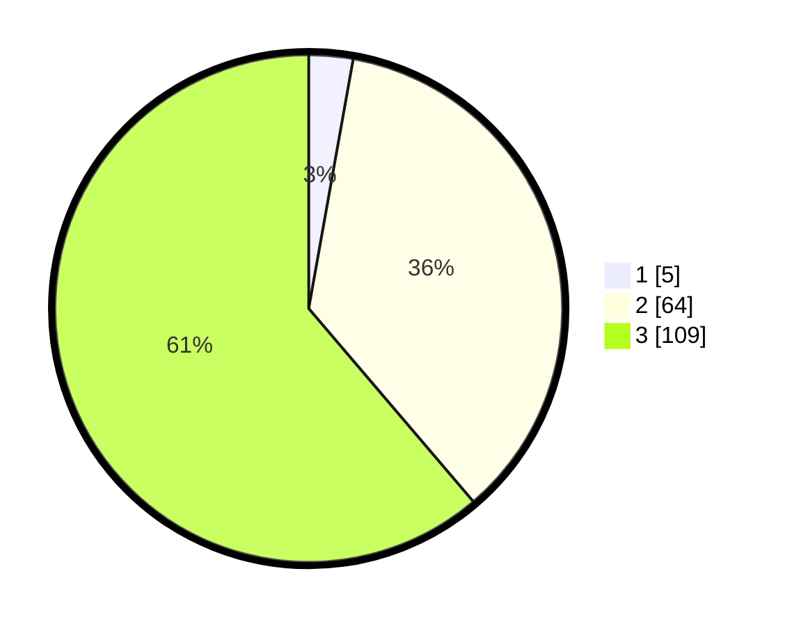

# Hasil

## Grafik

## Tabel

| No. | Nama Paslon    | Suara | Suara (raw) | Persentase |
|:--- |:-------------- | -----:| -----------:| ----------:|
| 1   | ANIES MUHAIMIN | 5     | [5][p-1]    | 2,81       |
| 2   | PRABOWO GIBRAN | 64    | [64][p-2]   | 35,96      |
| 3   | GANJAR MAHFUD  | 109   | [109][p-3]  | 61,24      |

[p-1]: https://github.com/gigit-pemilu/pemilu-2024-33-jawa-tengah/blob/main/pilpres/hitung-suara/sub/33-jawa-tengah/sub/12-wonogiri/sub/25-puhpelem/sub/1002-giriharjo/sub/005-tps/sub/paslon-1.txt
[p-2]: https://github.com/gigit-pemilu/pemilu-2024-33-jawa-tengah/blob/main/pilpres/hitung-suara/sub/33-jawa-tengah/sub/12-wonogiri/sub/25-puhpelem/sub/1002-giriharjo/sub/005-tps/sub/paslon-2.txt
[p-3]: https://github.com/gigit-pemilu/pemilu-2024-33-jawa-tengah/blob/main/pilpres/hitung-suara/sub/33-jawa-tengah/sub/12-wonogiri/sub/25-puhpelem/sub/1002-giriharjo/sub/005-tps/sub/paslon-3.txt

## Foto C Plano

https://sirekap-obj-formc.kpu.go.id/29c7/pemilu/ppwp/33/12/25/10/02/3312251002005-20240216-162924--21f1151e-15a2-4f2d-bcde-9eb56d72a5e3.jpg

https://sirekap-obj-formc.kpu.go.id/29c7/pemilu/ppwp/33/12/25/10/02/3312251002005-20240216-161101--550cfacd-5b9b-4587-8354-d1e6fec582cc.jpg

## Metadata

| Key        | Value               |
| ---------- | ------------------- |
| Time Stamp | 2024-02-16 16:30:00 |

